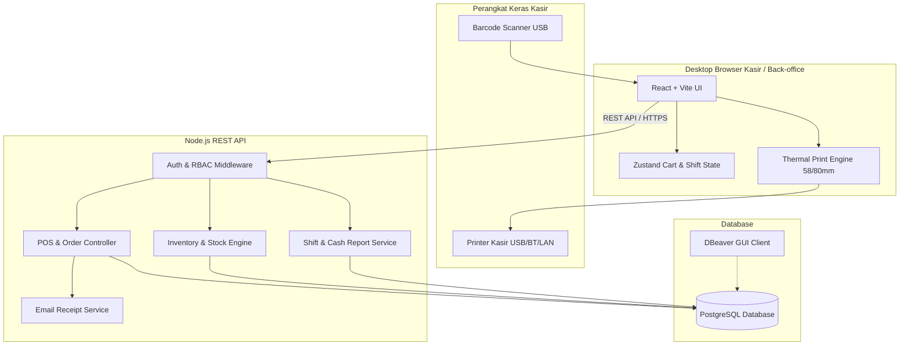
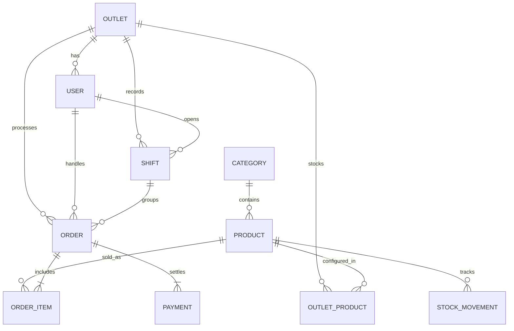

# System Architecture & Database Design
## Multi-Purpose POS Application

---

## 1. Rekomendasi Tech Stack & Alasan Pemilihan

Untuk aplikasi POS berbasis Web Browser / Desktop PC yang cepat, andal, dan mudah dijalankan secara lokal oleh pemula, berikut stack terbaik yang direkomendasikan:

| Komponen | Pilihan Teknologi | Alasan Utama |
| :--- | :--- | :--- |
| **Frontend** | **React (Vite) + TypeScript + Tailwind CSS** | Sangat cepat saat render item dan input kasir (zero latency), kaya komponen siap pakai (Shadcn UI/Radix), dukungan hotkeys keyboard, dan mudah dicetak ke thermal printer. |
| **State Management** | **Zustand + TanStack Query** | Zustand ideal untuk state keranjang kasir (ringan, tanpa boilerplate rumit). TanStack Query menangani caching data produk & stok otomatis. |
| **Backend API** | **Node.js (TypeScript) + Express / Hono** | Ekosistem JavaScript yang seragam antara FE & BE, performa tinggi untuk I/O transaksi, dan sangat mudah dipelajari serta didebug. |
| **ORM & Migrations** | **Prisma ORM** | Memberikan type-safety otomatis dari database ke kode, auto-migrasi skema yang rapi, dan mudah diinspeksi. |
| **Database** | **PostgreSQL** | Standar industri untuk sistem POS/keuangan: mendukung transaksi ACID (mencegah stok minus/transaksi ganda), serta kompatibel langsung dengan **DBeaver**. |
| **Struk & Export** | **Browser Print CSS + PDFKit / jsPDF + Nodemailer** | Fleksibel untuk ukuran 58mm & 80mm, mendukung ekspor PDF dan kirim email otomatis. |

---

## 2. Arsitektur Sistem (High-Level Architecture)



---

## 3. Desain Skema Database (Database Schema / ERD)

Berikut adalah rancangan tabel relasional yang dinormalisasi untuk mendukung transaksi multi-outlet, akuntansi sederhana (HPP/Laba), dan rekap kasir:



### Rincian Tabel Lengkap:

#### 1. `outlets` (Manajemen Cabang)
* `id` (UUID, Primary Key)
* `name` (VARCHAR, Nama Cabang/Toko)
* `address` (TEXT, Alamat Fisik Toko)
* `phone` (VARCHAR, Nomor Telepon Toko)
* `is_active` (BOOLEAN, Status Aktif)
* `created_at`, `updated_at` (TIMESTAMP)

#### 2. `users` (Petugas & Akun Pengguna)
* `id` (UUID, Primary Key)
* `outlet_id` (UUID, Foreign Key ke `outlets.id`, nullable untuk Superadmin)
* `name` (VARCHAR, Nama Lengkap)
* `email` (VARCHAR, Unik, untuk login)
* `password_hash` (VARCHAR, Terenkripsi)
* `pin` (VARCHAR 6 digit, untuk otorisasi cepat kasir/supervisor)
* `role` (ENUM: `ADMIN`, `SUPERVISOR`, `WAREHOUSE`, `CASHIER`)
* `is_active` (BOOLEAN)
* `created_at`, `updated_at` (TIMESTAMP)

#### 3. `categories` & `products` (Katalog Barang)
* `categories`:
  * `id` (UUID, Primary Key)
  * `name` (VARCHAR, misal: Makanan, Minuman, Sembako, Elektronik)
* `products`:
  * `id` (UUID, Primary Key)
  * `category_id` (UUID, Foreign Key ke `categories.id`)
  * `barcode` (VARCHAR, Unik, kode scan barcode EAN13/UPC)
  * `sku` (VARCHAR, Unik, Kode internal barang)
  * `name` (VARCHAR, Nama barang)
  * `description` (TEXT)
  * `cost_price` (DECIMAL 12,2 - Harga modal/HPP untuk kalkulasi laba)
  * `base_price` (DECIMAL 12,2 - Harga jual standar)
  * `unit` (VARCHAR, misal: Pcs, Box, Kg)
  * `image_url` (VARCHAR)
  * `is_active` (BOOLEAN)

#### 4. `outlet_products` (Stok & Harga Khusus per Cabang)
* `id` (UUID, Primary Key)
* `outlet_id` (UUID, Foreign Key ke `outlets.id`)
* `product_id` (UUID, Foreign Key ke `products.id`)
* `price` (DECIMAL 12,2 - Jika cabang punya harga khusus, jika null pakai `base_price`)
* `stock` (INTEGER - Jumlah stok riil di cabang saat ini)
* `min_stock_alert` (INTEGER - Ambang batas notifikasi stok menipis)
* *Unique constraint*: `(outlet_id, product_id)`

#### 5. `stock_movements` (Kartu Stok & Audit Inventori)
* `id` (UUID, Primary Key)
* `outlet_id` (UUID, Foreign Key ke `outlets.id`)
* `product_id` (UUID, Foreign Key ke `products.id`)
* `user_id` (UUID, Foreign Key ke `users.id`, siapa yang input)
* `type` (ENUM: `PURCHASE_IN`, `SALE_OUT`, `DAMAGE_OUT`, `TRANSFER_IN`, `TRANSFER_OUT`, `ADJUSTMENT`)
* `quantity` (INTEGER, positif untuk masuk, negatif untuk keluar)
* `notes` (TEXT, misal: "Barang rusak di rak B", "Penerimaan PO #102")
* `created_at` (TIMESTAMP)

#### 6. `shifts` (Sesi Kerja Kasir & Rekap Kas)
* `id` (UUID, Primary Key)
* `outlet_id` (UUID, Foreign Key ke `outlets.id`)
* `cashier_id` (UUID, Foreign Key ke `users.id`)
* `start_time` (TIMESTAMP)
* `end_time` (TIMESTAMP, Null jika masih buka)
* `starting_cash` (DECIMAL 12,2 - Modal awal di laci kasir)
* `expected_cash` (DECIMAL 12,2 - Dihitung sistem: Modal awal + Total transaksi tunai)
* `actual_cash` (DECIMAL 12,2 - Uang fisik saat tutup shift)
* `difference` (DECIMAL 12,2 - Selisih lebih/kurang)
* `status` (ENUM: `OPEN`, `CLOSED`)
* `notes` (TEXT)

#### 7. `orders` & `order_items` (Transaksi Penjualan)
* `orders`:
  * `id` (UUID, Primary Key)
  * `invoice_number` (VARCHAR, Unik, format: `INV/YYYYMMDD/OUTLET/0001`)
  * `outlet_id` (UUID, Foreign Key ke `outlets.id`)
  * `cashier_id` (UUID, Foreign Key ke `users.id`)
  * `shift_id` (UUID, Foreign Key ke `shifts.id`)
  * `customer_name` (VARCHAR, opsional)
  * `customer_email` (VARCHAR, untuk kirim struk digital)
  * `subtotal` (DECIMAL 12,2)
  * `discount_amount` (DECIMAL 12,2)
  * `tax_amount` (DECIMAL 12,2 - PPN misal 11%)
  * `service_charge` (DECIMAL 12,2)
  * `grand_total` (DECIMAL 12,2)
  * `total_cost` (DECIMAL 12,2 - Total HPP barang yang terjual untuk laba kotor)
  * `payment_status` (ENUM: `PAID`, `CANCELLED`, `REFUNDED`)
  * `created_at` (TIMESTAMP)
* `order_items`:
  * `id` (UUID, Primary Key)
  * `order_id` (UUID, Foreign Key ke `orders.id`)
  * `product_id` (UUID, Foreign Key ke `products.id`)
  * `quantity` (INTEGER)
  * `cost_price` (DECIMAL 12,2 - HPP saat barang terjual)
  * `unit_price` (DECIMAL 12,2 - Harga satuan saat transaksi)
  * `discount_amount` (DECIMAL 12,2)
  * `subtotal` (DECIMAL 12,2)

#### 8. `payments` (Pencatatan Pembayaran)
* `id` (UUID, Primary Key)
* `order_id` (UUID, Foreign Key ke `orders.id`)
* `method` (ENUM: `CASH`, `QRIS`)
* `amount_paid` (DECIMAL 12,2 - Nominal uang yang dibayarkan pelanggan)
* `change_given` (DECIMAL 12,2 - Kembalian uang tunai)
* `qris_reference` (VARCHAR, nomor referensi transaksi QRIS)
* `status` (ENUM: `SUCCESS`, `PENDING`, `FAILED`)
* `created_at` (TIMESTAMP)

---

## 4. Mekanisme Cetak Thermal (58mm & 80mm)

Sistem menggunakan format CSS `@media print` murni dengan lebar terkontrol:
```css
@media print {
  @page {
    margin: 0;
  }
  body.print-58mm {
    width: 58mm;
    font-size: 11px;
    font-family: 'Courier New', monospace;
  }
  body.print-80mm {
    width: 80mm;
    font-size: 13px;
    font-family: 'Courier New', monospace;
  }
}
```
Metode ini memastikan:
1. Kompatibel dengan semua printer (USB, Bluetooth, Wi-Fi, LAN) tanpa perlu driver khusus atau browser extension berbayar.
2. Kasir cukup menekan tombol `Cetak Struk` (atau shortcut keyboard `Enter`), dan printer kasir langsung memotong kertas (*auto-cut* jika didukung printer).
