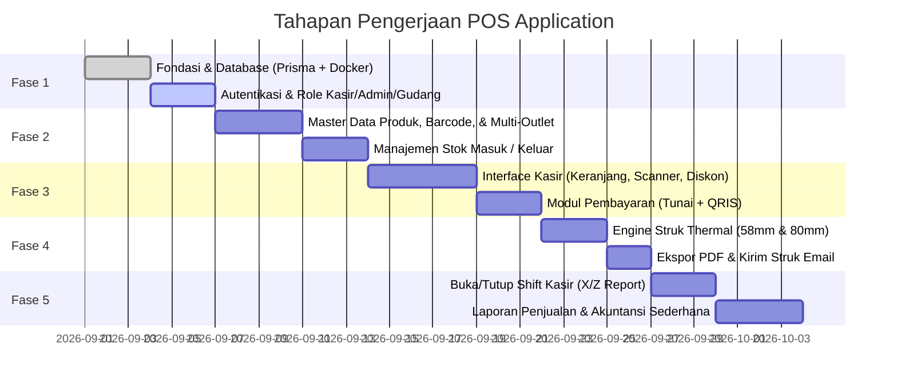

# Implementation Roadmap & Sprint Plan
## Multi-Purpose POS Development

Roadmap ini disusun terstruktur agar pengembangan aplikasi POS dapat dilakukan secara bertahap, mudah diuji coba pada setiap langkah, dan langsung dapat dieksekusi di Antigravity IDE.

---

---

## Rincian Sprint Pengerjaan

### Sprint 1: Fondasi Arsitektur, Database & Autentikasi
* [ ] Setup struktur folder `pos_apps/server` (Node.js/Express + Prisma) dan `pos_apps/client` (React/Vite + Tailwind).
* [ ] Setup `docker-compose.yml` untuk PostgreSQL lokal.
* [ ] Implementasi skema Prisma (User, Role, Outlet, Category, Product, Stock, Order, Shift).
* [ ] Script Seeding data (`npm run seed`) untuk mengisi data awal toko & akun demo.
* [ ] Endpoint autentikasi login (Email/Password & PIN Kasir) dan proteksi JWT.

### Sprint 2: Master Data & Manajemen Stok (Inventory)
* [ ] Dashboard Admin untuk kelola Cabang / Outlet.
* [ ] Manajemen Kategori dan Produk (upload gambar, barcode, SKU, harga modal/HPP, harga jual).
* [ ] Manajemen Stok Masuk (Stock-in dari supplier) dan Stok Keluar (rusak/expired).
* [ ] Notifikasi stok menipis (*low stock threshold*).

### Sprint 3: Interface Kasir & Mesin Checkout (POS Core)
* [ ] Layout Kasir Desktop (responsif, tombol besar, keyboard hotkeys F2, F4, Enter).
* [ ] Input produk via Barcode Scanner (USB keyboard listener) dan klik katalog.
* [ ] Logika keranjang belanja: diskon per item, diskon global, kalkulasi PPN & service charge.
* [ ] Dialog pembayaran:
  * Tunai: Tombol uang pas, kalkulasi otomatis kembalian.
  * QRIS: Tampilan QR code dan verifikasi nomor referensi.

### Sprint 4: Sistem Struk (Thermal, PDF, & Email)
* [ ] Komponen Struk dengan styling CSS khusus `@media print` untuk ukuran kertas **58mm** dan **80mm**.
* [ ] Tombol cetak langsung (*one-click print*) ke printer thermal USB/Bluetooth/LAN.
* [ ] Generator PDF struk untuk diunduh langsung oleh kasir/pelanggan.
* [ ] Layanan kirim struk ke alamat email pelanggan.

### Sprint 5: Manajemen Kasir (Shift) & Akuntansi Sederhana
* [ ] Modal awal kas saat kasir membuka shift.
* [ ] Laporan berjalan kasir (*X-Report*).
* [ ] Rekap tutup shift kasir (*Z-Report*): perhitungan uang tunai fisik di laci vs sistem, dan pencatatan selisih kas.
* [ ] Dashboard Laporan Finansial & Akuntansi Sederhana:
  * Total Omset Penjualan (Net Revenue).
  * Total Modal Barang Terjual (COGS / HPP).
  * Laba Kotor (Gross Profit).
  * Rekap Arus Kas harian (Tunai vs QRIS).
