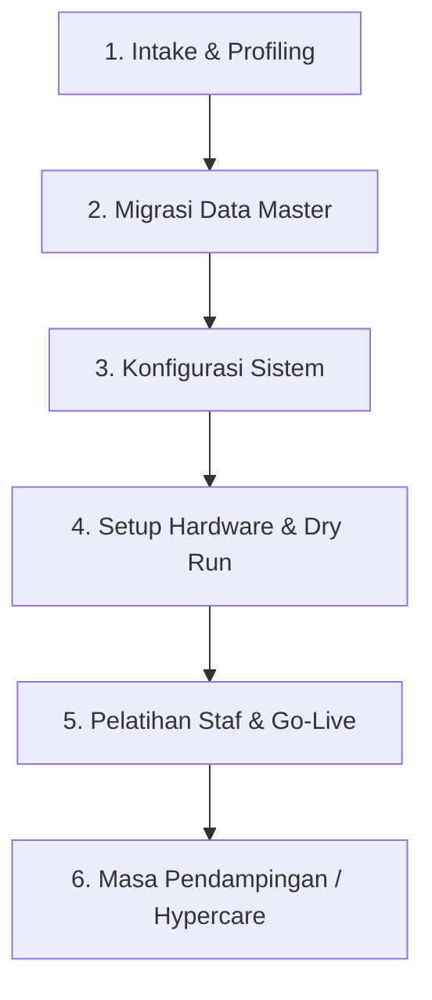

# Client Onboarding Playbook & Standard Operating Procedure (SOP)
## Panduan Lengkap Penerimaan & Implementasi Klien Baru Aplikasi POS

Dokumen ini adalah panduan terstandarisasi untuk tim operasional/implementator ketika ada pemilik usaha (klien) yang ingin mulai menggunakan aplikasi POS ini di toko atau cabangnya.

---

## 1. Alur Utama Onboarding (Onboarding Lifecycle)

| Fase | Durasi Ideal | Penanggung Jawab | Output Kunci |
| :--- | :--- | :--- | :--- |
| **1. Intake & Profiling** | Hari 1 | Account Exec / CS | Formulir profil toko & audit hardware |
| **2. Migrasi Data Master** | Hari 2 | Tim Data / Klien | File CSV katalog produk & stok awal siap impor |
| **3. Konfigurasi Sistem** | Hari 2 - 3 | Tim Teknis / Admin | Akun tenant, outlet, user, struk, & pajak siap |
| **4. Setup Hardware & Dry Run** | Hari 3 | Tim Implementator | Printer & scanner terhubung, transaksi tes sukses |
| **5. Pelatihan & Go-Live** | Hari 4 | Tim Trainer & Staf Klien | Kasir & SPV tersertifikasi, toko mulai live |
| **6. Hypercare** | 3 - 7 Hari pertama | Tim Support | Monitoring transaksi & rekonsiliasi shift harian |

---

## 2. Rincian Langkah Demi Langkah

### Fase 1: Intake & Profiling (Pengumpulan Data Bisnis)
Sebelum sistem dipasang, kumpulkan data berikut dari klien menggunakan **Formulir Profil Bisnis**:
1. **Identitas Usaha**:
   * Nama Bisnis / Brand.
   * Jumlah Cabang/Outlet yang akan aktif.
   * Alamat lengkap dan nomor telepon tiap outlet (untuk dicantumkan di struk).
2. **Kebutuhan Pajak & Biaya**:
   * Apakah menerapkan PPN (misal 11%)?
   * Apakah ada service charge?
3. **Audit Perangkat Keras (Hardware)**:
   * Jenis PC / Laptop kasir yang digunakan (OS Windows / macOS / Linux).
   * Tipe printer struk: Ukuran kertas (58mm atau 80mm), tipe koneksi (USB, Bluetooth, atau LAN/Wi-Fi).
   * Ketersediaan Barcode Scanner (USB plug-and-play).
4. **Metode Pembayaran**:
   * Rekening kasir / penampung tunai.
   * QRIS yang digunakan (QRIS statis cetak stiker atau QRIS dinamis).

---

### Fase 2: Migrasi Data Katalog & Inventori (Data Ingestion)
Agar klien tidak perlu menginput produk satu per satu secara manual:
1. Berikan **Template Spreadsheet Excel/CSV** kepada klien dengan format kolom:
   * `kategori`: misal Minuman, Makanan, Sembako
   * `nama_produk`: Nama lengkap barang
   * `sku`: Kode unik barang (bisa di-generate otomatis jika belum ada)
   * `barcode`: Kode barcode kemasan (jika menggunakan scanner)
   * `harga_modal_hpp`: Harga beli barang untuk perhitungan laba kotor
   * `harga_jual`: Harga jual ke pelanggan
   * `stok_awal`: Jumlah fisik barang saat ini
   * `satuan`: Pcs, Botol, Pack, Dus, dll.
2. Lakukan validasi data (pastikan tidak ada barcode kembar dan harga jual >= harga modal).
3. Jalankan bulk import ke dalam sistem.

---

### Fase 3: Konfigurasi Sistem & Hak Akses
Lakukan pengaturan di Dashboard Admin:
1. **Buat Outlet / Cabang**: Daftarkan nama cabang beserta alamat dan nomor kontaknya.
2. **Pengaturan Struk (Receipt Template)**:
   * Masukkan Header: Nama Toko, Alamat Cabang, Nomor Telepon.
   * Masukkan Footer: Ucapan terima kasih, info akun sosial media toko, ketentuan retur.
   * Tentukan lebar cetak default: **58mm** (compact) atau **80mm** (standar ritel).
3. **Pembuatan Akun Staf Toko**:
   * Buat akun **Owner / Admin** untuk pemilik toko.
   * Buat akun **Supervisor** cabang (beserta PIN 6-digit untuk otorisasi void).
   * Buat akun **Gudang** (untuk terima stok barang).
   * Buat akun **Kasir** per cabang.

---

### Fase 4: Setup Hardware & Uji Coba (Dry Run)
Lakukan pairing dan simulasi transaksi di meja kasir:
1. **Koneksi Printer Thermal**:
   * Pasang kertas thermal sesuai ukuran (58mm / 80mm).
   * Lakukan tes cetak dari browser via tombol `Cetak Tes Struk`.
   * Pastikan margin rapi, teks tidak terpotong, dan font terbaca jelas.
2. **Koneksi Barcode Scanner**:
   * Colokkan kabel USB scanner ke PC.
   * Scan salah satu produk barcode di layar kasir, pastikan produk langsung masuk ke keranjang dalam < 1 detik.
3. **Simulasi Transaksi Lengkap**:
   * Buka shift kasir (masukkan uang modal kasir, misal Rp 100.000).
   * Transaksi 1: Pembayaran Tunai (input nominal lebih, verifikasi kembalian dan cetak struk).
   * Transaksi 2: Pembayaran QRIS (scan QR dan pastikan status lunas).
   * Uji coba batal item/void (pastikan memerlukan otorisasi PIN Supervisor).
   * Tutup shift kasir: Hitung uang fisik dan cetak slip **Z-Report**.

---

### Fase 5: Pelatihan Staf (Training) & Go-Live
Waktu pelatihan kasir dirancang cepat (**maksimal 30 menit**):

#### Kurikulum Pelatihan Kasir (30 Menit):
1. **5 Menit Pertama**: Cara login & buka shift (input modal awal).
2. **10 Menit**: Cara scan produk, cari nama produk, ubah quantity, dan tambah diskon.
3. **5 Menit**: Cara proses pembayaran Tunai & QRIS, lalu cetak/kirim struk.
4. **5 Menit**: Prosedur pembatalan transaksi / panggil supervisor.
5. **5 Menit Terakhir**: Cara tutup shift (Z-Report) di akhir jam kerja dan serah terima uang.

> [!TIP]
> Tempelkan **Lembar Panduan Singkat Kasir (Cashier Cheat Sheet)** di samping monitor kasir agar staf kasir baru tidak panik saat toko sedang ramai.

---

### Fase 6: Masa Pendampingan (Hypercare Support)
* **Hari 1 - 3**:
  * Standby di grup WhatsApp khusus klien untuk merespons pertanyaan < 5 menit.
  * Memeriksa laporan penutupan shift kasir pada akhir hari pertama untuk memastikan uang fisik cocok dengan catatan sistem.
* **Hari 7**:
  * Melakukan review berkala bersama Owner: Menampilkan laporan produk terlaris, margin laba kotor, dan evaluasi kepuasan penggunaan.

---

## 3. Checklist Kesiapan Go-Live (Go-Live Readiness Checklist)

Gunakan checklist ini sebelum toko membuka layanan kasir ke pelanggan umum:

- [ ] Semua produk dan stok awal sudah masuk ke sistem dan diverifikasi oleh klien.
- [ ] Printer thermal sudah diuji coba dan ukuran kertas (58mm/80mm) sudah sesuai.
- [ ] Scanner barcode berfungsi dengan lancar tanpa delay.
- [ ] Akun kasir dan supervisor sudah dibuat dan PIN supervisor sudah dihafal oleh manajer toko.
- [ ] Template struk sudah memuat nama toko, alamat, dan pesan kaki yang benar.
- [ ] Laci kasir (*cash drawer*) sudah terisi uang kembalian pecahan kecil.
- [ ] Seluruh staf kasir sudah mencoba minimal 3 transaksi simulasi.
