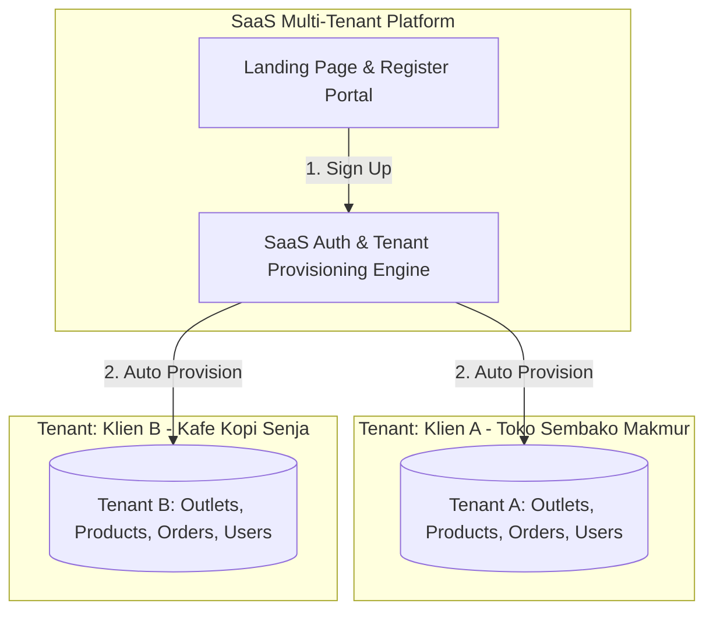
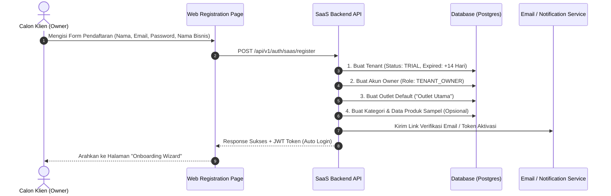
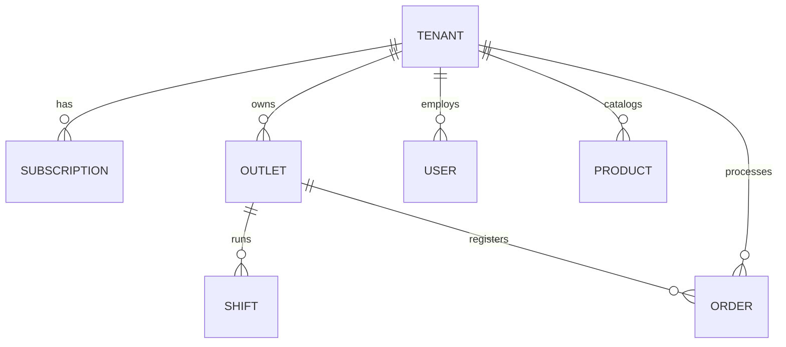

# SaaS Client Onboarding & Self-Service Registration Flow
## Multi-Tenant Architecture & First-Time User Experience (FTUX)

Dokumen ini merinci alur pendaftaran mandiri (*Self-Service Sign-Up*) dan penyediaan layanan (*Managed Provisioning*) untuk aplikasi POS berbasis **Software-as-a-Service (SaaS)** multi-tenant.

---

## 1. Arsitektur Multi-Tenancy (Konsep Dasar)

Dalam model SaaS POS, setiap klien adalah satu **Tenant (Perusahaan/Bisnis)** yang terisolasi datanya dari klien lain.



* **Data Isolation**: Setiap tabel inti (`outlets`, `users`, `products`, `orders`, `shifts`) memiliki foreign key `tenant_id`.
* **Satu Akun Owner**: Klien mendaftar sekali sebagai Owner, lalu bisa mengelola banyak outlet di bawah nama perusahaannya.

---

## 2. Alur Pendaftaran Klien (Registration Flow)



### 2.1 Formulir Pendaftaran (Sign-Up Form)
Formulir dibuat ringkas agar tingkat konversi (*conversion rate*) tinggi:
1. **Nama Lengkap Pemilik**: (contoh: Budi Santoso)
2. **Nama Bisnis / Brand**: (contoh: Toko Maju Jaya)
3. **Email Bisnis**: Digunakan sebagai username login utama & pengiriman struk/laporan.
4. **Nomor WhatsApp**: Untuk verifikasi akun / notifikasi bisnis.
5. **Password**: Minimal 8 karakter.
6. **Jenis Industri (Dropdown)**:
   * Retail / Minimarket
   * F&B / Resto / Kafe
   * Toko Pakaian / Fashion
   * Toko Elektronik / Gadget
   * Lainnya / Umum

---

## 3. Otomatisasi Provisioning Tenant (Di Balik Layar)

Ketika tombol **"Daftar Sekarang"** diklik, backend secara otomatis melakukan transaksi database atomik:
1. **Membuat Record Tenant**:
   * Nama Bisnis: Toko Maju Jaya
   * Slug: `toko-maju-jaya`
   * Paket Langganan: `TRIAL_14_DAYS` (Semua fitur terbuka selama 14 hari).
2. **Membuat Akun User Owner**:
   * Role: `ADMIN` / `OWNER` dengan hak akses penuh untuk tenant tersebut.
3. **Membuat Outlet Pertama**:
   * Nama: `Outlet Utama - Toko Maju Jaya`
4. **Inisialisasi Pengaturan Struk & Pajak Default**:
   * Ukuran kertas: 58mm (default), PPN: 0% (bisa diatur nanti).
5. **Menghasilkan JWT Token**: Klien langsung terautentikasi dan masuk ke sistem tanpa harus login ulang.

---

## 4. Onboarding Wizard (First-Time User Experience / FTUX)

Setelah registrasi berhasil, klien tidak dilempar ke dashboard kosong yang membingungkan. Mereka dipandu oleh **Setup Wizard 4 Langkah**:

```
+---------------------------------------------------------------+
|  Selamat Datang di POS! Mari siapkan toko Anda dalam 2 menit.  |
|  [ 1. Profil Toko ] -> [ 2. Struk ] -> [ 3. Kasir ] -> [ Selesai ]
+---------------------------------------------------------------+
```

### Langkah 1: Pengaturan Profil Outlet Utama
* Alamat lengkap outlet.
* Nomor telepon toko.
* Kota & Kode Pos.

### Langkah 2: Pengaturan Struk Kasir
* Header struk (otomatis terisi nama toko).
* Pesan kaki struk (default: *"Terima kasih atas kunjungan Anda!"*).
* Pilih ukuran printer kasir yang dimiliki: `58mm` atau `80mm`.
* Tombol: `[Cetak Struk Sampel]` (opsional, untuk mengetes printer).

### Langkah 3: Tambah Kasir Pertama (Opsional / Bisa Di-skip)
* Nama Kasir: (contoh: Kasir 1 / Siti)
* PIN Kasir: 6 Digit angka (contoh: `123456`) untuk login cepat di layar kasir.

### Langkah 4: Pilih Katalog Awal
Klien diberikan 3 pilihan praktis:
1. **Gunakan Produk Contoh**: Mengisi 5 produk sampel otomatis agar klien bisa langsung mencoba transaksi POS.
2. **Unggah File Excel/CSV**: Bagi klien yang sudah memiliki daftar barang di Excel.
3. **Mulai dari Nol (Kosong)**: Menambahkan produk sendiri secara manual nanti.

Setelah langkah 4 selesai, muncul tombol besar:
* **[Buka Aplikasi Kasir Sekarang]** (Langsung masuk ke layar POS)
* **[Ke Dashboard Manajemen]** (Melihat laporan & master data)

---

## 5. Skema Database Tambahan untuk Multi-Tenant SaaS

Untuk mendukung arsitektur SaaS, tabel database diperluas dengan entitas `tenants` dan `subscriptions`:



### Rincian Tabel Tambahan:

#### 1. `tenants` (Data Perusahaan Klien)
* `id` (UUID, Primary Key)
* `business_name` (VARCHAR, Nama Toko/Brand)
* `slug` (VARCHAR, Unik, misal: `toko-maju-jaya`)
* `business_type` (VARCHAR, Ritel, F&B, dll.)
* `phone` (VARCHAR)
* `status` (ENUM: `TRIAL`, `ACTIVE`, `SUSPENDED`, `CANCELLED`)
* `trial_ends_at` (TIMESTAMP, Tanggal berakhir trial)
* `created_at`, `updated_at` (TIMESTAMP)

#### 2. `subscriptions` (Paket Berlangganan Klien)
* `id` (UUID, Primary Key)
* `tenant_id` (UUID, Foreign Key ke `tenants.id`)
* `plan_name` (ENUM: `FREE_TRIAL`, `STARTER`, `PRO`, `ENTERPRISE`)
* `max_outlets` (INTEGER, misal: Starter = 1, Pro = 5, Enterprise = Unlimited)
* `max_cashiers` (INTEGER)
* `started_at` (TIMESTAMP)
* `expires_at` (TIMESTAMP)
* `is_active` (BOOLEAN)

---

## 6. Alur Login Klien yang Sudah Terdaftar (Returning User)

Ketika klien kembali ke aplikasi di kemudian hari:

1. **Login Utama (Owner / Manager / Admin)**:
   * Halaman login: `https://app.namapos.com/login`
   * Masukkan **Email** & **Password**.
   * Sistem mendeteksi `tenant_id` user dan membawa ke Dashboard Admin Tenant tersebut.

2. **Login Kasir di Meja Kasir (Dedicated Cashier Screen)**:
   * Kasir cukup memilih Nama Outlet -> Memilih Nama Kasir -> Memasukkan **6-Digit PIN**.
   * Sangat cepat untuk pergantian shift kasir tanpa perlu mengetik email & password panjang setiap saat.
