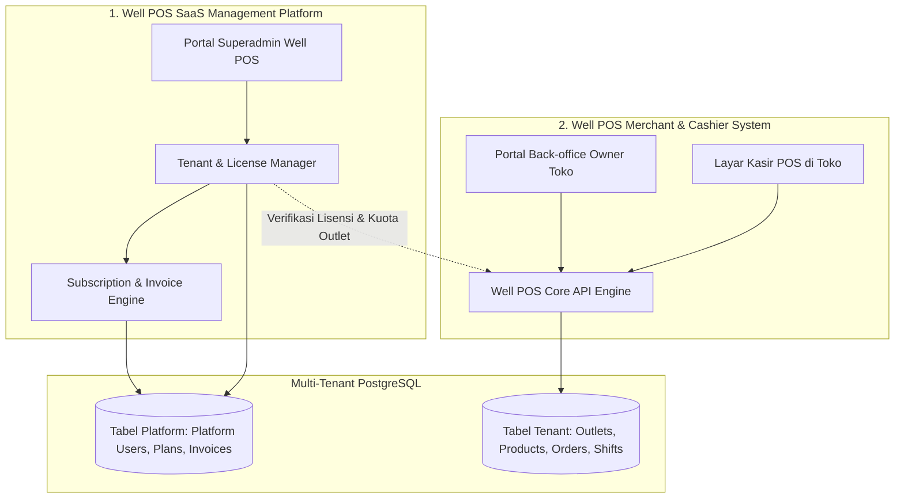
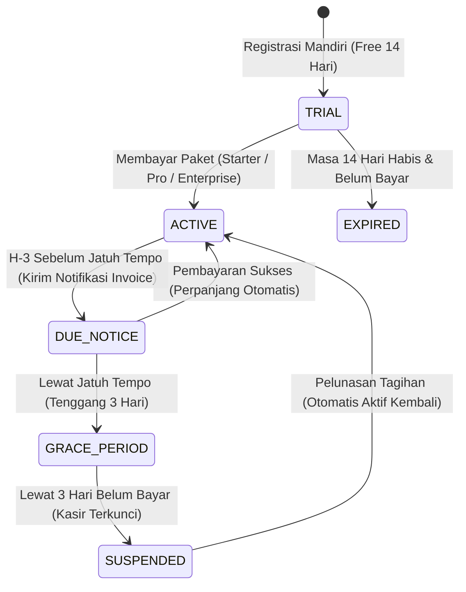
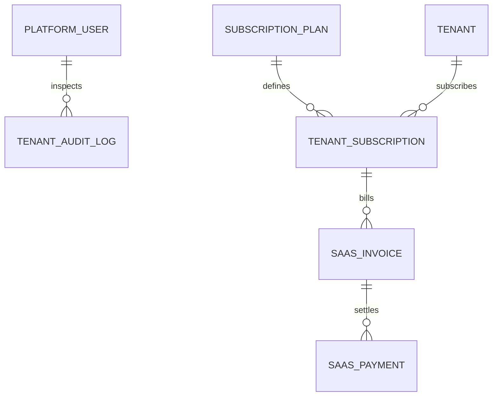

# Arsitektur Terpisah: Well POS SaaS Platform vs Well POS Merchant/POS
## Model Peran (RBAC), Manajemen Tenant, & Sistem Pembayaran Berlangganan

---

## 1. Pemisahan Dua Sistem Utama: SaaS Platform vs Merchant POS

Aplikasi **Well POS** terbagi menjadi dua sistem independen yang saling terhubung:



| Karakteristik | **Well POS SaaS Platform** | **Well POS Merchant POS** |
| :--- | :--- | :--- |
| **Pengguna** | Tim Internal Well POS (Superadmin, Finance, Support) | Klien (Pemilik Toko, Supervisor, Gudang, Kasir) |
| **URL / Akses** | `https://admin.wellpos.id` (internal) | `https://app.wellpos.id` & `https://pos.wellpos.id` |
| **Fungsi Utama** | Kelola daftar klien, pantau masa aktif langganan, terima pembayaran invoice SaaS, blokir tenant jika telat bayar. | Transaksi penjualan kasir, kelola stok barang, cetak struk, rekap shift kasir, laporan laba rugi toko. |
| **Fokus Keuangan** | Pendapatan Well POS (MRR, Annual Plan, Tagihan Invoice Klien). | Pendapatan Toko Klien (Omset penjualan barang, modal HPP, kas kasir). |

---

## 2. Struktur Role & Hak Akses Berjenjang (Dual-Layer RBAC)

Well POS menggunakan pemisahan role pada dua tingkatan berbeda untuk menjamin keamanan absolut:

```
+-------------------------------------------------------------------------+
| LEVEL 1: SAAS PLATFORM ROLES (Internal Well POS)                        |
| ├── SUPER_ADMIN    : Pemilik Well POS (Akses semua data & billing)      |
| └── SUPPORT_AGENT  : Tim CS (Bantu troubleshooting tenant tanpa billing) |
+-------------------------------------------------------------------------+
                                    │
                                    ▼ Mengelola banyak Tenant
+-------------------------------------------------------------------------+
| LEVEL 2: TENANT MERCHANT ROLES (Klien & Toko)                           |
| ├── TENANT_OWNER   : Pemilik Toko (Bayar SaaS, kelola cabang, laporan)  |
| ├── SUPERVISOR     : Kepala Toko (Otorisasi void kasir, Z-Report)       |
| ├── WAREHOUSE      : Petugas Gudang (Stok masuk & mutasi)               |
| └── CASHIER        : Staf Kasir (Buka shift, transaksi, struk)          |
+-------------------------------------------------------------------------+
```

### Rincian Kewenangan Matriks Akses:

| Modul / Tindakan | SUPER_ADMIN | SUPPORT_AGENT | TENANT_OWNER | SUPERVISOR | WAREHOUSE | CASHIER |
| :--- | :---: | :---: | :---: | :---: | :---: | :---: |
| **Manajemen Tenant & Lisensi** | ✅ | ❌ | ❌ | ❌ | ❌ | ❌ |
| **Atur Harga Paket SaaS & Promo** | ✅ | ❌ | ❌ | ❌ | ❌ | ❌ |
| **Suspend / Blokir Klien** | ✅ | ❌ | ❌ | ❌ | ❌ | ❌ |
| **Buka Toko Klien (Impersonate/Audit)**| ✅ | ✅ (Read) | ❌ | ❌ | ❌ | ❌ |
| **Bayar Tagihan SaaS Well POS** | ❌ | ❌ | ✅ | ❌ | ❌ | ❌ |
| **Tambah Outlet / Cabang Toko** | ❌ | ❌ | ✅ | ❌ | ❌ | ❌ |
| **Laporan Finansial Toko (Laba/HPP)** | ❌ | ❌ | ✅ | ❌ | ❌ | ❌ |
| **Otorisasi Void / Batal Transaksi** | ❌ | ❌ | ✅ | ✅ | ❌ | ❌ |
| **Input Stok Masuk / Pembelian** | ❌ | ❌ | ✅ | ✅ | ✅ | ❌ |
| **Buka Shift & Transaksi Kasir** | ❌ | ❌ | ✅ | ✅ | ❌ | ✅ |

---

## 3. Alur Pembayaran Tagihan Berlangganan Klien (Tenant Billing Lifecycle)

Setiap klien memiliki siklus berlangganan (*subscription lifecycle*) untuk menggunakan layanan Well POS:



### 3.1 Pilihan Paket Langganan Well POS

1. **Paket Trial (Gratis 14 Hari)**:
   * 1 Outlet, Maksimal 2 Kasir, Semua Fitur Terbuka.
2. **Paket Starter**:
   * 1 Outlet, Maksimal 3 Kasir, Fitur POS & Inventori Dasar.
3. **Paket Pro (Paling Populer)**:
   * Hingga 3 Outlet, Unlimited Kasir, Laporan Akuntansi HPP/Laba, Multi-Gudang.
4. **Paket Enterprise**:
   * Unlimited Outlet & Kasir, Dedicated Support, Custom Struk & Fitur Khusus.

### 3.2 Alur Pembuatan & Pembayaran Invoice Tagihan (Billing Flow)
1. **Invoice Dibuat Otomatis**:
   * Sistem SaaS membuat tagihan baru (Invoice) pada H-7 sebelum masa langganan berakhir.
2. **Kanal Pembayaran Otomatis (Payment Gateway)**:
   * Klien mengklik tombol **"Bayar Langganan"** di Back-office Well POS.
   * Terintegrasi dengan payment gateway (Virtual Account BCA/Mandiri/BRI, QRIS, Kartu Kredit).
   * Webhook otomatis mendeteksi pembayaran lunas -> Status tenant langsung diperpanjang tanpa perlu verifikasi manual.
3. **Kanal Pembayaran Manual (Transfer Bank Rekening Well POS)**:
   * Klien mengunggah bukti transfer di portal.
   * Superadmin Well POS memverifikasi bukti bayar di panel Superadmin lalu menekan tombol **"Approve & Activate"**.

---

## 4. Inisialisasi & Hubungan Antara SaaS dan POS Core

Bagaimana kedua sistem ini berkomunikasi secara teknis?

### 4.1 Middleware Verifikasi Tenant (Tenant License Gate)
Setiap kali ada request transaksi dari layar kasir atau back-office toko, API menjalankan **License Verification Middleware**:

```typescript
// Konsep Middleware di Backend Well POS
export async function verifyTenantLicense(req, res, next) {
  const tenantId = req.user.tenant_id;
  const tenant = await prisma.tenant.findUnique({ where: { id: tenantId } });

  // 1. Cek apakah akun klien dalam status diblokir/suspended
  if (tenant.status === 'SUSPENDED') {
    return res.status(403).json({
      error: 'SUBSCRIPTION_LOCKED',
      message: 'Masa aktif Well POS toko Anda telah berakhir. Silakan lakukan pembayaran tagihan untuk membuka akses.'
    });
  }

  // 2. Cek apakah kuota outlet melebihi paket
  if (req.path === '/api/v1/outlets' && req.method === 'POST') {
    const currentOutlets = await prisma.outlet.count({ where: { tenant_id: tenantId } });
    if (currentOutlets >= tenant.subscription.max_outlets) {
      return res.status(400).json({
        error: 'OUTLET_LIMIT_REACHED',
        message: 'Batas maksimum outlet tercapai. Silakan upgrade paket Well POS Anda.'
      });
    }
  }

  next();
}
```

---

## 5. Skema Database Tambahan untuk Platform SaaS



### Rincian Tabel SaaS Platform:

#### 1. `platform_users` (Tim Internal Well POS)
* `id` (UUID, Primary Key)
* `email` (VARCHAR, Unik)
* `password_hash` (VARCHAR)
* `name` (VARCHAR)
* `role` (ENUM: `SUPER_ADMIN`, `SUPPORT_AGENT`, `FINANCE_ADMIN`)
* `created_at` (TIMESTAMP)

#### 2. `subscription_plans` (Master Paket Harga)
* `id` (UUID, Primary Key)
* `code` (VARCHAR, misal: `STARTER`, `PRO`, `ENTERPRISE`)
* `name` (VARCHAR, misal: "Well POS Pro Bulanan")
* `price` (DECIMAL 12,2)
* `billing_cycle` (ENUM: `MONTHLY`, `ANNUALLY`)
* `max_outlets` (INTEGER)
* `max_cashiers` (INTEGER)
* `features` (JSONB, daftar fitur yang aktif)

#### 3. `saas_invoices` (Tagihan Berlangganan Klien)
* `id` (UUID, Primary Key)
* `invoice_number` (VARCHAR, Unik, misal: `INV-SAAS/2026/09/001`)
* `tenant_id` (UUID, Foreign Key ke `tenants.id`)
* `plan_id` (UUID, Foreign Key ke `subscription_plans.id`)
* `amount` (DECIMAL 12,2)
* `status` (ENUM: `UNPAID`, `PAID`, `CANCELLED`, `EXPIRED`)
* `due_date` (TIMESTAMP)
* `payment_url` (VARCHAR, tautan pembayaran payment gateway)
* `paid_at` (TIMESTAMP)

#### 4. `saas_payments` (Log Pembayaran Lisensi)
* `id` (UUID, Primary Key)
* `invoice_id` (UUID, Foreign Key ke `saas_invoices.id`)
* `payment_channel` (VARCHAR, misal: `BCA_VA`, `QRIS`, `MANUAL_TRANSFER`)
* `payment_proof_url` (VARCHAR, jika transfer manual)
* `verified_by` (UUID, Foreign Key ke `platform_users.id`, nullable jika auto via gateway)
* `created_at` (TIMESTAMP)
