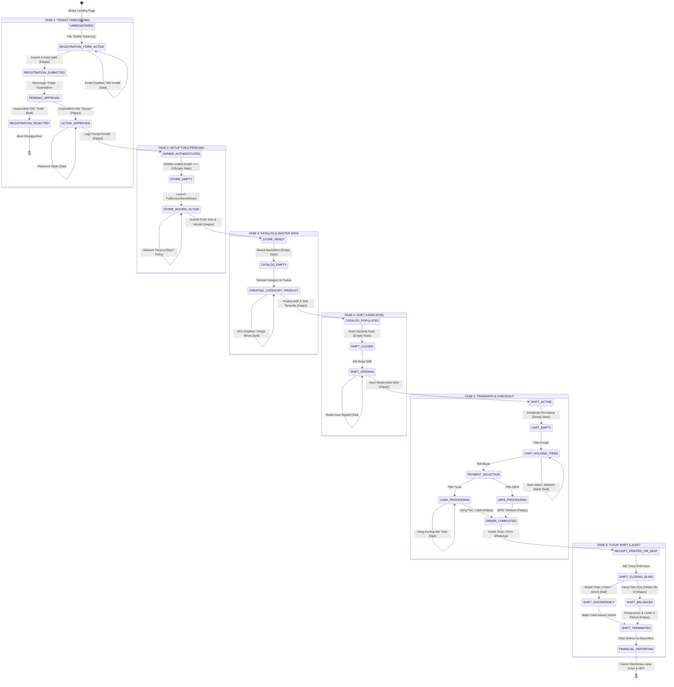
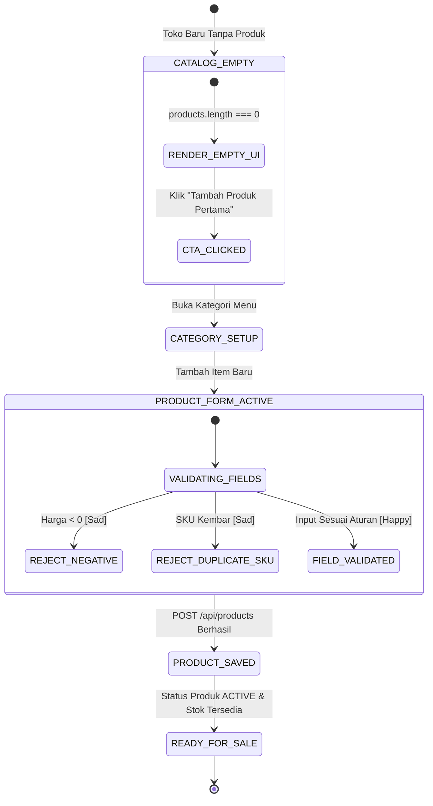
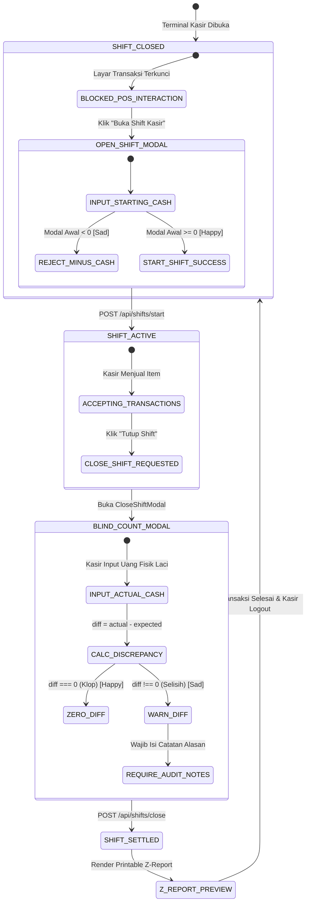
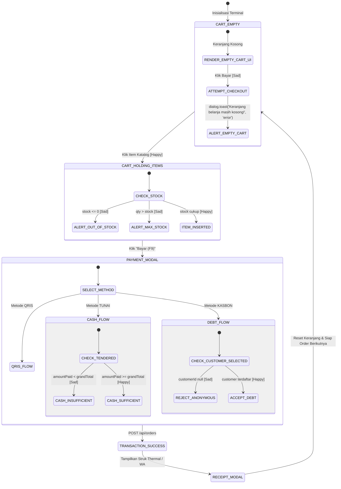
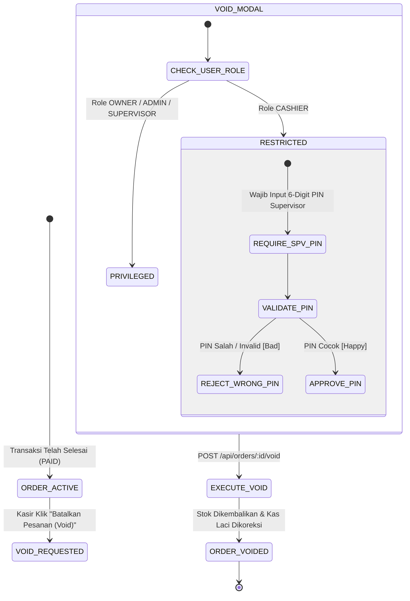

# WELL POS — SPESIFIKASI ARSITEKTUR STATE MACHINE & REKAYASA KUALITAS ALUR
## Pemetaan Lengkap Finite State Machine (FSM): Happy Path, Sad Path, Bad Path, Empty State & Error Notification Matrix

Dokumen ini adalah **spesifikasi kanonikal arsitektur transisi keadaan (*state machine*)** untuk seluruh alur utama platform **Well POS**, mulai dari *Onboarding Tenant*, *Store Setup Wizard*, *Manajemen Shift Kasir*, *Transaksi Checkout & Pembayaran*, *Otorisasi Keamanan Void*, hingga *Pelaporan Finansial*.

---

## 🗺️ PETA GLOBAL: LIFECYCLE STATE MACHINE UTAMA

Diagram Mermaid di bawah memetakan siklus hidup (*lifecycle*) end-to-end dari seorang tenant baru hingga menjalankan operasional kasir harian:

---

## 🔬 PEMETAAN 3 JALUR (*HAPPY, SAD, BAD PATH*) PER SUB-STATE MACHINE

### 1. Sub-Machine: Tenant Lifecycle & Onboarding

| Parameter | Spesifikasi Teknis |
| :--- | :--- |
| **Model DB Terkait** | Prisma `Tenant`, `User` |
| **Initial State** | `UNREGISTERED` |
| **Terminal State** | `OWNER_AUTHENTICATED` (atau `REGISTRATION_REJECTED`) |

#### Matriks Jalur (Paths):
* 🟢 **Happy Path**:
  1. `UNREGISTERED` $\rightarrow$ User mengisi form 5 field (Nama Depan, Belakang, WhatsApp, Email, Password).
  2. Sistem menormalkan telepon ke format `+628...` via `<WhatsAppInput />`.
  3. `REGISTRATION_SUBMITTED`: Data tersimpan dengan `tenant.status = 'PENDING'`.
  4. Superadmin membuka `#superadmin` $\rightarrow$ Menu Merchant $\rightarrow$ Klik **"Setujui"**.
  5. `ACTIVE_APPROVED`: Status berubah menjadi `'ACTIVE'`.
  6. Owner login di `#login` tab Portal Pemilik $\rightarrow$ `OWNER_AUTHENTICATED`.
* 🟡 **Sad Path (Recoverable)**:
  1. **Email Duplikat**: User memasukkan email yang sudah terdaftar.  
     *Response*: HTTP 400 Bad Request.  
     *UI Notification*: `dialog.alert({ title: 'Pendaftaran Gagal', message: 'Email sudah terdaftar. Silakan gunakan email lain atau masuk ke akun Anda.', variant: 'warning' })`.  
     *Recovery*: Form tetap terisi kecuali password, user mengganti alamat email.
  2. **Format Telepon Kurang Digit**: User memasukkan hanya 7 digit angka.  
     *UI Notification*: Inline badge merah *"Nomor WhatsApp minimal 9 digit"*. Tombol submit dinonaktifkan (`disabled`).
  3. **Password Mismatch**: Konfirmasi password berbeda dengan kata sandi utama.  
     *UI Notification*: Inline helper text *"Konfirmasi password tidak cocok"*.
* 🔴 **Bad Path (Unrecoverable / Hard Rejection)**:
  1. **Pendaftaran Ditolak Superadmin**: Superadmin mendeteksi data spam/tidak valid $\rightarrow$ Klik **"Tolak"** dengan alasan.  
     *State*: `REGISTRATION_REJECTED` (`tenant.status = 'SUSPENDED'`).  
     *UI Notification saat login*: `dialog.alert({ title: 'Akses Ditolak', message: 'Pendaftaran akun Anda ditolak atau akun dinonaktifkan oleh administrator. Hubungi tim bantuan.', variant: 'danger' })`.
  2. **Brute Force Login**: Memasukkan kata sandi salah berulang kali.  
     *UI Notification*: `dialog.alert({ title: 'Login Gagal', message: 'Email atau kata sandi yang Anda masukkan tidak sesuai.', variant: 'danger' })`.

---

### 2. Sub-Machine: First Store Setup Wizard (`FullScreenStoreWizard`)

| Parameter | Spesifikasi Teknis |
| :--- | :--- |
| **Model DB Terkait** | Prisma `Outlet` (Relasi 1:N dengan `Tenant`) |
| **Trigger Kondisi** | `user.role === 'OWNER' && user.outlets.length === 0` |
| **Terminal State** | `STORE_READY` |

#### Matriks Jalur (Paths):
* 🟢 **Happy Path**:
  1. `STORE_EMPTY`: Sistem mendeteksi toko belum ada, meluncurkan antarmuka layar penuh tanpa navbar distraktif.
  2. User memasukkan: Nama Pedagang (`Kopi Nusantara Group`), Nama Toko Pertama (`Kopi Nusantara - Outlet Malioboro`), No WA Toko (`+6281234567890`), Alamat (`Jl. Malioboro No. 45`), dan memilih chip industri `Kedai Kopi / Coffee Shop`.
  3. Klik tombol **"Selesaikan & Masuk ke Backoffice"**.
  4. Backend mengeksekusi `POST /api/outlets` $\rightarrow$ Toko dibuat dengan setting default struk & pajak.
  5. `STORE_READY`: Redirect otomatis ke Backoffice Dashboard dengan active outlet terpilih.
* 🟡 **Sad Path (Recoverable)**:
  1. **Field Wajib Belum Lengkap**: User langsung klik tombol simpan tanpa memilih industri atau mengisi alamat.  
     *UI Notification*: Banner peringatan oranye di header form: *"Harap lengkapi nama toko, nomor telepon, dan pilih minimal 1 kategori industri."*
  2. **Pencarian Chip Industri Nihil**: User mengetik industri antah berantah di search bar (misal: "Pesawat Terbang").  
     *Empty State UI*: Container chips menampilkan pesan: *"Tidak ada industri yang cocok dengan pencarian 'Pesawat Terbang'."* dengan tombol *"Gunakan Kategori Umum"*.
* 🔴 **Bad Path (Network Failure)**:
  1. **Koneksi Terputus saat Submit**: Server timeout saat menyimpan ke database.  
     *UI Notification*: `dialog.alert({ title: 'Gagal Menyimpan Toko', message: 'Terjadi kendala koneksi saat membuat toko perdana. Silakan coba klik simpan kembali.', variant: 'danger' })`.  
     *Safe State*: State form tidak di-reset, user tidak perlu mengetik ulang data dari awal.

---

### 3. Sub-Machine: Master Katalog & Persediaan (`CatalogMachine`)

#### Empty State & Error Notification Check:
* **Empty State Katalog**:  
  Saat `products.length === 0`: Menampilkan ilustrasi keranjang belanja kosong berlatar abu-abu lembut dengan teks *"Belum Ada Produk Terdaftar"*, deskripsi *"Katalog toko Anda masih kosong. Buat kategori menu dan daftarkan produk pertama untuk mulai berjualan di kasir"*, serta tombol aksi utama `+ Tambah Produk Baru`.
* **Sad Path Notifikasi**:
  * Harga Jual < 0: `<CurrencyInput />` memblokir input minus secara preventif. Jika di-bypass via API: `dialog.alert({ title: 'Harga Tidak Valid', message: 'Harga jual produk tidak boleh bernilai kurang dari Rp 0', variant: 'warning' })`.
  * Duplikasi Barcode: `dialog.alert({ title: 'Barcode Duplikat', message: 'Barcode telah digunakan oleh produk lain dalam toko ini.', variant: 'warning' })`.

---

### 4. Sub-Machine: Manajemen Shift Kasir (`ShiftMachine`)

#### Empty State, Discrepancy & Error Checks:
* **Empty State Shift**:  
  Saat kasir mencoba memilih produk di katalog ketika shift belum dimulai:  
  *Banner/Toast*: `⚠️ Shift kasir belum dibuka! Buka shift kasir terlebih dahulu untuk mulai transaksi.`  
  *Aksi Otomatis*: Sistem langsung meluncurkan modal `StartShiftModal` di atas layar kasir.
* **Sad Path (Selisih Kas Fisik / Discrepancy)**:  
  Jika uang fisik yang dihitung kasir tidak cocok dengan ekspektasi sistem (`actualCash !== expectedCash`):  
  *UI Banner*: Muncul kotak kuning-oranye berlatar lembut di dalam `CloseShiftModal`:  
  *"Terdapat selisih kas sebesar Rp X (+Lebih / -Kurang). Supervisor dan Kasir wajib memverifikasi nota transaksi fisik dan mencatat alasan selisih pada kolom catatan sebelum menutup kasir."*  
  *Catatan Audit*: Kolom input textarea `Catatan Rekonsiliasi Kasir` berubah menjadi *required*.
* **Bad Path (Input Fisik Negatif)**:  
  Jika kasir memasukkan angka negatif:  
  *Error Message*: *"Nominal uang fisik tidak boleh negatif"*. Tombol submit diblokir.

---

### 5. Sub-Machine: Keranjang & Transaksi Kasir (`PosCheckoutMachine`)

#### Empty State & Error Notification Check:
* **Empty State Keranjang**:  
  Saat `cart.length === 0`: Panel kanan menampilkan ikon belanja abu-abu, teks *"Keranjang Belanja Kosong"*, *"Pilih produk di katalog atau scan barcode untuk menambahkan pesanan."*, dan tombol Bayar disabled berwarna abu-abu redup.
* **Sad Path (Stok Habis / Out-of-Stock)**:  
  *Trigger*: Kasir menekan produk non-composite dengan stok 0.  
  *UI Alert*: `dialog.alert({ title: 'Stok Produk Habis', message: 'Stok "[Nama Produk]" saat ini habis (0)!', variant: 'warning' })`.
* **Sad Path (Uang Tunai Kurang)**:  
  *Trigger*: Nominal uang diterima lebih kecil dari grand total.  
  *UI State*: Label peringatan merah *"Uang diterima kurang Rp [Kekurangan]"*. Tombol *"Selesaikan Pembayaran"* dinonaktifkan (`disabled`).
* **Sad Path (Kasbon Tanpa Pelanggan Terdaftar)**:  
  *Trigger*: Kasir memilih metode kasbon tetapi transaksi anonim (tanpa nama pelanggan).  
  *UI State*: Tombol terblokir dengan peringatan *"Pilih pelanggan terdaftar terlebih dahulu untuk transaksi piutang/kasbon"*.

---

### 6. Sub-Machine: Keamanan Transaksi & Otorisasi PIN Supervisor (`VoidMachine`)

#### Bad Path & Security Alert Check:
* **Bad Path (Kasir Mencoba Void Tanpa Izin)**:  
  *Trigger*: Kasir memasukkan PIN sembarangan atau PIN kasirnya sendiri.  
  *UI Error*: Kotak peringatan merah di dalam `VoidOrderModal`: *"PIN Supervisor tidak valid atau tidak memiliki wewenang pembatalan transaksi."*  
  *Security Log*: Percobaan gagal dicatat pada audit log. Transaksi tetap berstatus `PAID` dan uang kas tidak boleh berkurang.
* **Happy Path (Supervisor Hadir Memasukkan PIN)**:  
  *Outcome*: Transaksi diberi stempel `VOIDED` dengan coretan visual di riwayat pesanan, stok bahan baku/produk otomatis di-rollback bertambah ke stok gudang/toko, dan slip retur dapat dicetak.

---

### 7. Sub-Machine: Menu Tamu Mandiri QR Meja (`QrMenuMachine`)

| Parameter | Spesifikasi Teknis |
| :--- | :--- |
| **Model DB Terkait** | Prisma `Outlet`, `Product`, `QrTable`, `Order` |
| **Entry Point** | Public Web URL `http://localhost:5173/#menu?outletId=...&table=...` |
| **Terminal State** | `QR_ORDER_SUBMITTED` |

#### Matriks Jalur (Paths):
* 🟢 **Happy Path**:
  1. Tamu memindai QR Code di meja 04 $\rightarrow$ Menu digital terbuka lengkap dengan nama toko & nomor meja.
  2. Tamu memilih menu, menentukan varian rasa/topping, dan mengisi catatan pesanan.
  3. Buka keranjang meja $\rightarrow$ Isi nama pemesan *"Dimas"* dan no WhatsApp `081298765432`.
  4. Klik **"Kirim Pesanan ke Dapur / Kasir"**.
  5. Pesanan diterima secara real-time pada modul POS Kasir (`QrLiveOrdersView`) dengan status `UNPAID` (Open Tab) siap diproses dapur.
* 🟡 **Sad Path (Recoverable)**:
  1. **Nama Tamu Belum Diisi**: Tamu menekan tombol konfirmasi tanpa mengisi nama.  
     *UI Notification*: `dialog.alert({ title: 'Nama Wajib Diisi', message: 'Isi nama untuk melihat contoh tampilan konfirmasi.', variant: 'warning' })`.
  2. **Varian Wajib Belum Dipilih**: Tamu memilih produk dengan modifier grup berstatus *required* (misal: Level Pedas) tanpa memilih opsi.  
     *UI State*: Modal kustomisasi menampilkan badge merah *"Pilih minimal 1 opsi untuk melanjutkan"*. Tombol *"Tambah ke Pesanan"* dinonaktifkan.
* 🔴 **Bad Path (Meja Tidak Ditemukan / QR Invalid)**:
  1. Tamu mengakses URL dengan ID meja fiktif.  
     *UI Empty / Error State*: Layar menampilkan ikon peringatan *"Meja Tidak Ditemukan. Silakan hubungi staf pelayan atau minta QR code meja yang aktif."*

---

### 8. Sub-Machine: Laporan Finansial & Analisis Bisnis (`ReportingMachine`)

| Parameter | Spesifikasi Teknis |
| :--- | :--- |
| **Model DB Terkait** | Agregasi Prisma `Order`, `OrderItem`, `Shift`, `ProductCost` |
| **Initial State** | `REPORT_FILTER_SELECT` |
| **Terminal State** | `REPORT_DISPLAYED` |

#### Matriks Jalur (Paths):
* 🟢 **Happy Path**:
  1. Pemilik memilih filter rentang tanggal (misal: "Hari Ini" atau "Bulan Ini").
  2. Sistem menghitung total penjualan kotor, diskon, omzet bersih, HPP riil bahan baku, dan laba kotor.
  3. `REPORT_DISPLAYED`: Tampil kartu ringkasan omzet, grafik tren penjualan, breakdown metode bayar, dan tabel produk terlaris.
* 🟡 **Sad Path (Empty State - Belum Ada Penjualan)**:
  1. Pemilik memilih rentang tanggal baru buka di mana belum ada satupun transaksi selesai.  
     *Empty State UI*: Kartu statistik menampilkan nominal `Rp 0`. Grafik menampilkan placeholder flat dengan pesan bersahabat: *"Belum ada transaksi penjualan pada rentang tanggal yang dipilih. Mulai operasional kasir untuk melihat pertumbuhan omzet bisnis Anda."*
* 🔴 **Bad Path (Network Failure / Cold Start)**:
  1. Koneksi API lambat atau cold start backend.  
     *UI State*: Skeleton loading animasi shimmer ditampilkan. Jika terjadi timeout, muncul banner: *"Gagal memuat laporan finansial. Periksa koneksi internet Anda."* dengan tombol **"Muat Ulang Data"**.

---

## 📋 TABEL REFERENSI KANONIKAL ERROR NOTIFICATION & EMPTY STATE

Berikut adalah inventaris lengkap seluruh pesan notifikasi, toast, dan komponen *empty state* yang telah distandarisasi di Well POS:

| Modul / Domain | Skenario Alur | Jenis Tampilan | Teks Notifikasi / Tampilan Persis | Aksi Pemulihan (Recovery) |
| :--- | :--- | :--- | :--- | :--- |
| **Registrasi** | Email sudah terdaftar | Dialog Alert (Warning) | `"Email sudah terdaftar. Silakan gunakan email lain atau masuk ke akun Anda."` | Fokuskan kursor ke input email bisnis |
| **Registrasi** | Password mismatch | Inline Helper Text | `"Konfirmasi password tidak cocok"` | Blokir tombol submit hingga password identik |
| **Superadmin** | Menolak akun pendaftar | Modal Konfirmasi | `"Apakah Anda yakin ingin menolak pendaftaran akun [Nama]?"` | Simpan alasan penolakan & ubah status ke SUSPENDED |
| **Store Wizard** | Toko belum ada | Full-Screen Wizard | Layar penuh wizard onboarding toko perdana | Pandu pemilik mengisi identitas toko & industri |
| **Store Wizard** | Kategori industri nihil | Empty State Container | `"Tidak ada industri yang cocok dengan pencarian \"[Keyword]\"."` | Tampilkan tombol fallback industri umum |
| **Katalog** | Belum ada produk | Empty State Card | `"Belum Ada Produk Terdaftar. Katalog toko Anda masih kosong."` | Klik tombol `+ Tambah Produk Baru` |
| **Katalog** | Stok habis saat dipilih | Dialog Alert (Warning) | `"Stok Produk Habis: Stok \"[Nama Produk]\" saat ini habis (0)!"` | Batalkan penambahan item ke keranjang |
| **Katalog** | Qty melebihi stok | Dialog Alert (Warning) | `"Batas Stok Tercapai: Jumlah pesanan melebihi stok tersedia ([Stock])!"` | Kunci kuantitas keranjang pada angka stok maksimal |
| **POS Shift** | Transaksi sebelum buka shift | Toast / Alert (Warning) | `"⚠️ Shift kasir belum dibuka! Buka shift kasir terlebih dahulu untuk mulai transaksi."` | Luncurkan otomatis `StartShiftModal` |
| **POS Shift** | Modal awal negatif | Dialog Alert (Warning) | `"Modal awal tidak boleh bernilai negatif"` | Koreksi nilai input menjadi minimal Rp 0 |
| **POS Shift** | Selisih kas saat tutup shift | Warning Banner (Amber) | `"Perhatian: Terdapat selisih kas sebesar Rp X. Masukkan catatan penjelasan sebelum tutup shift."` | Wajibkan kasir mengisi catatan audit rekonsiliasi |
| **POS Kasir** | Keranjang belanja kosong | Dialog Toast (Error) | `"Keranjang belanja masih kosong!"` | Tombol bayar disabled |
| **POS Kasir** | Uang tunai kurang | Live Validation Banner | `"Uang yang diterima kurang Rp [Selisih]"` | Tombol submit pembayaran disabled |
| **POS Kasir** | Kasbon tanpa pelanggan | Disabled Button Tooltip | `"Pilih pelanggan terdaftar terlebih dahulu untuk transaksi kasbon"` | Buka modal picker pelanggan |
| **Keamanan Void** | PIN Supervisor salah | Modal Alert (Danger) | `"PIN Supervisor salah atau tidak memiliki wewenang pembatalan transaksi."` | Batalkan aksi void & catat percobaan gagal di log |
| **Menu QR Tamu** | Tamu belum isi nama | Dialog Alert (Warning) | `"Nama Wajib Diisi: Isi nama untuk melihat contoh tampilan konfirmasi."` | Fokuskan kursor ke input nama tamu |
| **Laporan** | Tidak ada data di tanggal filter | Friendly Empty State | `"Belum ada transaksi pada rentang tanggal ini."` | Tampilkan saran ubah filter kalender |

---

## 🛠️ INTEGRASI DENGAN ALUR PENGUJIAN OTOMATIS & PLAYWRIGHT

Seluruh matriks keadaan di atas telah dipetakan ke dalam spesifikasi **Page Object Model (POM)**:
1. `LandingPage.js`: Menguji Happy Path registrasi & Sad Path email duplikat.
2. `SuperadminPage.js`: Menguji Happy Path approval & Bad Path penolakan merchant.
3. `StoreWizardPage.js`: Menguji Happy Path pembuatan toko & Sad Path validasi form.
4. `PosTerminalPage.js`: Menguji Sad Path shift terkunci, Sad Path keranjang kosong, Happy Path tunai/QRIS, serta Sad Path selisih kas tutup shift.
5. `CustomerQrPage.js`: Menguji Happy Path pemesanan meja & Sad Path form nama kosong.

> **Visual Explorer**: Anda dapat membuka visualizer interaktif arsitektur state machine ini secara langsung di browser Anda melalui berkas:  
> [`docs/artifacts/state_machine_interactive.html`](file:///Users/dendyaditya/Projects/pos_project/docs/artifacts/state_machine_interactive.html).
