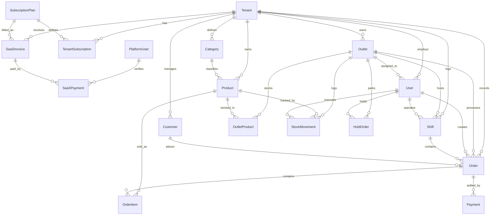

# EXISTING POS SYSTEM AUDIT
**Architecture & Business Discovery Baseline Report**

* **Peran Auditor:** Senior Software Architect, Product Architect, & System Analyst
* **Status Sistem:** ~70% Matang (Core Retail & Quick-Service Active)
* **Target Arsitektur:** Multi-Tenant SaaS POS Platform (Retail, F&B, Services)
* **Metode Audit:** Read-Only Source Code & Database Discovery (Tanpa modifikasi kode)

---

## A. Executive Summary

Sistem yang diaudit saat ini adalah **Point of Sale (POS) berbasis Web dengan kapabilitas Multi-Outlet dan modul SaaS Tenant Management**. Fokus operasional sistem yang telah berjalan nyata di kode sumber adalah model bisnis **General Retail & Quick-Service Counter**.

Sistem berada pada fase transisi evolusioner dari aplikasi *single-merchant* menjadi *multi-tenant SaaS platform*:
1. **Core POS & Transaksi Kasir:** Telah matang dan stabil. Mendukung pencarian produk/barcode cepat, keranjang belanja, kalkulasi pajak/service charge dinamis per cabang, split payment (Tunai + QRIS), hold order (antrean tertahan), serta manajemen shift kasir lengkap (modal awal, X-Report mid-shift, tutup shift, dan rekonsiliasi kas riil vs tercatat / Z-Report).
2. **Inventori & Pergudangan Multi-Cabang:** Menggunakan model sentralisasi kartu stok berbasis cabang (`outlet_products` dan `stock_movements`). Gudang Pusat dimodelkan sebagai cabang khusus (`isWarehouse: true`). Mendukung penerimaan barang (PO), pengeluaran barang rusak, penyesuaian fisik (stock opname), dan mutasi transfer antar cabang dengan transaksi atomik database ACID.
3. **Multi-Tenant / SaaS Platform:** Skema database telah mengadopsi entitas penyewa (`Tenant`), pengguna platform internal (`PlatformUser`), paket langganan (`SubscriptionPlan`), lisensi aktif (`TenantSubscription`), dan faktur tagihan (`SaaSInvoice`). Tersedia portal Level 1 Superadmin Platform (`#superadmin`) dengan fitur approval pendaftaran klien baru, pemantauan tenant, dan impersonasi login.
4. **Kesiapan Vertikal Industri:** Sistem saat ini murni **Retail**. Fitur lanjutan untuk **F&B** (Kitchen Display System/KDS, Resep Bahan Baku/BOM, manajemen denah meja interaktif) dan **Services** (Booking/Appointment, penugasan teknisi, komisi staf per pengerjaan jasa) **belum diimplementasikan di backend maupun database**, melainkan baru sebatas label antarmuka (UI only) atau catatan teks bebas.

---

## B. Technology Stack

### 1. Frontend Application
* **Framework & Core:** React 19.2.8 (Single Page Application)
* **Language:** TypeScript 6.0.2
* **Build System & Dev Server:** Vite 8.3.0 (Proxying `/api` ke backend port 5001)
* **UI & Styling:** Tailwind CSS 3.4.19, Lucide React 1.46.0 (Icons), PostCSS 8.5.28, Autoprefixer 10.6.0
* **State Management:** React Component State Hooks (`useState`, `useEffect`) & Browser `localStorage` (`authStorage` untuk token JWT dan profil user)
* **Routing:** Client-side Hash Router manual di `App.tsx` (`#landing`, `#pos` / `#login`, `#superadmin`, deep-linking `#register`)
* **Dokumen Struk:** jsPDF 4.2.1 (Kalkulasi dimensi dan pencetakan struk thermal roll 58mm & 80mm)

### 2. Backend API & Services
* **Runtime & Framework:** Node.js dengan Express 4.21.0
* **Language:** TypeScript 5.6.2 (dieksekusi menggunakan `tsx 4.19.1` saat dev / `tsc` saat build)
* **Arsitektur API:** RESTful API JSON over HTTP
* **Validasi Input:** Zod 3.23.8 (Skema validasi ketat di seluruh endpoint POST/PUT)
* **Otentikasi:** JSON Web Token (`jsonwebtoken 9.0.3`) dengan hashing kata sandi `bcryptjs 2.4.3`
* **Otorisasi:** Role-Based Access Control (RBAC) via `authenticate` & `authorize` middlewares
* **Email Service:** Nodemailer 10.0.10 (Koneksi ke SMTP server untuk nota transaksi dan verifikasi)

### 3. Database & ORM
* **Database Engine:** PostgreSQL
* **ORM:** Prisma Client & CLI 5.22.0
* **Skema & Migrasi:** Prisma Schema (`server/prisma/schema.prisma`) dengan 18 entitas relasional
* **Data Seeding:** TypeScript seeder (`server/prisma/seed.ts`)

### 4. Infrastruktur & Operasional
* **Hosting:** Local / Self-hosted Node.js process (Port 5001) dan Vite dev server (Port 5173)
* **Background Jobs:** Tidak ada worker terpisah (BullMQ/Redis). Operasi email berjalan asynchronous via Node event loop.
* **Cache:** Memory caching untuk tenant default (`cachedDefaultTenantId`). Belum menggunakan Redis.
* **Logging:** Standard console output (`console.log`, `console.error`) tanpa centralized logger.

---

## C. Project Structure

```text
pos_project/pos_apps/
├── client/                               # FRONTEND REACT APPLICATION
│   ├── src/
│   │   ├── components/                   # Komponen Reusable & Modal
│   │   │   ├── saas/                     # OnboardingWizardModal.tsx
│   │   │   ├── PaymentModal.tsx          # Pembayaran Tunai, QRIS, Split Payment
│   │   │   ├── ProductModal.tsx          # Form Tambah/Edit Produk & Kustomisasi
│   │   │   ├── StockMovementModal.tsx    # Form Stok Masuk & Keluar
│   │   │   ├── StockTransferModal.tsx    # Form Mutasi Transfer Stok Antar-Cabang
│   │   │   ├── SupervisorFeesModal.tsx   # Modal Otorisasi Biaya & Diskon
│   │   │   ├── StartShiftModal.tsx       # Form Buka Shift Kasir
│   │   │   ├── CloseShiftModal.tsx       # Tutup Shift Kasir & Rekonsiliasi Kas
│   │   │   ├── XReportModal.tsx          # Modal Pratinjau X-Report Mid-Shift
│   │   │   └── OrderSuccessModal.tsx     # Pratinjau Struk, WhatsApp, & Cetak Ulang
│   │   ├── pages/                        # Halaman & Tampilan Utama
│   │   │   ├── SaasLandingPage.tsx       # Landing Page Publik & Pendaftaran Klien
│   │   │   ├── LoginPage.tsx             # Mesin Kasir Login (PIN) & Portal Pemilik (Email)
│   │   │   ├── SuperadminDashboardPage.tsx # Portal Level 1 Platform Superadmin
│   │   │   ├── DashboardPage.tsx         # Shell Navigasi Utama POS
│   │   │   ├── PosTerminalView.tsx       # Terminal Kasir (Katalog, Keranjang, Hold Order)
│   │   │   ├── ProductsView.tsx          # Master Katalog & Kategori
│   │   │   ├── InventoryView.tsx         # Manajemen Stok, Kartu Stok, Mutasi Transfer
│   │   │   ├── OrdersView.tsx            # Riwayat & Pelacakan Faktur Transaksi
│   │   │   ├── ShiftsAuditView.tsx       # Log Audit Sesi Kerja Kasir
│   │   │   ├── FinancialReportView.tsx   # Laporan Laba Kotor, HPP, & Arus Kas
│   │   │   ├── CustomersView.tsx         # Database Pelanggan & Member CRM
│   │   │   ├── UsersView.tsx             # Manajemen Staf & Peran Toko
│   │   │   └── OutletsView.tsx           # Manajemen Cabang & Gudang Pusat
│   │   ├── services/
│   │   │   └── api.ts                    # HTTP Client Terpusat untuk Seluruh API
│   │   ├── types/                        # Definisi TypeScript Interfaces
│   │   └── utils/                        # Generator Struk PDF, Format WA, Export CSV
│   └── package.json
│
├── server/                               # BACKEND NODE.JS EXPRESS APPLICATION
│   ├── prisma/
│   │   ├── schema.prisma                 # Skema Database Relasional (18 Model)
│   │   └── seed.ts                       # Database Seeder Data Awal
│   ├── src/
│   │   ├── config/                       # Prisma Client singleton
│   │   ├── controllers/                  # Logika Bisnis per Domain
│   │   │   ├── auth.controller.ts        # Otentikasi Email, PIN Kasir, Device Pairing
│   │   │   ├── category.controller.ts    # CRUD Kategori Produk
│   │   │   ├── customer.controller.ts    # CRUD Pelanggan & Metrik Belanja
│   │   │   ├── inventory.controller.ts   # Stok Masuk/Keluar, Opname, Transfer Cabang
│   │   │   ├── order.controller.ts       # Engine Checkout, Split Pay, Hold Order
│   │   │   ├── outlet.controller.ts      # Manajemen Cabang, Gudang, & Dynamic Fees
│   │   │   ├── platform.controller.ts    # Portal Superadmin, Approval, Impersonasi
│   │   │   ├── product.controller.ts     # Master Produk, Barcode, SKU, Stok Cabang
│   │   │   ├── report.controller.ts      # Analitik Laba Kotor, HPP, Arus Kas
│   │   │   ├── saas.controller.ts        # Registrasi Mandiri & Onboarding Wizard
│   │   │   ├── shift.controller.ts       # Siklus Shift Kasir, X-Report, Z-Report
│   │   │   └── user.controller.ts        # Manajemen Staf Toko
│   │   ├── middlewares/                  # Auth Middleware & Tenant Context Resolver
│   │   ├── routes/                       # Express Route Definitions
│   │   ├── services/                     # Layanan Nodemailer Email
│   │   └── index.ts                      # Server Bootstrap & Router Mounting
│   └── package.json
└── ...
```

---

## D. Existing Modules & Feature Inventory

| Modul | Fitur | Status | Bukti / Lokasi Kode | Catatan Arsitektur |
| :--- | :--- | :--- | :--- | :--- |
| **Authentication** | Login Email & Password | **Implemented** | `server/src/controllers/auth.controller.ts:34` | Case-insensitive email, enkripsi bcrypt |
| **Authentication** | Login PIN Kasir (6 Digit) | **Implemented** | `server/src/controllers/auth.controller.ts:133` | Otorisasi cepat staf tanpa password panjang |
| **Authentication** | Device Pairing Mesin Kasir | **Implemented** | `server/src/controllers/auth.controller.ts:285` | Pairing device via Slug/Email/WA + PIN Pemilik |
| **SaaS Platform** | Registrasi Mandiri Tenant | **Implemented** | `server/src/controllers/saas.controller.ts:56` | Calon klien mendaftar; status awal `PENDING` |
| **SaaS Platform** | Approval Tenant Superadmin | **Implemented** | `server/src/controllers/platform.controller.ts:241` | Mengaktifkan masa trial 14 hari |
| **SaaS Platform** | Impersonasi Tenant | **Implemented** | `server/src/controllers/platform.controller.ts:460` | Superadmin dapat inspeksi dashboard toko klien |
| **Product Master** | Master Produk, Barcode, SKU | **Implemented** | `server/src/controllers/product.controller.ts:192` | SKU & Barcode unik per tenant |
| **Product Master** | Kategori Produk | **Implemented** | `server/src/controllers/category.controller.ts` | Kategori terisolasi per tenant |
| **Product Master** | Varian Produk (Size/Warna) | **Not Found** | `server/prisma/schema.prisma:284` | Tidak ada tabel variant atau sub-SKU di database |
| **Product Master** | Modifiers / Opsi Tambahan | **Partially Implemented** | `client/src/components/ProductModal.tsx:448` | Disimpan sebagai string JSON di kolom `description` |
| **POS / Sales** | Engine Checkout Transaksi | **Implemented** | `server/src/controllers/order.controller.ts:88` | Transaksi atomik: Order, Item, Bayar, Potong Stok |
| **POS / Sales** | Split Payment (Tunai + QRIS)| **Implemented** | `server/src/controllers/order.controller.ts:259` | Mendukung kombinasi pembayaran tunai dan QRIS |
| **POS / Sales** | Hold Order (Antrean Tertahan)| **Implemented** | `server/src/controllers/order.controller.ts:532` | Snapshot JSON keranjang disimpan di database |
| **POS / Sales** | Pajak & Biaya Dinamis | **Implemented** | `server/src/controllers/outlet.controller.ts:140` | Configurable per cabang (Persentase/Nominal) |
| **Shift Kasir** | Buka Shift & Modal Awal | **Implemented** | `server/src/controllers/shift.controller.ts:21` | Mencegah transaksi sebelum kasir buka shift |
| **Shift Kasir** | X-Report (Audit Mid-Shift) | **Implemented** | `server/src/controllers/shift.controller.ts:133` | Audit interim penjualan tunai tanpa tutup shift |
| **Shift Kasir** | Tutup Shift & Z-Report | **Implemented** | `server/src/controllers/shift.controller.ts:233` | Rekonsiliasi otomatis kas fisik vs sistem |
| **Inventory** | Stok Masuk, Keluar, & Opname | **Implemented** | `server/src/controllers/inventory.controller.ts:35` | Mencatat kartu stok mutasi lengkap |
| **Inventory** | Mutasi Transfer Antar Cabang | **Implemented** | `server/src/controllers/inventory.controller.ts:414` | Memotong cabang asal & menambah cabang tujuan |
| **Inventory** | Low Stock Alert | **Implemented** | `server/src/controllers/inventory.controller.ts:366` | Mengambil barang di bawah ambang batas minimum |
| **Inventory** | Resep / BOM Bahan Baku | **Not Found** | `server/prisma/schema.prisma` | Belum ada pemotongan bahan baku F&B |
| **Purchasing** | Purchase Order (PO) Formal | **Stub / Placeholder** | `server/src/controllers/inventory.controller.ts:65` | Hanya field string `poNumber` di catatan mutasi |
| **Customer CRM** | Database Pelanggan & Member | **Implemented** | `server/src/controllers/customer.controller.ts` | Nama, No. HP, Email, total belanja & visit |
| **Reporting** | Laba Kotor & Analisis HPP | **Implemented** | `server/src/controllers/report.controller.ts:9` | Gross Sales, Net Revenue, COGS, Gross Margin |
| **Multi-Outlet** | Multi-Branch & Gudang Pusat | **Implemented** | `server/src/controllers/outlet.controller.ts` | Outlet vs Warehouse (`isWarehouse: true`) |
| **F&B Specific** | Manajemen Denah Meja (Table)| **UI Only** | `client/src/pages/PosTerminalView.tsx:1346` | Hanya field teks nama/nomor meja di pesanan |
| **F&B Specific** | Kitchen Display System (KDS)| **Not Found** | N/A | Belum ada antrean layar dapur / bar |
| **Services Specific**| Booking / Jadwal Layanan | **Not Found** | N/A | Belum ada reservasi waktu layanan jasa |
| **Services Specific**| Komisi Teknisi / Staf | **Not Found** | N/A | Belum ada perhitungan bagi hasil pegawai |

---

## E. Business Domain Model



### Entitas Bisnis Utama:
1. **Tenant:** Badan usaha penyewa software (misal: Toko Kopi Nusantara).
2. **PlatformUser:** Akun pengelola internal SaaS (Superadmin, Support, Finance).
3. **Outlet:** Titik fisik operasional toko atau gudang penyimpanan persediaan (`isWarehouse = true`).
4. **User:** Petugas merchant dengan peran hierarkis (`ADMIN`, `SUPERVISOR`, `WAREHOUSE`, `CASHIER`).
5. **Product & Category:** Master katalog barang dagangan dengan `basePrice` dan `costPrice` (HPP).
6. **OutletProduct:** Saldo persediaan fisik dan harga jual khusus per cabang (`@@unique([outletId, productId])`).
7. **StockMovement:** Kartu stok historis yang mencatat penambahan/pengurangan persediaan beserta pelakunya.
8. **Shift:** Sesi operasional laci kasir harian dari pembukaan kas awal hingga penutupan kas fisik.
9. **Order & OrderItem:** Header dan rincian transaksi belanja beserta snapshot harga jual dan HPP saat transaksi.
10. **Payment:** Catatan penyelesaian pembayaran transaksi (mendukung split payment tunai dan QRIS).
11. **HoldOrder:** Penyimpanan sementara transaksi belanja yang tertahan / antrean meja.
12. **Customer:** Master data pelanggan/member toko, kontak WhatsApp, dan akumulasi belanja.

---

## F. Sales / POS Transaction Flow

```text
[Kasir di Terminal POS]
       ↓ (1)
[Pilih Produk / Scan Barcode] → (Ambil harga cabang & cek stok di OutletProduct)
       ↓ (2)
[Kustomisasi Modifiers]       → (Jika ada JSON modifier, sesuaikan delta harga di client)
       ↓ (3)
[Hold Order (Opsional)]        → (Bisa disimpan ke tabel hold_orders jika antrean tertunda)
       ↓ (4)
[Kalkulasi Biaya & Diskon]    → (Subtotal - Diskon Global + Service Charge + Pajak Cabang)
       ↓ (5)
[Pilih Pembayaran]            → (Tunai, QRIS, atau Split Payment Tunai + QRIS)
       ↓ (6)
[POST /api/orders/checkout]   → (Validasi skema Zod)
       ↓ (7)
[Verifikasi Stok Fisik]        → (Loop cek OutletProduct.stock >= qty; tolak jika kurang)
       ↓ (8)
[Prisma ACID $transaction]     → (a) Buat Order header & nomor invoice unik
                                 (b) Buat baris OrderItem (snapshot costPrice & unitPrice)
                                 (c) Buat Payment records
                                 (d) Update Customer (totalSpent & visitCount)
                                 (e) Kurangi stok di OutletProduct (decrement)
                                 (f) Buat record kartu stok StockMovement (type: SALE_OUT)
       ↓ (9)
[Cetak Struk & Notifikasi]    → (Client: Generator PDF Struk 58/80mm, Kirim Email SMTP, Web WA)
```

**Karakteristik Implementasi:**
* **Coupling:** Penjualan, pembayaran, dan pemotongan stok dilakukan dalam **satu transaksi database monolitik** (`prisma.$transaction`). Ini menjamin konsistensi data stok pada retail, namun perlu didekopling untuk mendukung alur F&B restoran (*Pesan dulu, bayar belakangan*) dan Jasa (*Booking/DP dulu, pengerjaan, pelunasan kemudian*).

---

## G. Inventory & Warehouse Deep Audit

### 1. Product / Item
* **Product:** Ada (`Product` model).
* **SKU & Barcode:** Ada. Diproteksi unik per tenant (`@@unique([tenantId, barcode])`, `@@unique([tenantId, sku])`).
* **Variant:** `NOT IMPLEMENTED / NOT FOUND`. Tidak ada tabel varian produk terpisah.
* **Unit:** String tunggal (misal: "Pcs", "Box", "Kg", default: "Pcs").
* **Batch / Serial Number / Expiry:** `NOT IMPLEMENTED / NOT FOUND`.

### 2. Warehouse
* **Warehouse Entity:** Gudang dimodelkan sebagai entitas `Outlet` dengan penanda boolean `isWarehouse: true`.
* **Bin / Storage Location:** `NOT IMPLEMENTED / NOT FOUND`.

### 3. Stock Tracking
* **Stock Balance:** Disimpan sebagai nilai skalar pada kolom `outlet_products.stock`.
* **Stock Ledger:** Ada via tabel `StockMovement` (mencatat tipe mutasi, kuantitas delta, tanggal, staf, dan outlet).
* **Stock Adjustment (Opname):** Ada (`/api/inventory/adjustment`), menghitung selisih fisik dan membuat kartu stok `ADJUSTMENT`.
* **Stock Transfer:** Ada (`/api/inventory/transfer`), memotong cabang asal (`TRANSFER_OUT`) dan menambah cabang tujuan (`TRANSFER_IN`) secara atomik.
* **Stock Receiving (PO):** Ada (`/api/inventory/stock-in`), menambah saldo stok dan mencatat kartu stok `PURCHASE_IN`.

### 4. Purchasing & Supplier
* **Purchase Order (PO):** `NOT IMPLEMENTED / NOT FOUND` (Hanya input teks `poNumber` pada catatan mutasi).
* **Supplier Master:** `NOT IMPLEMENTED / NOT FOUND` (Hanya input teks `supplierName` pada catatan mutasi).
* **Goods Receipt & Purchase Invoice:** `NOT IMPLEMENTED / NOT FOUND`.

### 5. Consumption & Manufacturing
* **Ingredient Consumption / Recipe / BOM / Production:** `NOT IMPLEMENTED / NOT FOUND`.

---

## H. Database & Data Model Analysis

1. **Struktur Relasional:**
   * Skema database dirancang cukup teratur dengan 18 model dan relasi foreign key yang rapi (`Cascade` untuk order items dan payments, `Restrict` untuk produk yang sudah terjual).
2. **Nullable Tenant ID (Risiko Isolasi Data):**
   * Kolom `tenantId` pada tabel-tabel penting (`outlets`, `users`, `categories`, `products`, `orders`, `shifts`, `hold_orders`, `customers`) berstatus `String?` (Nullable).
   * **Dampak:** Jika query Prisma tidak menyertakan filter `where: { tenantId }`, data dari tenant berbeda berpotensi bocor atau tercampur secara logis.
3. **Compound Indexes & Uniqueness:**
   * Sudah baik: `@@unique([tenantId, barcode])`, `@@unique([tenantId, sku])`, `@@unique([tenantId, name])` pada kategori, dan `@@unique([outletId, productId])` pada stok cabang.
4. **Audit Fields & Soft Deletes:**
   * Seluruh tabel memiliki `createdAt` dan `updatedAt`.
   * Flag `isActive` tersedia pada `User`, `Product`, `Outlet`. Namun, mekanisme *soft delete* formal (seperti kolom `deletedAt`) belum diterapkan.

---

## I. API Architecture

* **Struktur Endpoint:** Terorganisasi rapi berdasarkan domain controller (`/api/auth`, `/api/products`, `/api/inventory`, `/api/orders`, `/api/shifts`, `/api/reports`, `/api/customers`, `/api/outlets`, `/api/platform`, `/api/saas`).
* **Validasi:** Menggunakan pustaka Zod pada seluruh endpoint `POST` dan `PUT`. Error validasi dikembalikan dengan kode 400 dan pemetaan field yang jelas.
* **Standar Response:** Konsisten menggunakan format JSON `{ status: 'success' | 'error', message?: string, data?: any, errors?: any }`.
* **Kelemahan API:**
  * Belum ada mekanisme **Idempotency Key** pada endpoint `/api/orders/checkout`. Jika jaringan terputus dan kasir menekan tombol bayar 2 kali, ada risiko duplikasi order.
  * Pagination baru diterapkan secara parsial (pada customer dan orders), sementara endpoint produk masih mengambil data sekaligus tanpa *cursor-based pagination*.

---

## J. Frontend Architecture

* **Komposisi Tampilan:** Menggunakan sistem view switcher manual di `DashboardPage.tsx` (`activeTab: 'pos' | 'overview' | 'products' | 'inventory' | 'orders' | 'customers' | 'reports' | 'shifts' | 'users' | 'outlets'`).
* **Abstraksi API:** Terpusat dalam satu file service `client/src/services/api.ts`.
* **State Management:** Mayoritas state diatur secara lokal pada tingkat komponen halaman. Belum menggunakan Global State Manager (seperti Zustand atau Redux) maupun query caching library (seperti TanStack Query), sehingga perpindahan tab selalu memicu refetch data ke server.
* **Trik Penyimpanan Modifiers:** Frontend melakukan `JSON.parse` dan `JSON.stringify` pada field teks `product.description` untuk menyimpan metadata modifiers dan flag `hasStock`.

---

## K. Authentication & Authorization

* **Hierarki Role:**
  * **Level 1 (SaaS Platform):** `SUPER_ADMIN`, `SUPPORT_AGENT`, `FINANCE_ADMIN` (Tabel `platform_users`).
  * **Level 2 (Merchant Toko):** `ADMIN` (Owner/Pemilik), `SUPERVISOR`, `WAREHOUSE`, `CASHIER` (Tabel `users`).
* **Mekanisme Login:**
  * **Portal Pemilik / Superadmin:** Email + Kata Sandi (bcrypt).
  * **Mesin Kasir Counter:** Autentikasi ganda via Device Pairing (ID Toko/Slug/No. HP + PIN Pemilik), kemudian kasir memilih nama dan memasukkan PIN 6-digit pribadi.
* **Role-Based Tab Filtering:**
  * Kasir hanya dapat mengakses tab `pos`, `orders`, `customers`, `shifts`.
  * Staf gudang hanya dapat mengakses tab `inventory`, `products`, `overview`.
  * Pemilik (`ADMIN`) memiliki akses penuh ke semua tab operasional toko.

---

## L. Multi-Outlet Analysis

* **Dukungan Multi-Outlet:** **IMPLEMENTED**.
* **Model Isolasi Cabang:**
  * Satu tenant dapat memiliki banyak cabang toko dan gudang (`outlets`).
  * Kasir dan staf gudang dikunci ke cabang penugasan mereka (`user.outletId`), sementara Admin/Owner dapat berpindah konteks cabang melalui dropdown selector.
  * Setiap produk memiliki harga khusus dan saldo stok mandiri di masing-masing cabang (`outlet_products`).
  * Transaksi penjualan (`orders`) dan sesi kasir (`shifts`) selalu terikat ke `outletId`.
  * Pelaporan keuangan (`/api/reports/financial`) dapat difilter per cabang maupun konsolidasi seluruh cabang perusahaan (`outletId = 'ALL'`).

---

## M. SaaS / Multi-Tenant Readiness

| Domain | Status Kesiapan | Bukti Implementasi | Catatan Kritis |
| :--- | :--- | :--- | :--- |
| **Penyewa (Tenant)** | **Ready** | Model `Tenant`, registrasi mandiri, status langganan | Mendukung siklus hidup dari Trial 14 hari hingga Active |
| **Isolasi Pengguna** | **Ready** | User terikat ke `tenantId` | Admin tenant hanya melihat staf tokonya sendiri |
| **Isolasi Produk** | **Ready** | Product unik per `tenantId` | Barcode dan SKU terisolasi per tenant |
| **Isolasi Transaksi** | **Partially Ready** | `Order.tenantId` diisi saat checkout | Kolom `tenantId` masih nullable di database |
| **Isolasi Stok** | **Partially Ready** | Stok terisolasi via `Outlet.tenantId` | `OutletProduct` tidak memiliki kolom `tenantId` langsung |
| **Isolasi Pelanggan** | **Ready** | Customer memiliki `tenantId` | Member terdaftar per tenant |
| **Enforcement Lisensi** | **Partially Ready** | `verifyTenantLicense` memblokir `SUSPENDED` | Pengecekan masa trial habis belum dipicu cron otomatis |

---

## N. Core vs Business-Specific Classification

### 1. Core POS (Universal untuk Retail, F&B, dan Services)
* Sistem Otentikasi, JWT, dan PIN Kasir
* Manajemen Pengguna & Hierarki Role
* Multi-Tenant Organization & Manajemen Cabang Toko
* Sesi Kasir & Shift Management (Modal Awal, X-Report, Z-Report)
* Engine Checkout, Kalkulasi Pajak, dan Biaya Tambahan Dinamis
* Engine Pembayaran (Tunai, QRIS, Split Payment)
* Modul Pelanggan (CRM Member Dasar)
* Generator Struk Pembayaran (PDF 58mm/80mm & Teks Ringkas)

### 2. Retail-Specific (Sudah Terpasang Lengkap)
* Barcode scanning dan pencarian instan via SKU
* Alokasi stok cabang dan gudang logistik pusat
* Kartu stok mutasi (Stock-In, Damage-Out, Stock Opname)
* Mutasi transfer stok antar-cabang (Inter-branch transfer)
* Low Stock Alert (Ambang batas minimum stok)
* Kalkulasi HPP (Cost of Goods Sold) dan margin laba kotor retail

### 3. F&B-Specific (Belum Terpasang / Parsial)
* *Hold Order:* Parsial (Bisa menyimpan pesanan sementara atas nama nomor meja).
* *Table Management (Floor Plan, status meja terisi/kosong):* `NOT IMPLEMENTED`.
* *Kitchen Ticket Printing / Kitchen Display System (KDS):* `NOT IMPLEMENTED`.
* *Recipe / Raw Material Inventory (Pemotongan bahan baku saat menu terjual):* `NOT IMPLEMENTED`.
* *Split Bill per kursi / per orang:* `NOT IMPLEMENTED`.

### 4. Services-Specific (Belum Terpasang)
* *Appointment / Booking System:* `NOT IMPLEMENTED`.
* *Produk Non-Fisik (Service tanpa pelacakan stok):* Parsial (Metadata JSON `hasStock: false`).
* *Employee / Stylist / Technician Commission:* `NOT IMPLEMENTED`.
* *Service Order / Progress Status (Diterima, Dikerjakan, Selesai):* `NOT IMPLEMENTED`.

---

## O. Integrations

1. **Email Gateway (Nodemailer):**
   * **Tujuan:** Mengirimkan nota transaksi digital dan email aktivasi pendaftaran klien.
   * **Lokasi:** `server/src/services/mail.service.ts`.
   * **Status:** Terintegrasi via protokol SMTP standar.
2. **WhatsApp Gateway:**
   * **Tujuan:** Berbagi struk digital ke pelanggan via WhatsApp.
   * **Lokasi:** `client/src/components/OrderSuccessModal.tsx:170`.
   * **Status:** Client-side URL redirection (`api.whatsapp.com/send?text=...`). **Belum terintegrasi dengan WhatsApp Cloud API resmi**.
3. **Payment Gateway (QRIS / EDC):**
   * **Tujuan:** Menerima pembayaran non-tunai.
   * **Status:** **Simulasi manual**. Kasir menginput nomor referensi QRIS secara manual; belum ada webhook otomatis ke Midtrans/Xendit/Doku.
4. **Thermal Printer Hardware:**
   * **Tujuan:** Cetak struk kasir 58mm dan 80mm.
   * **Status:** Menggunakan generator dokumen jsPDF client-side atau dialog browser `window.print()`. Belum ada driver WebUSB / ESC-POS raw socket.

---

## P. Reporting

1. **Laporan Finansial & Akuntansi Kasir (`/api/reports/financial`):**
   * **Gross Sales:** Total nilai penjualan kotor sebelum diskon.
   * **Net Revenue:** Penjualan bersih setelah dikurangi diskon global.
   * **Total COGS (HPP):** Akumulasi harga modal barang yang terjual.
   * **Gross Profit & Margin:** Laba kotor nominal dan persentase keuntungan.
   * **Arus Kas Pembayaran:** Rincian nominal dan jumlah transaksi Tunai vs QRIS.
   * **Peringkat Produk & Kategori Terlaris:** Volume unit terjual dan kontribusi omzet.
   * **Tren Harian:** Penjualan per tanggal dalam rentang waktu yang dipilih.
2. **Laporan Audit Sesi Kasir (`/api/shifts`):**
   * Riwayat modal awal, kas sistem, kas fisik, dan selisih (selisih lebih / selisih kurang) per kasir dan per cabang.
3. **Isolasi Laporan:**
   * Laporan sudah **Tenant-Aware** dan **Outlet-Aware** (bisa memilih satu cabang spesifik atau konsolidasi seluruh cabang).

---

## Q. Technical Debt & Architectural Risks

### Critical (Risiko Signifikan untuk SaaS Masa Depan)
1. **Nullable `tenantId` pada Skema Relasional:**
   * *Problem:* Relasi `tenantId` diizinkan `null` pada tabel-tabel data operasional.
   * *Impact:* Kerentanan kebocoran data (*data leak*) antar klien jika ada query yang lupa memfilter `tenantId`.
   * *Why it matters:* SaaS multi-tenant yang aman wajib mewajibkan `tenantId NOT NULL` pada level skema database.
2. **Ketiadaan Idempotency Key pada Checkout:**
   * *Problem:* Request `POST /api/orders/checkout` tidak memiliki idempotency check.
   * *Impact:* Double payment atau double order jika kasir menekan tombol bayar berkali-kali pada jaringan lambat.

### Significant (Menghambat Pengembangan Vertikal Baru)
3. **Metadata Modifiers Disimpan di Kolom Teks Deskripsi:**
   * *Problem:* Opsi kustomisasi produk (misal: level gula, ukuran) disimpan sebagai string JSON di kolom `product.description`.
   * *Impact:* Database tidak bisa melakukan query agregasi terhadap modifier terlaris, dan pemotongan stok bahan baku untuk modifier mustahil dilakukan via SQL murni.
4. **Model Gudang Menyatu dengan Cabang (`Outlet.isWarehouse`):**
   * *Problem:* Gudang dimodelkan sebagai cabang toko biasa.
   * *Impact:* Menimbulkan kebingungan dalam pelaporan penjualan (gudang tidak boleh melakukan transaksi penjualan kasir, sehingga harus difilter secara manual di UI).
5. **Coupling Transaksi Penjualan dan Pengurangan Stok:**
   * *Problem:* Checkout langsung memotong stok di saat yang sama dengan pembayaran.
   * *Impact:* Menghambat alur bisnis F&B (di mana pesanan dibuat dulu, diantar, baru dibayar kemudian) dan Services (di mana stok alat/bahan dipotong saat pekerjaan selesai).

### Minor (Peluang Peningkatan Kualitas)
6. **State Management Monolitik di Frontend:**
   * *Problem:* State API dimuat ulang (*refetch*) setiap perpindahan tab tanpa caching client (misal: SWR / React Query).
   * *Impact:* Utilisasi bandwidth lebih tinggi dan sedikit *flicker* saat navigasi antar modul.

---

## R. Hardcoded Business Assumptions

1. **Asumsi Tipe Bisnis Default:**
   * Di database, default `businessType` diisi `"Retail"` (`schema.prisma:111`).
2. **Asumsi Satuan Default:**
   * Satuan barang default otomatis adalah `"Pcs"` (`schema.prisma:294`).
3. **Asumsi Saluran Penjualan:**
   * Skema mengasumsikan saluran penjualan `"DINE_IN"`, `"TAKEAWAY"`, `"GOFOOD"`, `"GRABFOOD"`, `"SHOPEEFOOD"`, `"DELIVERY"`. Ini adalah istilah tipikal industri Kuliner / F&B, sementara istilah untuk jasa (seperti *Walk-in / In-Clinic*) belum tersedia.
4. **Asumsi Penjualan Langsung Lunas (`PaymentStatus.PAID`):**
   * Setiap checkout diasumsikan langsung lunas saat itu juga (`order.controller.ts:340`). Sistem belum memiliki status piutang, *open bill*, atau *down payment* (DP).

---

## S. Reusable Existing Components

1. **Shift Management Engine (`shift.controller.ts` & `ShiftsAuditView.tsx`):**
   * Sangat matang, akurat, dan dapat digunakan langsung di industri apapun (Retail, F&B, Salon, dll.) untuk mencegah kecurangan kasir.
2. **Dynamic Tax & Service Fee Engine (`outlet.controller.ts:feesConfig` & `SupervisorFeesModal.tsx`):**
   * Arsitektur biaya dinamis per outlet yang sangat fleksibel untuk mengakomodasi regulasi PB1 Resto 10%, PPN retail 11%, maupun biaya platform ojek online.
3. **Multi-Outlet Inventory Transfer Engine (`inventory.controller.ts:transferStock`):**
   * Penanganan mutasi stok antar cabang dengan transaksi atomik dan pencatatan kartu stok ganda yang sangat rapi.
4. **SaaS Superadmin Platform & Impersonation Engine (`platform.controller.ts`):**
   * Fondasi manajemen penyewa SaaS yang solid (pendaftaran klien, verifikasi, pemantauan MRR, dan impersonasi akun klien untuk customer support).
5. **PDF Receipt Generator (`receiptPdf.ts`):**
   * Generator struk modular yang sudah menyesuaikan lebar fisik kertas 58mm dan 80mm secara presisi.

---

## T. Information Gaps

### Technical Unknowns
1. **Target Volume Data:** Berapa perkiraan jumlah transaksi per detik/menit per tenant yang ditargetkan untuk arsitektur SaaS final?
2. **Metode Isolasi Database Masa Depan:** Apakah akan tetap menggunakan *Shared Database, Shared Schema* (kolom `tenant_id`) atau akan beralih ke *Separate Database / Schema per Tenant*?
3. **Spesifikasi Perangkat Keras Kasir:** Apakah akan ada keharusan integrasi direct hardware (ESC/POS Bluetooth thermal printer, cash drawer RJ11, barcode scanner fisik USB) di mobile/tablet?

### Business / Product Unknowns
1. **Prioritas Vertikal Selanjutnya:** Antara **F&B** (Meja, Dapur/KDS, Resep Bahan Baku) vs **Services** (Booking, Jadwal Teknisi, Komisi Pegawai), mana yang menjadi prioritas peluncuran pertama setelah Retail?
2. **Model Lisensi F&B vs Retail:** Apakah fitur F&B/Services akan dijual sebagai paket langganan terpisah (*Add-on Modul*) atau termasuk dalam paket Pro?
3. **Kebutuhan Akuntansi Lanjutan:** Apakah sistem POS ini ditargetkan memiliki modul Jurnal Umum / Neraca sendiri, atau diintegrasikan ke software akuntansi eksternal (seperti Accurate, Jurnal, Xero)?

---

## U. Recommended NEXT ANALYSIS STEPS

1. **Analisis Pemisahan Domain Core POS vs Domain Plugin Vertikal:**
   * Menganalisis bagaimana memisahkan alur Order Header agar independen dari domain stok (memungkinkan alur *Order First, Pay Later* untuk F&B dan *Deposit First, Work Later* untuk Jasa).
2. **Analisis Desain Database untuk Modifiers & Variants:**
   * Merancang model tabel relasional untuk Varian (Matrix SKU) dan Modifier (Item kustomisasi) untuk menggantikan penyimpanan JSON pada kolom `description`.
3. **Analisis Penguatan Multi-Tenancy (Strict Multi-Tenant Isolation):**
   * Mengaudit dependensi kode yang masih mengizinkan `tenantId` bernilai `null` dan merumuskan strategi pengetatan `NOT NULL` serta Row-Level Security (RLS).
4. **Analisis Kebutuhan Modul F&B (Recipe / Bill of Materials):**
   * Menelaah bagaimana relasi antara 1 Menu Produk dengan banyak Bahan Baku (Ingredients) beserta satuan konversinya (misal: 1 Cup Kopi memotong 18 gram Biji Kopi dan 120 ml Susu).
5. **Analisis Kebutuhan Modul Services (Appointment & Work Orders):**
   * Menelaah struktur data jadwal staf, penugasan teknisi/terapis, dan formula perhitungan komisi staf per transaksi jasa.
