# DATA ARCHITECTURE RFC: POS MULTI-TENANT SAAS PLATFORM
## Core Engine + Multi-Vertical Industry Modules (Retail, F&B, Services)

**Document ID:** RFC-2026-09-DATA-01 (Revision 4)  
**Status:** RFC REVISION 4 — OWNER DECISIONS INCORPORATED — READY FOR SCHEMA DESIGN REVIEW  
**Classification:** Strategic Architectural Specification (Authoritative Pre-Schema RFC)  
**Target Platform:** Multi-Tenant Cloud POS SaaS Platform  
**Target Verticals:** Retail, Food & Beverage (F&B), Services  
**Author:** Principal Software & Data Architect (Antigravity)  
**Date:** September 19, 2026  

---

## 1. Status

`RFC REVISION 4 — OWNER DECISIONS INCORPORATED — READY FOR SCHEMA DESIGN REVIEW`

This document represents **Revision 4 (Final Architecture RFC)**. It incorporates all approved Architectural Decision Records (ADR-001 through ADR-005) and the binding Project Owner decision on **User Identity Architecture (Model B)**:
* **ADR-001:** Direct `tenantId NOT NULL` on operational child records + Service-Layer Enforcement; PostgreSQL Row-Level Security (RLS) recognized as future defense-in-depth.
* **ADR-002:** Context-Driven Negative Stock Policy (`Tenant -> Location -> Item Override`); no hard database `CHECK (quantity >= 0)` constraint; full auditability in the stock ledger.
* **ADR-003:** Strict separation of Canonical Inventory UOM, Physical UOM Conversion, Purchasing UOM Conversion, and Commercial Packaging Multipliers.
* **ADR-004:** `InventoryBatch` introduced as an optional stock dimension from the initial target architecture; advanced batch lifecycles (FEFO, recalls) deferred.
* **ADR-005:** Lean Services scope using `ProductType.SERVICE_LABOR` with optional material consumables; full Services domain (Appointments, Work Orders, Commissions) deferred; unified platform.
* **Owner Decision — User Identity (Model B):** Tenant-scoped user identity. Operational staff log in using a human-friendly `userCode + PIN` pattern within their tenant context. Internal identity remains opaque UUID (`User.id`). Global `PlatformUser` remains strictly separate for superadmin platform operations.
* **Reconciliation Gate 2 Correction:** Clarified that `inventoryQuantityMultiplier` is a transactional conversion factor and does NOT alter physical stock baseline reconciliation.
* **Reconciliation Gate 3 Correction:** Clarified that only inventory-affecting operations require corresponding `InventoryLedger` entries; pure `SERVICE_LABOR` and non-stock orders are legitimately excluded.

All architectural gates are resolved. The document is ready for `PROMPT 09 — DATABASE/PRISMA SCHEMA DESIGN REVIEW`.

---

## 2. Document Purpose

The purpose of this document is to bridge:
```text
Domain Analysis & Validation Findings
                ↓
Approved Owner Decisions (ADR-001 to ADR-005 + Model B User Identity)
                ↓
Data Architecture RFC Revision 4 (This Document)
                ↓
Prompt 09 — Database/Prisma Schema Design Review
```

This specification resolves existing model deficiencies in the ~70% completed codebase (the overloaded `Product` god-entity, integer inventory constraints, tight order-payment-stock coupling, and global email collisions across tenants) while preserving working operational features (checkout flows, cashier shifts, multi-outlet management, and subscription billing) without requiring a disruptive full rewrite.

---

## 3. Scope

### In-Scope
* **Multi-Tenant Foundation:** Database tenancy architecture, tenant boundary enforcement, and cross-tenant reference prevention across all operational data models.
* **User & Operational Authentication (Model B):** Tenant-scoped user identity, internal UUID keys, tenant-scoped operational `userCode` (`UNIQUE(tenantId, userCode)`), PIN hash storage, and optional tenant-scoped email.
* **Domain Decomposition:** Separation of commercial catalog (`Product`, `ProductVariant`), physical inventory (`InventoryItem`, `InventoryBatch`, `StorageLocation`, `InventoryBalance`, `InventoryLedger`), recipes (`Recipe`, `RecipeItem`), modifiers (`ModifierGroup`, `ModifierItem`, `ModifierRecipeEffect`), and transactions (`Order`, `OrderItem`, `PaymentTransaction`, `Refund`, `RefundItem`).
* **Multi-Vertical Core Support:** Unified data models supporting Retail (barcodes, variants, packaging multipliers), F&B (recipes/BOM, modifier ingredient deductions, kitchen prep states), and Services (service labor products, optional consumable materials).
* **Inventory Mechanics:** Decimal precision, atomic transaction boundaries, row-level locking concurrency control (including first-row upsert race handling), context-driven negative stock handling, and batch tracking.
* **Migration & Compatibility:** Dual-write abstraction, phased schema expansion, corrected reconciliation gates, and legacy model mapping (`OutletProduct`, `StockMovement`).

### Out-of-Scope (Deferred / Non-Goals)
* Implementing application source code, Prisma schema files, or database migrations in this document.
* Enterprise ERP workflows: automated FEFO stock picking algorithms, automated lot recall workflows, vendor consignment, and advanced shelf-life analytics.
* Full Services domain expansion: standalone `ServiceDefinition`, `Appointment`, `WorkOrder`, `StaffAssignment`, `ServiceMaterialUsage`, and `StaffCommission` tables.
* Splitting the codebase into separate microservices (the system remains a modular monolith).

---

## 4. Goals

1. **Strict Multi-Tenant Isolation:** Ensure zero data contamination across tenants by combining direct `tenantId NOT NULL` columns on domain entities with mandatory service-layer filtering and validation.
2. **Tenant-Scoped Operational Staff Management:** Enable distinct tenants to manage their staff using intuitive operational codes (e.g. `KSR001`, `SPV001`) and PIN authentication without cross-tenant username or email collisions.
3. **True Separation of Commercial vs. Inventory Concerns:** Decouple sellable menu items and merchandise from physical bulk raw materials and stocked goods.
4. **Decoupled Order and Financial Lifecycles:** Separate order operational states (`OrderStatus`) from payment states (`PaymentStatus`) and physical stock deduction events.
5. **Audit-Grade Stock Ledger:** Provide an immutable stock movement ledger recording `balanceBefore`, `balanceAfter`, signed `quantityDelta`, actor, and transaction reference for every inventory change.
6. **Safe, Zero-Downtime Migration:** Provide an additive, non-destructive migration path (`EXPAND -> BACKFILL -> DUAL-WRITE -> VALIDATE -> CUTOVER -> CONTRACT`) that guarantees uninterrupted operations for existing tenants.

---

## 5. Non-Goals

1. **No Full Rewrite:** Do not discard existing, working code in checkout, shift management, and SaaS billing.
2. **No Premature Microservices:** Do not decouple the application into multiple independent deployables or distributed databases.
3. **No Domain Contamination:** Do not inject service-specific workflow fields (e.g., technician status, appointment timestamps) into core retail or commerce entities.
4. **No Premature Database RLS Prerequisite:** Do not block Phase 1 migration on complex PostgreSQL RLS policies; RLS remains a secondary defense-in-depth layer.

---

## 6. Source of Truth

The hierarchy of authority governing this RFC is:
1. **Existing Source Code & Actual Database Schema:** The physical reality of the running system (`server/prisma/schema.prisma`, actual backend controllers, and existing database migrations).
2. **`/docs/00_PROJECT_CONTEXT.md`:** Core project mandate and constraints.
3. **`/docs/architecture/01_EXISTING_SYSTEM_AUDIT.md`:** Audit of implemented vs missing features.
4. **`/docs/architecture/02_DEEP_DOMAIN_ANALYSIS.md`:** Deep-dive domain findings and coupling analysis.
5. **Approved ADRs (`/docs/decisions/`):** Binding architectural decisions (ADR-001 through ADR-005).
6. **Approved Owner Decision on User Identity (Model B):** Tenant-scoped operational user architecture.
7. **`/docs/validation/05_SCHEMA_CONSISTENCY_VALIDATION.md`:** Schema consistency findings and gap analysis.
8. **This RFC Document (Revision 4):** Authoritative synthesis of architectural direction.

Where conflicts exist between prior speculative documents and approved ADRs/Owner decisions, the approved decisions strictly supersede.

---

## 7. Architectural Principles

1. **Unified Platform / Modular Monolith:** A single multi-tenant database and backend platform powers Retail, F&B, and Services. Tenant feature flags toggle vertical capabilities without schema bifurcation.
2. **Defense-in-Depth Multi-Tenancy:** Direct `tenantId NOT NULL` foreign keys on operational tables ensure tenant partition visibility, while application-layer domain services explicitly validate cross-entity references.
3. **Tenant-Scoped Identity with Operational Login:** Staff accounts belong strictly to their tenant partition. Operational staff authenticate via tenant context and `userCode + PIN`, decoupling daily cashier operations from global email uniqueness.
4. **Commercial vs. Logistical Decoupling:** Customers purchase commercial products (`ProductVariant`); the warehouse and kitchen track logistical materials (`InventoryItem`). Respective lifecycles communicate through explicit recipes or packaging multipliers.
5. **Independent Operational & Financial Lifecycles:** An order can be confirmed before payment (table dining / invoicing) or paid before preparation (quick service / retail). Statuses must never be collapsed into a single column.
6. **Immutable Financial & Stock Ledgers:** Historical balances are never recalculated by updating past rows. Every inventory change appends a ledger row; financial adjustments create offsetting transactions.
7. **Strict Concurrency & Atomicity:** Inventory mutations and ledger insertions must execute within a single database transaction guarded by pessimistic row locks (`SELECT ... FOR UPDATE`), with explicit handling for first-row creation races.
8. **Additive Evolution:** New features are added as new tables and optional columns. Existing tables are deprecated only after dual-write verification and reconciliation gates pass.

---

## 8. Domain Boundaries

The platform is structured into clean bounded contexts:

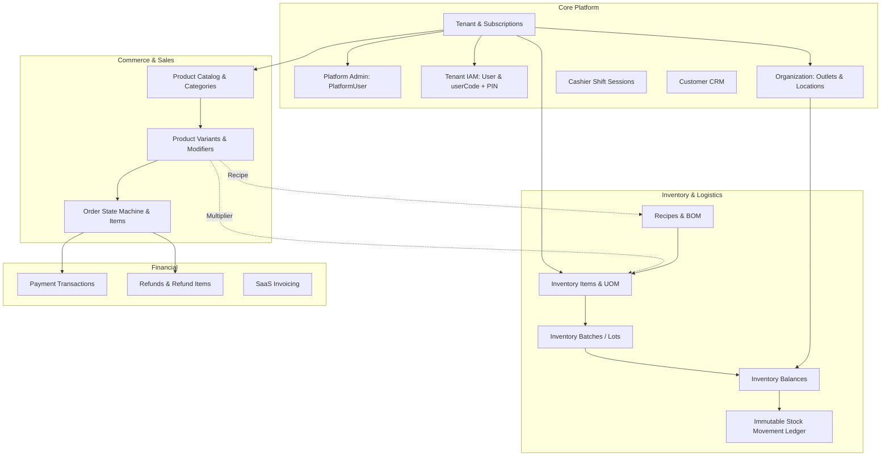

---

## 9. Tenant Architecture (ADR-001)

### Decision & Model
The platform adopts a **Shared Database, Shared Schema** architecture. All tenant data resides within the same PostgreSQL database, partitioned logically.

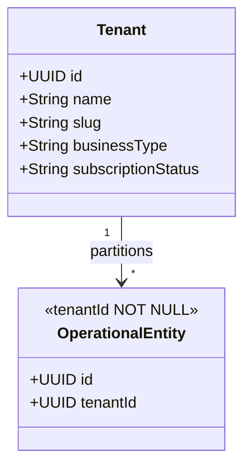

### Direct `tenantId NOT NULL` Requirement
To eliminate the architectural risks identified in `05_SCHEMA_CONSISTENCY_VALIDATION.md` (where child records lacked direct tenant keys and relied on multi-hop joins), **direct `tenantId NOT NULL` columns must be present on all tenant-owned operational and domain child records**, including:
* `User`
* `OrderItem`
* `RecipeItem`
* `ModifierGroup`, `ModifierItem`, `ProductModifierGroup`, `ModifierRecipeEffect`
* `PaymentTransaction`
* `Refund`, `RefundItem`
* `InventoryBatch`
* `InventoryBalance`
* `InventoryLedger`

### Service-Layer Enforcement & Cross-Tenant Reference Validation
A direct `tenantId` column alone does NOT prevent cross-tenant data corruption if an attacker or buggy query supplies foreign keys belonging to different tenants. 
1. **Mandatory Scope Injection:** All database reads and writes in application repositories must inject `WHERE tenantId = :tenantId`.
2. **Explicit Reference Validation:** Before persisting any relationship, domain services must explicitly verify that both parent and child belong to the identical tenant:
   * `RecipeItem.inventoryItemId` must have `InventoryItem.tenantId == RecipeItem.tenantId`.
   * `ModifierRecipeEffect.inventoryItemId` must have `InventoryItem.tenantId == ModifierRecipeEffect.tenantId`.
   * `ProductModifierGroup.modifierGroupId` must match `Product.tenantId`.
   * `OrderItem.variantId` must match `Order.tenantId`.
   * `InventoryBalance.inventoryBatchId` must match `InventoryBalance.tenantId`.

### Removal of Static Tenant Fallback
The legacy development fallback in `saas.middleware.ts` (`req.tenantId = 'toko-maju-jaya'`) is strictly deprecated. Any request lacking a valid, authenticated tenant context must fail immediately with HTTP `401 Unauthorized` or `403 Forbidden`.

### Role of PostgreSQL Row-Level Security (RLS)
PostgreSQL RLS is recognized as an architectural defense-in-depth mechanism. It will **not** be a mandatory prerequisite for Phase 1 cutover to avoid connection pooling complexities with Prisma, but the schema must include direct `tenantId NOT NULL` so that RLS policies can be enabled cleanly in later phases.

---

## 10. Core Platform Data: User & IAM (Model B Incorporated)

The Core Platform layer manages entities foundational to all business operations, implementing the Project Owner's approved **Model B (Tenant-Scoped User Identity)**:

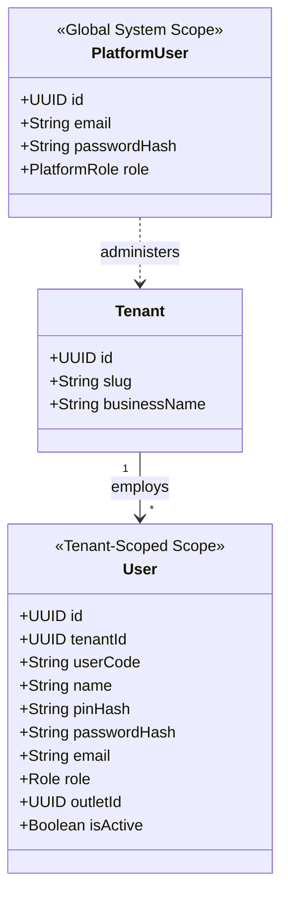

### 1. Separation of Platform vs. Tenant Identity
* **`PlatformUser` (Global System Level):** Represents SaaS internal platform staff (Superadmins, Billing Operators, Support Agents). Completely separate table with global unique email (`PlatformUser.email @unique`). Has no `tenantId`.
* **`User` (Tenant Level):** Represents merchant staff (Owners, Branch Managers, Supervisors, Cashiers, Warehouse Operators). Belongs strictly to a single `Tenant` (`tenantId NOT NULL`).

### 2. Operational Identity & Login Architecture (Model B)
To resolve the cashier onboarding collision problem where multiple stores employ workers without globally unique emails, the identity architecture defines:

* **Internal Identity:** Opaque UUID primary key (`User.id`). Used for foreign keys (`Order.cashierUserId`, `InventoryLedger.actorId`, `Shift.cashierUserId`).
* **Tenant Scoping:** `User.tenantId NOT NULL`. Every user belongs strictly to one tenant partition.
* **Operational Login Identifier (`userCode`):** A human-friendly code assigned by the tenant admin (e.g. `KSR001`, `KSR002`, `GUD001`, `SPV001`).
  * Uniqueness constraint: `UNIQUE (tenantId, userCode)`.
  * Tenant A and Tenant B can both have a user with code `KSR001` without conflict.
* **Operational Credential (`pinHash`):** Securely hashed 6-digit numeric PIN (e.g., bcrypt/argon2, never plaintext) used for rapid cashier login, lock screen unlocking, and manager transaction authorization.
* **Backoffice Credential (`passwordHash`):** Password hash used by Owners/Admins for browser-based dashboard login.
* **Email Attribute:** `User.email` is optional/nullable for operational staff (cashiers, kitchen staff) and tenant-scoped (`UNIQUE (tenantId, email)` when populated). Two independent tenants may employ staff with the same email (e.g. `staff@gmail.com`).

### 3. Operational Authentication Flows
* **POS Terminal Login:** Cashier selects or enters the store identifier / tenant slug, enters their `userCode` (e.g., `KSR001`), and submits their 6-digit PIN. The terminal authenticates against `(tenantId, userCode, pinHash)`.
* **Dashboard / Owner Login:** Owner supplies tenant identifier (or tenant slug) along with email/userCode and password.

---

## 11. Commerce Data

The Commerce domain manages products presented to customers:

1. **Category:** Hierarchical product organization (supporting parent/child categories for deep retail taxonomies or F&B menu sections).
2. **Product:** Master commercial catalog grouping representing a marketable concept, brand, or general item.
3. **ProductVariant:** Specific sellable SKU containing distinct attributes (size, color, packaging volume), individual pricing, and barcode identifiers.
4. **Tax & Service Charge:** Tenant-configured sales tax rules (e.g., PPN 11%) and F&B service fees applied at the outlet or item level.

---

## 12. Product vs. InventoryItem

The existing system's primary architectural flaw is that `Product` acts simultaneously as catalog, sellable unit, and inventory balance. This RFC enforces their absolute separation:

```text
Product / ProductVariant (Commercial Concept)
       ≠
InventoryItem (Physical / Logistical Concept)
```

| Dimension | `Product` / `ProductVariant` | `InventoryItem` |
| :--- | :--- | :--- |
| **Domain** | Commercial / Sales Catalog | Logistics / Stockroom / Kitchen |
| **Primary Identifier** | SKU, Barcode, Menu Code | Item Code, Logistics Barcode |
| **Pricing** | Retail Selling Price, Promotional Price | Purchase Cost (HPP), Moving Average Cost |
| **Unit of Measure** | Commercial Unit (Porsi, Cup, Pack, Dus) | Canonical Inventory UOM (Gram, ML, PCS) |
| **Physical Reality** | May be tangible goods, menu mixes, or services | Tangible material, raw ingredient, or merchandise |

### Three Major Architectural Patterns

```mermaid
flowchart TD
    subgraph Pattern 1: Retail
        R_Prod[Product: Aqua 600ml] --> R_Var1[Variant: Single Bottle]
        R_Prod --> R_Var2[Variant: Karton 24]
        R_Var1 -->|Multiplier = 1.0| R_Inv[InventoryItem: Aqua 600ml Bottle]
        R_Var2 -->|Multiplier = 24.0| R_Inv
    end

    subgraph Pattern 2: Food & Beverage
        F_Prod[Product: Beef Burger] --> F_Var1[Variant: Regular]
        F_Prod --> F_Var2[Variant: Double Patty]
        F_Var1 --> F_Rec1[Recipe A]
        F_Var2 --> F_Rec2[Recipe B]
        F_Rec1 -->|1 Bun, 1 Patty 100g, 15g Sauce| F_Ingredients[InventoryItems]
        F_Rec2 -->|1 Bun, 2 Patties 100g, 30g Sauce| F_Ingredients
    end

    subgraph Pattern 3: Services
        S_Prod[Product: Haircut Service] -->|ProductType.SERVICE_LABOR| S_Var[Variant: Standard Cut]
        S_Var --> S_NoStock[No Mandatory Physical Stock]
        S_Var -.->|Optional Consumable Recipe| S_Towel[InventoryItem: Disposable Towel]
    end
```

* **Retail:** Direct 1:1 or N:1 relationship via `ProductVariant.inventoryQuantityMultiplier`. No recipe required.
* **F&B:** Decoupled 1:N relationship mediated by `Recipe` owned by `ProductVariant`. Selling a menu item consumes multiple raw ingredients in canonical UOMs.
* **Services:** `ProductType.SERVICE_LABOR`. Does not deduct labor stock; may optionally deduct consumable supplies via a standard recipe linkage.

---

## 13. ProductVariant

`ProductVariant` is the concrete commercial unit of sale.

### Core Responsibilities
* Unique commercial identification: `sku` (tenant-scoped) and `barcode` (tenant-scoped, nullable).
* Base selling price (`price`) and cost price tracking (`costPrice`).
* Linkage to commercial packaging via `inventoryQuantityMultiplier` when directly linked to an `InventoryItem`.
* Active status and display ordering.

### SKU and Barcode Identification Rules
* **Canonical Commercial Identifier:** `ProductVariant` is the exclusive transactional entity scanned and sold at POS checkout. Therefore:
  * `ProductVariant.sku`: Authoritative SKU identifier used for checkout, stock counting, and POS search. Required and unique within tenant (`tenantId + sku`).
  * `ProductVariant.barcode`: Authoritative barcode scanned at POS register. Nullable and unique within tenant when present (`tenantId + barcode`).
* **Legacy Product SKU Demoted:** The legacy `Product.sku` column is demoted to a parent catalog reference code (or family code). It is retained temporarily during Phase 1 migration for backward compatibility, but transactional lookups must query `ProductVariant.sku` and `ProductVariant.barcode`.

### Inventory & Recipe Relationship
* A `ProductVariant` must follow exactly one stock linkage strategy:
  1. **Direct Inventory Link (Retail):** References `inventoryItemId` with an `inventoryQuantityMultiplier > 0`.
  2. **Recipe Link (F&B):** Owns a `Recipe` that defines consumption across multiple `InventoryItem`s.
  3. **No Stock Link (Services / Digital):** Contains neither `inventoryItemId` nor `Recipe`, representing pure service labor.
* Enforced by domain validation: a variant cannot link to both a direct `InventoryItem` and a `Recipe` simultaneously.

---

## 14. Inventory Architecture

The target inventory architecture separates master records, storage locations, balances, and historical movements:

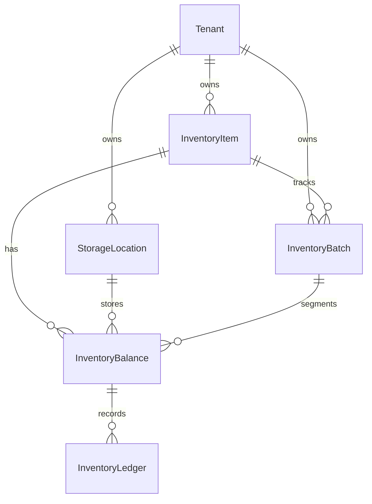

### Terminology Correction
**Crucial Architectural Clarification:** The stock movement ledger must **NOT** be referred to as "double-entry accounting." Double-entry accounting refers strictly to balanced financial debits and credits across general ledger accounts. The stock ledger is an **Immutable Stock Movement Ledger / Stock Mutation Ledger** tracking signed inventory quantity deltas and balance snapshots.

---

## 15. StorageLocation

`StorageLocation` represents a physical or logical area where inventory resides:
* Decouples stock keeping from commercial outlets. An `Outlet` can have multiple `StorageLocation`s (e.g., "Main Sales Floor", "Back Warehouse", "Kitchen Prep Cooler", "Bar Station").
* A central warehouse is simply a `StorageLocation` associated with a warehouse-type outlet or designated as a standalone facility.
* Every balance record and ledger entry must reference an explicit `storageLocationId`.

---

## 16. InventoryBalance

`InventoryBalance` represents the current physical stock state at a specific location.

### Stock Dimension Tuple
The stock dimension represents the physical segmentation of stock:
* **Non-Batched Items:** `(tenantId, inventoryItemId, storageLocationId)` where `inventoryBatchId IS NULL`.
* **Batched Items:** `(tenantId, inventoryItemId, storageLocationId, inventoryBatchId)`.

### Balance Uniqueness Invariant
The database must guarantee that duplicate balance records cannot exist for the same stock dimension:
1. **Non-Batched Invariant:** For any combination of `(tenantId, inventoryItemId, storageLocationId)`, there must be at most **one** `InventoryBalance` row where `inventoryBatchId IS NULL`.
2. **Batched Invariant:** For any combination of `(tenantId, inventoryItemId, storageLocationId, inventoryBatchId)`, there must be at most **one** `InventoryBalance` row for that specific batch.

> [!IMPORTANT]
> **PostgreSQL Nullable Unique Concern:** In standard SQL and PostgreSQL, a traditional composite unique constraint `UNIQUE (tenant_id, item_id, location_id, batch_id)` permits duplicate rows when `batch_id IS NULL` because `NULL != NULL`.
> 
> The exact database implementation mechanism to enforce this invariant is classified as `[OPEN SCHEMA IMPLEMENTATION DETAIL]`. Acceptable schema mechanisms for evaluation in Prompt 09 include:
> * Two partial unique indexes:
>   ```sql
>   CREATE UNIQUE INDEX uq_bal_non_batched ON "InventoryBalance" (tenant_id, inventory_item_id, storage_location_id) WHERE inventory_batch_id IS NULL;
>   CREATE UNIQUE INDEX uq_bal_batched ON "InventoryBalance" (tenant_id, inventory_item_id, storage_location_id, inventory_batch_id) WHERE inventory_batch_id IS NOT NULL;
>   ```
> * PostgreSQL 15+ `UNIQUE NULLS NOT DISTINCT (tenant_id, inventory_item_id, storage_location_id, inventory_batch_id)`.
> * Explicit normalized dimension modeling.

### Balance Fields
* `quantityOnHand`: Total physical stock present (Decimal 12,3).
* `quantityReserved`: Stock committed to pending/in-progress orders but not yet fulfilled (Decimal 12,3).
* `quantityAvailable`: Calculated as `quantityOnHand - quantityReserved`.
* `tenantId`: Direct tenant foreign key (`NOT NULL`).

---

## 17. InventoryLedger

`InventoryLedger` is the immutable, append-only history of every stock mutation.

### Required Fields
* `id`: Unique UUID identifier.
* `tenantId`: Direct tenant foreign key (`NOT NULL`).
* `inventoryItemId`: The affected logistical item (`NOT NULL`).
* `storageLocationId`: The location of the mutation (`NOT NULL`).
* `inventoryBatchId`: The specific batch affected (nullable if item is non-batched).
* `quantityDelta`: Signed decimal change (`+` for stock in/inbound, `-` for sales/spoilage).
* `balanceBefore`: Balance immediately preceding the mutation.
* `balanceAfter`: Balance immediately following the mutation (`balanceBefore + quantityDelta`).
* `unitCost`: Cost per canonical UOM at the moment of mutation.
* `referenceType`: Reason for mutation (`ORDER_SALE`, `PURCHASE_RECEIPT`, `TRANSFER_IN`, `TRANSFER_OUT`, `STOCK_OPNAME_ADJUSTMENT`, `WASTE_DISPOSAL`, `RECIPE_CONSUMPTION`).
* `referenceId`: Identifier of the triggering document (e.g., `orderId`, `transferId`).
* `actorId`: User or system ID triggering the mutation.
* `isNegativeBalance`: Boolean audit flag set to `true` if `balanceAfter < 0`.
* `createdAt`: Immutable timestamp.

Row updates and deletions on `InventoryLedger` are strictly prohibited. Corrective adjustments must be appended as new compensating ledger entries. Crucially, operations that do not affect physical inventory (such as service labor sales without consumables) do not create ledger entries.

---

## 18. InventoryBatch (ADR-004)

`InventoryBatch` is introduced as an **optional stock dimension** starting from the initial target architecture:

```text
InventoryItem 1 : N InventoryBatch
```

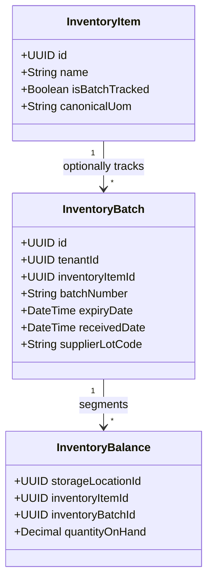

### Architectural Rules
1. **Batch Identity vs. Stock Containers:**
   * `InventoryBatch` is strictly **batch identity and descriptive metadata** (`tenantId`, `batchNumber`, `expiryDate`, `receivedDate`, `supplierLotCode`).
   * `InventoryBatch` contains **NO independent stock balance or `initialQuantity` field**. Current stock is tracked strictly in `InventoryBalance`, and stock history is tracked strictly in `InventoryLedger`.
   * Initial goods receipt into a batch appends a ledger entry (`referenceType = 'PURCHASE_RECEIPT'`) that establishes the initial balance in `InventoryBalance`.
2. **Tenant Boundary:** `InventoryBatch` contains `tenantId NOT NULL`. A batch cannot be referenced across tenants.
3. **Canonical UOM:** All batch-segmented balance quantities and ledger entries use the parent `InventoryItem`'s canonical UOM.
4. **Negative Stock Interaction:** If a batch-tracked item incurs negative stock (under an approved negative stock policy), the negative balance is tracked against that specific batch balance.
5. **Deferred Features:** Automated FEFO (First-Expired, First-Out) dispatching algorithms, automated recall execution workflows, and dynamic shelf-life analytics are explicitly deferred to post-Phase 1.

---

## 19. UOM Architecture (ADR-003)

The target architecture strictly separates four UOM concepts:

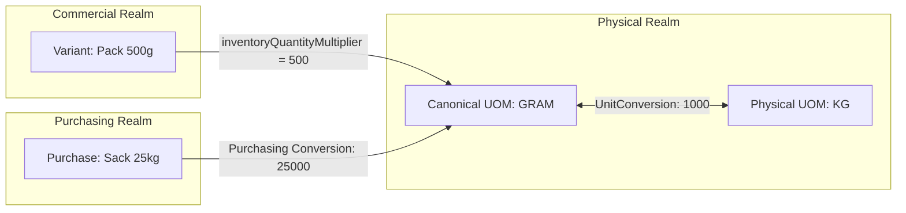

### A. Canonical Inventory UOM
* Owned directly by `InventoryItem` (`canonicalUom`, e.g., `GRAM`, `ML`, `PCS`).
* All stock balances, ledger deltas, recipes, and batch quantities are stored strictly in this canonical UOM.
* It is the standard reference unit chosen for inventory management—it is **not** required to be the smallest atomic unit in existence.

### B. Physical UOM Conversion
* Managed by the `UnitConversion` model for physical conversions (e.g., `1 KG = 1000 GRAM`, `1 LITER = 1000 ML`).
* Strictly restricted to standard physical dimensions (Mass to Mass, Volume to Volume).

---

## 20. Purchasing UOM

* Used when suppliers sell items in units different from internal stock tracking (e.g., purchasing cooking oil in 20-liter drums, but tracking stock in milliliters).
* Stored in purchasing catalog configurations (`supplierItemUom` with `purchasingConversionFactor`).
* Strictly decoupled from commercial sales packaging.

---

## 21. Commercial Packaging

Commercial packaging handles retail sales packaging where multiple stock units are sold under one SKU:
* Handled exclusively via `ProductVariant.inventoryQuantityMultiplier`.
* **Formula:**
  $$\text{Canonical Stock Deducted} = \text{Order Quantity} \times \text{inventoryQuantityMultiplier}$$
* **Example:**
  * Canonical `InventoryItem`: `Aqua 600ml Bottle` (UOM: `PCS`).
  * Variant 1: `Aqua Single Bottle` $\rightarrow$ `inventoryQuantityMultiplier = 1.0` (Deducts 1 PCS).
  * Variant 2: `Aqua Karton 24` $\rightarrow$ `inventoryQuantityMultiplier = 24.0` (Deducts 24 PCS).
* The multiplier must be a positive decimal (`Decimal > 0`) and is **not** a physical UOM conversion. It converts commercial transaction units into physical stock deduction units at transaction time.

---

## 22. Recipe / BOM

The Bill of Materials (BOM) engine enables F&B composite products:

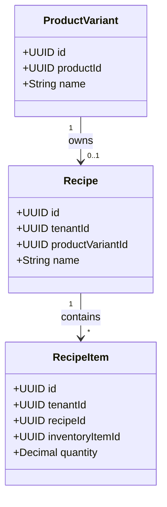

### Recipe Ownership Rule
To eliminate ambiguity between product-level and variant-level recipes, the Phase-1 canonical relationship is defined as:
* **Canonical Ownership:** A `Recipe` is owned strictly by a `ProductVariant` (`Recipe.productVariantId NOT NULL UNIQUE`).
* **Variant-Specific Recipes:** A `Product` with multiple variants (e.g., Burger Regular vs. Burger Double) owns distinct `ProductVariant` records, each possessing its own independent `Recipe`:
  ```text
  Beef Burger (Product)
   ├── Regular (ProductVariant) ──> Recipe A (1 Bun, 1 Patty 100g, 15g Sauce)
   └── Double (ProductVariant)  ──> Recipe B (1 Bun, 2 Patties 100g, 30g Sauce)
  ```
* **Single-Variant Products:** For standalone menu items with no customer-facing variations, the system creates a default `ProductVariant` (e.g., "Regular" or "Standard") which owns the `Recipe`.
* **Invariants:**
  1. A `Recipe` cannot belong directly to a `Product`; it must attach to a `ProductVariant`.
  2. `Recipe.tenantId` must match `ProductVariant.tenantId`.
  3. `RecipeItem.tenantId` must match `InventoryItem.tenantId`.
  4. Recipe versioning and effective date ranges are deferred beyond Phase 1.

---

## 23. Modifiers

Modifiers handle customizations (e.g., "Extra Espresso Shot", "Oat Milk Swap", "No Sugar"):

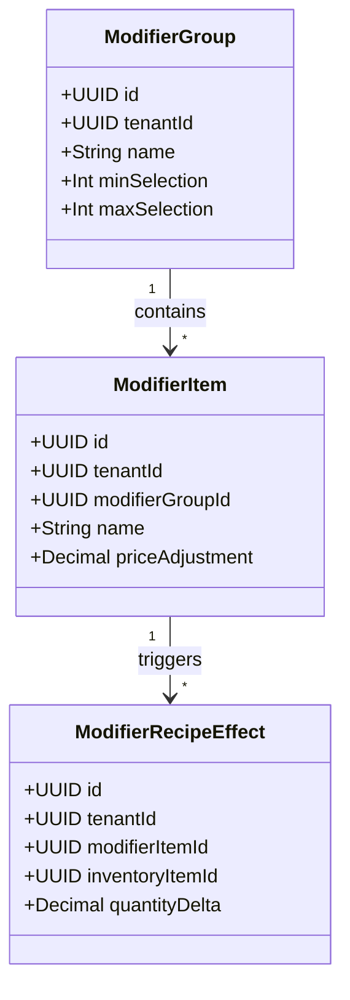

### Rules
* Modifiers are fully relational; arbitrary unindexed JSON for modifier stock effects is forbidden.
* When a modifier impacts stock, `ModifierRecipeEffect` explicitly specifies the target `inventoryItemId` and signed `quantityDelta` (e.g., adding +18g coffee beans, or substituting 200ml oat milk for regular milk).
* Every modifier entity requires direct `tenantId NOT NULL`.

---

## 24. Order Lifecycle

The operational order lifecycle is decoupled from payment and stock deduction:

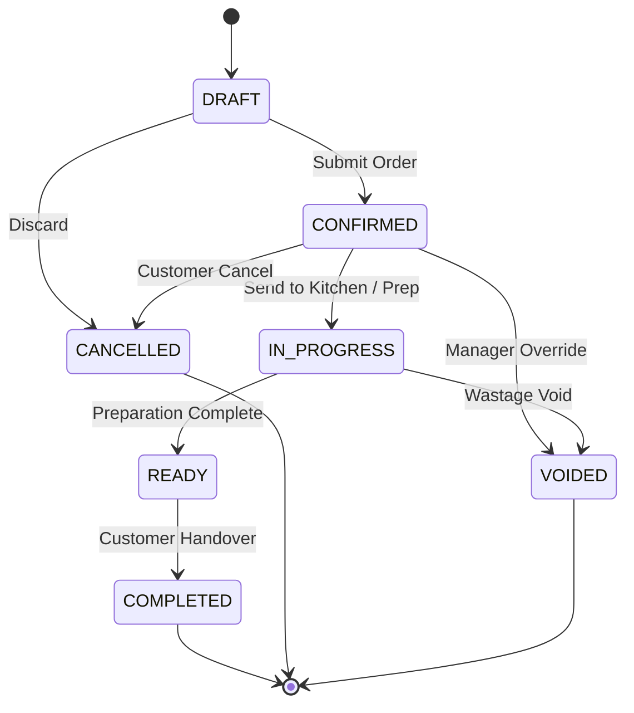

### Operational States (`OrderStatus`)
* `DRAFT`: Cart open on register.
* `CONFIRMED`: Order acknowledged and placed.
* `IN_PROGRESS`: Kitchen preparing meal / service underway.
* `READY`: Food ready at expo / retail items picked.
* `COMPLETED`: Transaction finalized and goods received by customer.
* `CANCELLED`: Order aborted before production.
* `VOIDED`: Order invalidated after production/confirmation.

### Stock Deduction Trigger Configuration
Stock deduction does not follow a hard-coded vertical rule. The platform defines a **Configurable Stock Deduction Trigger Engine**:

```text
Platform / Vertical Default
           ↓
Tenant Configuration
           ↓
Operational Context
```

#### Recognized Trigger Enumeration
1. **`ON_PAYMENT`:** Stock is deducted when payment is successfully captured.
   * *Vertical Default:* **Retail** (cash-and-carry, fast checkout).
2. **`ON_ORDER_CONFIRM`:** Stock is deducted when the order transitions to `CONFIRMED`.
   * *Vertical Default:* **F&B** (kitchen ticket printing, reservation of raw ingredients).
3. **`ON_KITCHEN_DISPATCH`:** Stock is deducted when kitchen marks an order or item as prepared.
   * *Availability:* Optional advanced F&B operational configuration.
4. **`ON_WORK_ORDER_FINISH`:** Stock is deducted upon completion of a service work order.
   * *Status:* **Deferred beyond Phase 1** (Services Phase 1 uses `ON_PAYMENT` or `ON_ORDER_CONFIRM` for consumable recipes).

Tenants can configure their preferred trigger within platform safety rules (e.g., a Retail boutique offering layaway can choose `ON_ORDER_CONFIRM` to reserve stock before final payment).

---

## 25. Payment Lifecycle

The financial lifecycle tracks payment tenders independently from order progress:

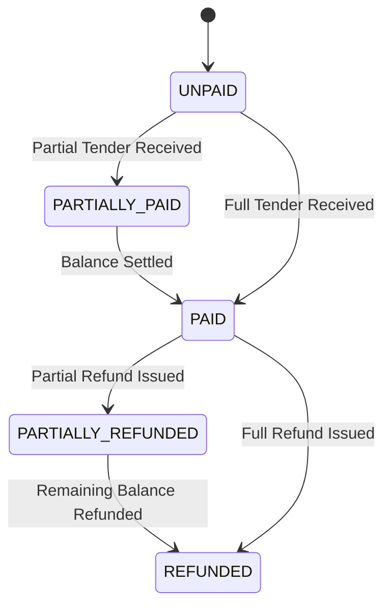

### Specifications
* `PaymentStatus`: `UNPAID`, `PARTIALLY_PAID`, `PAID`, `PARTIALLY_REFUNDED`, `REFUNDED`.
* `PaymentStatus = PAID` is **NOT** the default for new orders. Table service orders start as `UNPAID`.
* An order can have multiple `PaymentTransaction`s to support split tender (Cash + QRIS, Multiple Credit Cards).
* Each transaction records tender type, amount, gateway reference, authorization code, and transaction timestamp.

---

## 26. Refund

Refunds represent distinct financial and logistical counter-events:

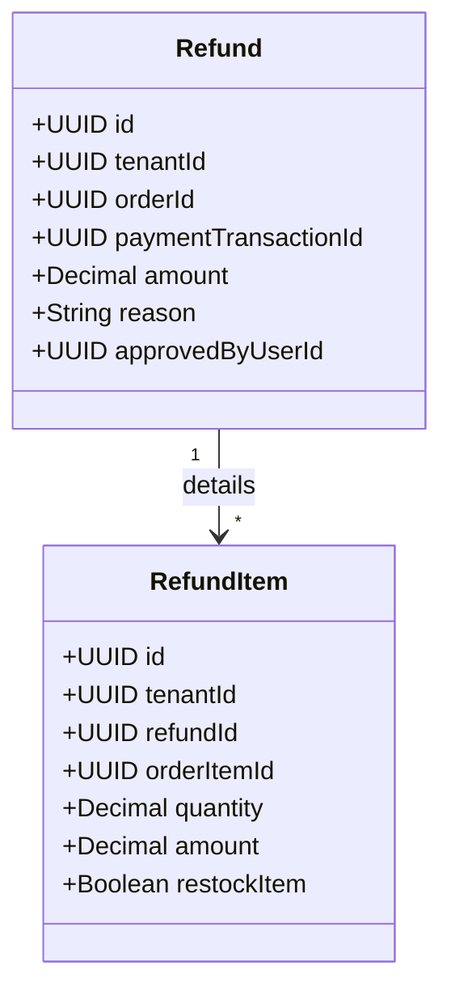

### Specifications
* Full and partial refunds are supported via `Refund` and `RefundItem`.
* `RefundItem` captures the exact quantity returned and line amount refunded.
* If `restockItem == true`, the inventory service appends a positive delta entry to `InventoryLedger` restoring stock at the designated `StorageLocation`. Financial refunds for pure service labor do not trigger inventory restock.

---

## 27. Idempotency

To protect against duplicate transactions caused by network retries, mobile POS reconnects, or duplicate webhook delivery:
* **Unique Idempotency Key Scope:**
  $$\text{Scope} = (\text{tenantId}, \text{operationType}, \text{idempotencyKey})$$
* **Critical Operations Covered:**
  * Order checkout (`CHECKOUT_SUBMIT`)
  * Payment authorization / capture (`PAYMENT_CAPTURE`)
  * Webhook settlement (`PAYMENT_WEBHOOK`)
  * Manual inventory adjustments (`STOCK_ADJUSTMENT`)
* If an incoming request matches an existing key within the validity window, the system returns the cached response without re-executing business logic or financial mutations.

---

## 28. Negative Stock (ADR-002)

The system adopts a **Context-Driven Negative Stock Policy Engine**:

```text
Tenant Policy Default
        ↓ (Override)
Location Override
        ↓ (Override)
Item Override
```

### Vertical Defaults vs. Effective Policy
A crucial architectural distinction governs negative stock:
* **Vertical Defaults:** Recommended operational defaults provided by the platform:
  * *Retail Default:* `ALLOW_NEGATIVE = false` (standard merchandise scanning).
  * *Warehouse Default:* `ALLOW_NEGATIVE = false` (outbound transfers require verified stock).
  * *F&B Default:* `ALLOW_NEGATIVE = true` (fast-paced kitchen prep cannot block sales when delivery invoices are delayed).
  * *Services Consumables Default:* `ALLOW_NEGATIVE = true` (treatments cannot halt for inventory receipts).
* **Effective Policy Hierarchy:** Vertical defaults do **NOT** act as hard-coded bypasses. The actual decision to allow negative stock is evaluated strictly through the policy hierarchy:
  1. Does the **Item** have an explicit override (`allowNegativeStock` boolean)? If set, use it.
  2. Otherwise, does the **StorageLocation** have an override? If set, use it.
  3. Otherwise, use the **Tenant Policy** setting.

An F&B tenant that enforces strict inventory discipline can set `Tenant.allowNegativeStock = false`. Conversely, a Retail tenant during high-volume clearance sales can configure an item override to permit negative stock.

### Database Constraint Policy
* **Explicit Prohibition:** A universal PostgreSQL check constraint such as:
  ```sql
  -- PROHIBITED IN TARGET ARCHITECTURE:
  ALTER TABLE "InventoryBalance" ADD CONSTRAINT "chk_no_negative_stock" CHECK (quantity_on_hand >= 0);
  ```
  is strictly forbidden.
* **Service Responsibility:** The `InventoryDomainService` evaluates the effective policy hierarchy. If `allowNegative == false` and available stock is insufficient, the transaction throws an `InsufficientStockException`.
* **Audit Trail:** When negative stock is permitted, `InventoryBalance.quantityOnHand` drops below zero, and the corresponding `InventoryLedger` row records `isNegativeBalance = true` for mandatory reconciliation reporting.

---

## 29. Inventory Concurrency

Concurrency control during stock mutations is critical to prevent race conditions and phantom stock overselling:

```mermaid
sequenceDiagram
    autonumber
    actor POS as Cashier POS
    participant Svc as InventoryDomainService
    participant DB as PostgreSQL (Tx)
    
    POS->>Svc: Mutate Stock (orderId, items)
    Svc->>DB: BEGIN TRANSACTION
    Svc->>DB: SELECT * FROM "InventoryBalance"<br/>WHERE tenant_id = :t AND item_id = :i AND location_id = :l<br/>FOR UPDATE
    Note over DB: Row locked; concurrent transactions block
    alt Row does not exist (First-Row Creation Race)
        Svc->>DB: INSERT INTO "InventoryBalance" ... ON CONFLICT DO NOTHING
        Svc->>DB: SELECT ... FOR UPDATE (Re-lock)
    end
    Svc->>Svc: Evaluate Negative Stock Policy vs. Available
    Svc->>DB: UPDATE "InventoryBalance"<br/>SET quantity_on_hand = quantity_on_hand + :delta
    Svc->>DB: INSERT INTO "InventoryLedger"<br/>(balance_before, quantity_delta, balance_after, ...)
    Svc->>DB: COMMIT TRANSACTION
    Note over DB: Row lock released
    Svc-->>POS: Stock Mutation Success
```

### Concurrency Rules
1. **Atomic Transaction Boundary:** Balance update and ledger append must execute within the exact same database transaction.
2. **Pessimistic Row Locking:** Stock balances must be retrieved using `SELECT ... FOR UPDATE` on `InventoryBalance`.
3. **First-Row Creation Race Handling (`[OPEN SCHEMA IMPLEMENTATION DETAIL]`):** When mutating an item-location balance that has never had stock recorded before, concurrent transactions could attempt simultaneous `INSERT`s. The service/schema layer must handle this atomically via `INSERT ... ON CONFLICT (tenant_id, item_id, location_id, [batch_id]) DO NOTHING` followed by row-locking the confirmed balance row.
4. **Controller Pre-Checks Rejected:** Application pre-checks outside an active database lock are explicitly rejected as architecturally unsafe.
5. **Retry Handling:** The service layer must implement exponential backoff retry logic for transient database serialization failures or deadlock timeouts.

---

## 30. Services Boundary (ADR-005)

To maintain a lean, robust platform without unnecessary schema bloat, Services domain modeling adopts Phase 1 boundaries:

### In-Scope (Phase 1)
* `ProductType.SERVICE_LABOR`: Products marked as service labor do not track direct physical stock.
* Optional material consumables: Handled via standard `Recipe` / `RecipeItem` links where a service consumes tangible materials (e.g., massage oil, car polish).
* **Migration Exemption:** Service products do **NOT** require an underlying `InventoryItem`. Data backfills and reconciliation gates must not force phantom inventory items for labor.

### Deferred Beyond Phase 1
* Dedicated tables for `ServiceDefinition`, `Appointment`, `WorkOrder`, `StaffAssignment`, `ServiceMaterialUsage`, and `StaffCommission`.
* Generic Core tables must not be polluted with specialized service workflow fields.
* `assignedStaffUserId` on `OrderItem` is classified as `[OPEN IMPLEMENTATION DETAIL]`.

---

## 31. Tenant-Scoped Uniqueness (Model B Incorporated)

To prevent multi-tenant registration collisions, business identifiers must be scoped properly:

| Identifier | Target Uniqueness Scope | Rationale |
| :--- | :--- | :--- |
| `PlatformUser.email` | **Global Platform** | SaaS operator / superadmin account login. |
| `Tenant.slug` | **Global Platform** | Subdomain routing / tenant resolution. |
| `User.userCode` | **Tenant-Scoped** (`tenantId + userCode`) | **Model B:** Human-friendly staff login code (e.g. `KSR001`); unique within tenant. |
| `User.email` | **Tenant-Scoped** (`tenantId + email`) | Optional for operational staff; unique within tenant when present. |
| `ProductVariant.sku` | **Tenant-Scoped** (`tenantId + sku`) | Authoritative transactional SKU; unique within tenant. |
| `ProductVariant.barcode` | **Tenant-Scoped** (`tenantId + barcode`) | POS scanner barcode; unique within tenant; nullable. |
| `Product.sku` | **Tenant-Scoped** (`tenantId + sku`) | Deprecated parent catalog code; nullable. |
| `Order.invoiceNumber` | **Tenant-Scoped** (`tenantId + invoiceNumber`) | Sequenced per tenant or per outlet. |
| `IdempotencyKey` | **Tenant-Scoped** (`tenantId + operation + key`) | Prevents cross-tenant key collision. |
| Primary Keys (`id`) | **Global (UUID v4 / v7)** | Cryptographically random unique IDs across all tables. |

---

## 32. Decimal Precision

All numeric columns must use domain-appropriate decimal precision:

| Domain Value | Data Type | Specification | Rationale |
| :--- | :--- | :--- | :--- |
| **Inventory Quantities** | `Decimal` | `Decimal(12, 3)` | Supports up to 999,999,999.999 units (milligrams, milliliters, grams). |
| **Packaging Multiplier** | `Decimal` | `Decimal(12, 3)` | Supports fractional conversion multipliers (strictly positive). |
| **Unit Conversion Factors**| `Decimal` | `Decimal(12, 6)` | High precision for fine metric conversions (e.g., mg to kg). |
| **Prices & Monetary Values**| `Decimal` | `Decimal(15, 2)` | Standard financial currency scale. |
| **Tax & Discount Rates** | `Decimal` | `Decimal(5, 4)` | Supports exact percentages (e.g., 0.1100 for 11% PPN). |

---

## 33. Legacy Mapping

Existing models are mapped to the target architecture without immediate destructive drops:

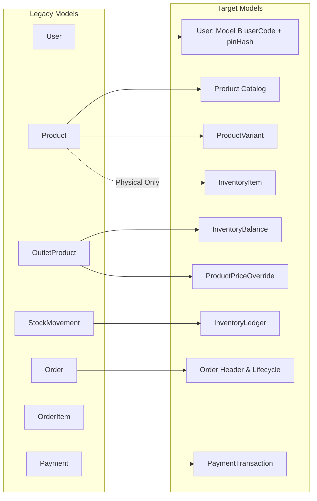

### Detailed Transition Plan

| Legacy Model | Current State | Target Model | Transition / Compatibility Plan | Contract Status |
| :--- | :--- | :--- | :--- | :--- |
| `User` | Global unique email (`email String @unique`); nullable `tenantId`. | `User` (Model B: `userCode` + `pinHash` + tenant-scoped) | Backfill missing `userCode` (e.g. derived from role + sequence); preserve `email` as tenant-scoped; hash PINs into `pinHash`. | Evolved; `tenantId NOT NULL`. |
| `Product` | Tri-role god model (Catalog + Variant + Stock). | `Product` + `ProductVariant` + `InventoryItem` | Extract logistical attributes into `InventoryItem` (physical products only; exempt `SERVICE_LABOR`). Create default `ProductVariant`. | Deprecate stock columns on `Product`; retain catalog metadata. |
| `OutletProduct` | Integer stock balance + price override. | `InventoryBalance` + `ProductPriceOverride` | Backfill stock into `InventoryBalance` (converted to Decimal); backfill price into `ProductPriceOverride`. | Deprecated in Phase 4; read-synced via dual-write. |
| `StockMovement` | Operational delta log (`quantity Int`). | `InventoryLedger` | Dual-write appends to both during migration; target ledger populates full financial audit columns. | Deprecated in Phase 4; retired after reconciliation. |
| `Order` | Direct checkout with `paymentStatus = PAID`. | `Order` (State Machine) | Add `orderStatus` column; preserve existing `paymentStatus` column during dual-write. | Evolved; non-breaking expansion. |
| `OrderItem` | Linked directly to `productId`. | `OrderItem` | Add `productVariantId` column; backfill with default variant ID. | Evolved; `productId` retained for backward compatibility. |
| `Payment` | Single payment entry per order. | `PaymentTransaction` | Evolve table to support multiple transactions and gateway references. | Evolved; backward compatible. |
| `Outlet` | Represents store and warehouse (`isWarehouse`). | `Outlet` + `StorageLocation` | Create default primary `StorageLocation` for every existing `Outlet`. | Evolved; `isWarehouse` mapped to location types. |
| `Shift` | Cash drawer shift tracking. | `Shift` (Enhanced) | Retain existing schema; enhance non-cash reconciliation. | Preserved. |

---

## 34. Migration Strategy

Migration executes via a strict 6-stage phased rollout:

```text
EXPAND
  ↓
BACKFILL
  ↓
DUAL-WRITE
  ↓
VALIDATE / RECONCILE
  ↓
CUTOVER
  ↓
CONTRACT
```

1. **EXPAND:** Deploy additive schema changes (new tables: `InventoryItem`, `ProductVariant`, `StorageLocation`, `InventoryBalance`, `InventoryLedger`, `InventoryBatch`, `Recipe`, `RecipeItem`, `ModifierGroup`, `ModifierItem`, `RefundItem`; new columns on `User`: `userCode`, `pinHash`). Legacy tables remain completely untouched.
2. **BACKFILL:** Execute background data scripts:
   * Populate `User.userCode` for existing staff (e.g. `KSR001` based on existing role/name sequence).
   * Hash existing PINs into `pinHash`.
   * Migrate existing physical products into `InventoryItem` and `ProductVariant`.
   * Migrate outlets into default `StorageLocation`s.
   * Backfill `OutletProduct` balances into `InventoryBalance`.
   * `SERVICE_LABOR` products generate `ProductVariant` records without mandatory `InventoryItem` rows.
3. **DUAL-WRITE:** Application services write simultaneously to both legacy tables (`OutletProduct`, `StockMovement`) and new target tables (`InventoryBalance`, `InventoryLedger`) for all inventory-affecting operations.
4. **VALIDATE / RECONCILE:** Automated reconciliation jobs compare legacy balances with new balances across all outlets using the corrected reconciliation gates (Section 36).
5. **CUTOVER:** Switch primary application read and write paths exclusively to the new domain models. Legacy tables become read-only archives.
6. **CONTRACT:** Safely drop obsolete columns and legacy tables after a mandatory 30-day stability window.

---

## 35. Dual-Write Architecture

* **Centralized Service Enforcement:** Dual-writing must be centralized exclusively inside `InventoryDomainService` and `OrderDomainService`.
* **Zero Controller Dual-Write:** Controllers must never orchestrate dual-writes. Web controllers interact solely with domain service contracts.
* **Transactional Integrity:** Dual-writes must execute within the same database transaction. A failure in either write branch aborts the transaction to prevent state desynchronization.

---

## 36. Reconciliation Gates (Corrected & Finalized)

Before cutting over from legacy models to target models, three mandatory reconciliation gates must pass:

### Gate 1: Catalog Completeness Gate
* 100% of existing active `Product` rows must possess an active `ProductVariant`.
* For physical goods (`RETAIL` products, physical `FNB` items), 100% of variants must link to an `InventoryItem` or a `Recipe`.
* Products categorized as `SERVICE_LABOR` are explicitly **exempted** from requiring an `InventoryItem`.

### Gate 2: Physical Stock Baseline Parity Gate (Corrected)
For each legacy physical stock record `OutletProduct(outletId, productId)`, the legacy integer stock is reconciled directly against the target physical balance in canonical UOM:

$$\text{OutletProduct.stock} = \sum_{\text{all batches } b} \text{InventoryBalance.quantityOnHand}(\text{locationId}, \text{inventoryItemId}, b)$$

* **Canonical Stock Invariant:** `inventoryQuantityMultiplier` is a commercial packaging/transaction conversion factor and must **NOT** be applied to alter the physical stock baseline comparison.
* **Dimension Alignment:** Evaluated across the mapped `StorageLocation` (derived from `Outlet`) and mapped `InventoryItem` (derived from `Product`).
* **Batch Aggregation:** All batch-segmented balances for that item and location are summed to compare against the legacy unbatched total.
* **Packaging Verification:** Transactional multipliers (`inventoryQuantityMultiplier`) are validated separately via transactional conversion tests, not through baseline stock balance parity.
* **Exemptions:** Products with `ProductType.SERVICE_LABOR` and recipe-based composite items (whose stock is held in ingredients) are excluded from direct 1:1 item stock comparisons.

### Gate 3: Transaction Flow Audit Gate (Corrected)
100% of **inventory-affecting orders/operations** created during the dual-write period must have corresponding and reconcilable entries in both `StockMovement` and `InventoryLedger`.
* Transactions that legitimately do not affect inventory (e.g. pure `SERVICE_LABOR` sales without consumables, non-stock commercial items) are excluded from requiring an `InventoryLedger` entry.
* For every operation that alters physical stock (retail sale, F&B recipe consumption, restock return, manual adjustment), ledger parity is verified.

---

## 37. Risks & Mitigations

| Risk | Impact | Mitigation Strategy |
| :--- | :--- | :--- |
| **Row Lock Contention** | High-volume checkout latency due to `SELECT ... FOR UPDATE` on hot items. | Optimize lock duration (lock immediately before commit); batch lock ordering by ID to prevent deadlocks. |
| **First-Row Creation Race** | Concurrent checkout of newly created item causes insert collision on `InventoryBalance`. | Use `INSERT ... ON CONFLICT DO NOTHING` followed by row-lock select within transaction. |
| **Data Drift During Dual-Write** | Desynchronization between legacy and target balances. | Centralized domain service dual-writes inside atomic transactions + hourly automated reconciliation cron jobs. |
| **Cross-Tenant Reference Leaks** | Data corruption across SaaS tenants. | Direct `tenantId NOT NULL` on all child entities + strict repository-level tenant verification. |
| **Negative Stock Drift in F&B** | Uncontrolled negative inventory accumulation. | Mandatory audit flags (`isNegativeBalance`) + daily variance exception reports for store managers. |

---

## 38. Open Implementation Details

The following items are recognized as operational implementation details to be resolved during service coding (Prompt 09 / implementation phases) without requiring new architectural decision gates:
1. **`assignedStaffUserId` Placement:** Whether to place a temporary nullable `assignedStaffUserId` directly on `OrderItem` for Phase 1 service tracking, or create a lightweight `StaffAssignment` join table immediately.
2. **Lock Timeout & Retry Backoff:** Specific tuning parameters for pessimistic row locking (e.g., 500ms timeout with 3 exponential backoff retries).
3. **Negative Stock Reconciliation UI Workflow:** Exact user interface flow for prompting managers to perform stock adjustments when physical goods arrive after negative stock has occurred.
4. **Database Uniqueness Mechanism for Nullable Batch:** Selection between partial unique indexes vs. `NULLS NOT DISTINCT` in PostgreSQL for `InventoryBalance`.
5. **First-Row Balance Creation Strategy:** Exact SQL syntax (`ON CONFLICT DO NOTHING` vs application advisory lock) for initializing unseeded balances under high concurrency.

---

## 39. Schema Design Readiness

### Declaration of Architectural Completeness

```text
STATUS: READY FOR PROMPT 09 — DATABASE/PRISMA SCHEMA DESIGN REVIEW
```

All architectural foundations, owner decisions (ADR-001 to ADR-005, and Model B User Identity), domain boundaries, inventory mechanics, concurrency rules, and reconciliation gates are complete, consistent, and finalized.

The Data Architecture RFC is officially closed for revision and ready to serve as the direct specification input for **Prompt 09 — Database/Prisma Schema Design Review**.
