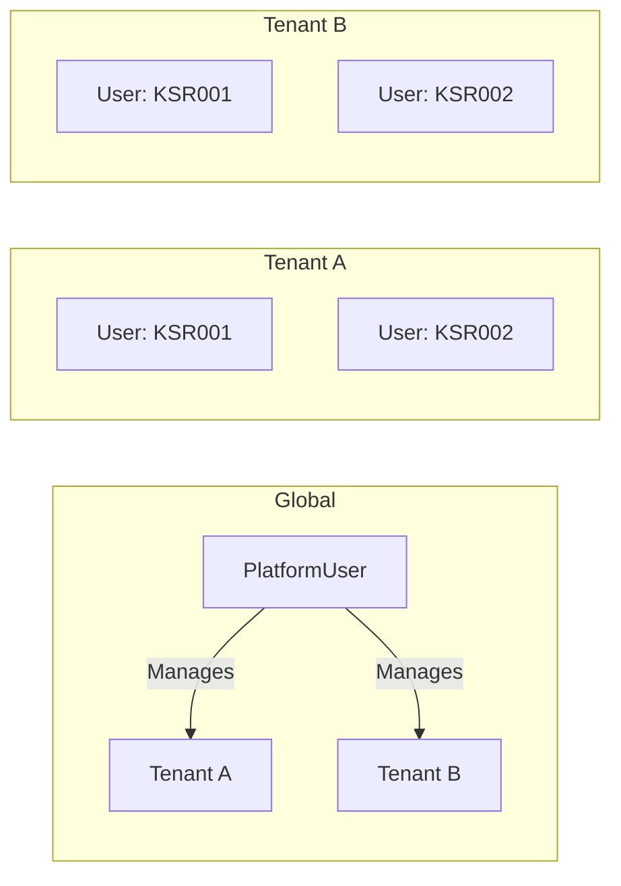
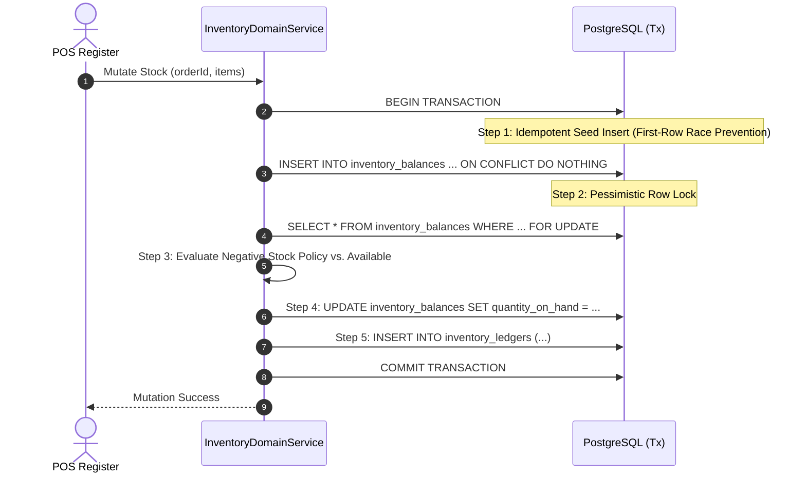
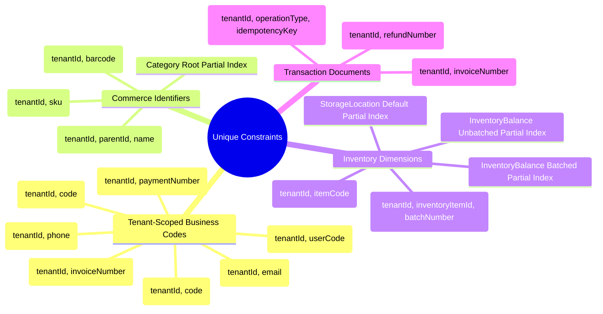

# TARGET DATABASE SCHEMA DESIGN & SPECIFICATION
## Multi-Tenant SaaS POS Platform (Retail, F&B, Services)

**Document ID:** ARCH-2026-09-DB-SCHEMA-04 (Revision 4 — Final Consistency Gate Pass)  
**Status:** SCHEMA DESIGN PROPOSAL — REVISION 4 (READY FOR OWNER APPROVAL)  
**Target Engine:** PostgreSQL 15+ / Prisma ORM 5.x+  
**Classification:** Lead Database & Systems Architecture Blueprint (Read-Only Design Specification)  
**Date:** September 19, 2026  
**Author:** Principal Database & Systems Architect (Antigravity)  

---

## 1. Document Metadata

* **Document Title:** Target Database Schema Design & Specification (Revision 4 — Final Consistency Gate Pass)
* **Document Purpose:** Definitive, implementation-ready database schema proposal translating the approved Data Architecture RFC Revision 4, Project Owner ADRs (ADR-001 through ADR-005), Model B User Identity, and Final Review Consistency Gate requirements into an exact, internally coherent Prisma/PostgreSQL specification.
* **Preceding Documents:**
  * `01_EXISTING_SYSTEM_AUDIT.md` (System Baseline Audit)
  * `02_DEEP_DOMAIN_ANALYSIS.md` (Domain Coupling Analysis)
  * `03_DATA_ARCHITECTURE_RFC.md` (RFC Revision 4 — Final Architecture RFC)
  * `05_SCHEMA_CONSISTENCY_VALIDATION_REPORT.md` (Validation Gate)
  * `06_ARCHITECTURE_DECISION_GATE_REPORT.md` (ADR Consensus)
  * `ADR-001` through `ADR-005` (Project Owner Architecture Decision Records)
  * `ODR-01` through `ODR-06` (Project Owner Decision Register — Final Confirmed Contracts: PlatformRole canonical [ODR-01], TenantStatus +PENDING [ODR-02], InvoiceStatus [ODR-03], Role +WAREHOUSE [ODR-04], InventoryLedger opening balance policy without legacy stock_movements backfill [ODR-05], PaymentTxStatus manual review lifecycle [ODR-06])
* **Status:** `READY FOR OWNER APPROVAL`
* **Implementation State:** Read-Only Design Specification. **No application code, Prisma schema (`schema.prisma`), database migrations, or production database changes have been performed.**

---

## 2. Scope

### In-Scope (Phase 1 Target Architecture)
* **Multi-Tenant Foundation:** Database tenancy architecture, explicit tenant boundary enforcement, and cross-tenant foreign key protection across all operational tables.
* **User & Operational Authentication (Model B):** Tenant-scoped operational staff identity (`tenantId + userCode + PIN hash`), internal UUID surrogate keys, tenant-scoped email, and global superadmin isolation (`PlatformUser`).
* **User ↔ Outlet Invariants:** Strict binding between operational staff (`User.outletId NOT NULL`) and their assigned outlet; explicit tenant-wide authority semantics (`User.outletId IS NULL`) for administrative personnel.
* **Storage Location Defaults:** Strict single-default invariant per outlet (`StorageLocation.isDefault = true`) enforced via a PostgreSQL partial unique index.
* **Commerce & Catalog:** Clean separation between commercial catalog grouping (`Product`) and sellable commercial units (`ProductVariant`), with hierarchical taxonomy (`Category`).
* **Logistics & Inventory:** Master logistical materials (`InventoryItem`), physical/logical storage locations (`StorageLocation`), optional stock batching (`InventoryBatch`), current stock state projection (`InventoryBalance`), and append-only movement history (`InventoryLedger`).
* **Recipes & Modifiers:** Variant-owned bill of materials (`Recipe`, `RecipeItem`) and relational modifiers (`ModifierGroup`, `ModifierItem`, `ProductModifierGroup`, `ModifierRecipeEffect`).
* **Sales & Financial Lifecycles:** Decoupled order states (`OrderStatus`), payment states (`PaymentStatus`), multi-tender transactions (`PaymentTransaction`), granular refunds (`Refund`, `RefundItem`) with cumulative over-refund invariants, and network deduplication (`IdempotencyRecord`).
* **Packaging & UOM:** Strict separation between physical canonical UOM, physical conversion factors (`UnitConversion`), purchasing UOM, and commercial packaging multipliers (`inventoryQuantityMultiplier`).

### Out-of-Scope (Deferred Beyond Phase 1)
* **Granular Multi-Outlet User Matrix (`UserOutlet` Table):** Deferred to Phase 2. Handled cleanly in Phase 1 via dual-mode `User.outletId`.
* **Dedicated Services Domain Tables:** Standalone `ServiceDefinition`, `Appointment`, `WorkOrder`, `StaffAssignment`, `ServiceMaterialUsage`, and `StaffCommission` tables are deferred. Basic service labor is fully supported in Phase 1 via `ProductType.SERVICE_LABOR`.
* **Active Stock Reservation Engine:** `quantityReserved Decimal(12, 3) @default(0)` is present in the schema, but automated reservation workflows (layaway/pre-orders) are deferred.
* **Database-Level Immutability Triggers:** Immutability is enforced strictly by the application/service layer in Phase 1; database triggers/privilege revocations are deferred to infrastructure hardening.
* **PostgreSQL Row-Level Security (RLS):** Preserved as a future defense-in-depth hardening layer. Phase 1 relies on direct `tenantId NOT NULL` columns and mandatory repository tenant filtering.

---

## 3. Architecture Principles

1. **Unified Platform / Modular Monolith:** A single shared database and backend platform powers Retail, F&B, and Services. Tenant feature flags activate vertical capabilities without bifurcating database schemas.
2. **Three-Tier Multi-Tenancy Defense:**
   * **Tier 1 (DB Structural):** Direct `tenantId NOT NULL` columns on all tenant-owned models, composite unique indexes (`tenantId + businessCode`), and referential foreign keys.
   * **Tier 2 (Service-Layer Validation):** Mandatory query scope injection (`WHERE tenantId = :tenantId`) and runtime verification that both parent and child entities belong to the same tenant before persisting relationships.
   * **Tier 3 (Future Hardening):** PostgreSQL Row-Level Security (RLS) policies and composite foreign keys to be added post-Phase 1.
3. **Tenant-Scoped Identity with Operational Login (Model B):** Operational staff authenticate via tenant slug and `userCode + PIN`, decoupling daily cashier operations from global email uniqueness.
4. **Commercial vs. Logistical Decoupling:** Customers purchase commercial products (`ProductVariant`); the warehouse and kitchen track logistical materials (`InventoryItem`). Respective lifecycles communicate through explicit recipes or packaging multipliers.
5. **N:1 Variant to Inventory Item Mapping:** Multiple commercial variants (e.g. Single, 6-Pack, Carton 24) can point to the same physical inventory item, scaled by `inventoryQuantityMultiplier`.
6. **Independent Operational & Financial Lifecycles:** Orders can be confirmed before payment (table dining / invoicing) or paid before preparation (quick service / retail). Statuses are never collapsed into a single column.
7. **Immutable Stock Movement Ledger:** Historical balances are never recalculated by updating past rows. Every inventory change appends a ledger row; financial adjustments create offsetting transactions.
8. **Strict Deletion Protections:** Historical audit trails, inventory ledgers, and financial records use `RESTRICT` delete policies. Master records must be deactivated (`isActive = false`) rather than physically deleted.
9. **Strict Concurrency & Atomicity:** Inventory mutations and ledger insertions execute within a single database transaction guarded by pessimistic row locks (`SELECT ... FOR UPDATE`), with explicit handling for first-row creation races.
10. **Additive Evolution:** New features are added as new tables and optional columns. Existing tables are deprecated only after dual-write verification and reconciliation gates pass.

---

## 4. Entity Inventory & Domain Module Classification

The target schema defines **31 Target Prisma Models** organized across **8 Domain Modules**:

| # | Entity Name | Domain Module | Primary Responsibility | Tenant Scoping |
| :---: | :--- | :--- | :--- | :--- |
| 1 | `PlatformUser` | Platform SaaS | Internal SaaS superadmins, tech support, billing operators | Global Platform (No Tenant) |
| 2 | `Tenant` | Platform SaaS | Root tenant organization, business vertical, subscription state | Root Tenant Entity |
| 3 | `SubscriptionPlan` | Platform SaaS | SaaS tier definitions, quotas, enabled vertical module flags | Global Platform (No Tenant) |
| 4 | `TenantSubscription`| Platform SaaS | Active tenant subscription license and billing cycle | Direct `tenantId NOT NULL` |
| 5 | `SaaSInvoice` | Platform SaaS | Platform subscription billing invoices | Direct `tenantId NOT NULL` |
| 6 | `SaaSPayment` | Platform SaaS | Proof of payment for SaaS subscriptions | Direct `tenantId NOT NULL` |
| 7 | `User` | Core IAM | Tenant staff (Owners, Managers, Cashiers, Kitchen Staff) | Direct `tenantId NOT NULL` |
| 8 | `Outlet` | Core Platform | Physical commercial store, branch, or virtual outlet | Direct `tenantId NOT NULL` |
| 9 | `Shift` | Core Platform | Cashier drawer session and physical cash reconciliation | Direct `tenantId NOT NULL` |
| 10 | `Customer` | Core Platform | CRM customer master, loyalty, contact details | Direct `tenantId NOT NULL` |
| 11 | `Category` | Commerce | Hierarchical catalog taxonomy (Root & Sub-categories) | Direct `tenantId NOT NULL` |
| 12 | `Product` | Commerce | Master commercial catalog grouping/family | Direct `tenantId NOT NULL` |
| 13 | `ProductVariant` | Commerce | Concrete sellable unit scanned at POS checkout | Direct `tenantId NOT NULL` |
| 14 | `UnitConversion` | Logistics | Standard physical UOM conversion ratios (Mass, Volume) | Global Platform Data |
| 15 | `StorageLocation` | Logistics | Storage areas (Storefront, Warehouse, Kitchen, Bar) | Direct `tenantId NOT NULL` |
| 16 | `InventoryItem` | Logistics | Master physical raw material or stock item | Direct `tenantId NOT NULL` |
| 17 | `InventoryBatch` | Logistics | Optional batch/lot identity and expiry metadata | Direct `tenantId NOT NULL` |
| 18 | `InventoryBalance` | Logistics | Current stock state projection per stock dimension | Direct `tenantId NOT NULL` |
| 19 | `InventoryLedger` | Logistics | Immutable stock movement history event stream | Direct `tenantId NOT NULL` |
| 20 | `Recipe` | Recipes & BOM | Variant-owned bill of materials | Direct `tenantId NOT NULL` |
| 21 | `RecipeItem` | Recipes & BOM | Ingredient consumption quantity in canonical UOM | Direct `tenantId NOT NULL` |
| 22 | `ModifierGroup` | Modifiers | Customization group (Toppings, Sugar, Milk) | Direct `tenantId NOT NULL` |
| 23 | `ModifierItem` | Modifiers | Selectable modifier option and price adjustment | Direct `tenantId NOT NULL` |
| 24 | `ProductModifierGroup`| Modifiers | Linkage between Product catalog and ModifierGroup | Direct `tenantId NOT NULL` |
| 25 | `ModifierRecipeEffect`| Modifiers | Relational inventory consumption delta for modifiers | Direct `tenantId NOT NULL` |
| 26 | `Order` | Sales & Orders | Order header and operational state machine | Direct `tenantId NOT NULL` |
| 27 | `OrderItem` | Sales & Orders | Order line item with historical commercial snapshot | Direct `tenantId NOT NULL` |
| 28 | `PaymentTransaction`| Financial | Multi-tender payment attempt/capture record | Direct `tenantId NOT NULL` |
| 29 | `Refund` | Financial | Financial and logistical refund transaction header | Direct `tenantId NOT NULL` |
| 30 | `RefundItem` | Financial | Granular line-item refund and restock directive | Direct `tenantId NOT NULL` |
| 31 | `IdempotencyRecord` | Financial | Deduplication store for network retries and webhooks | Direct `tenantId NOT NULL` |

---

## 5. Full Target Entity Definitions (Prisma Schema DSL)

Below is the complete, reviewable target Prisma Schema DSL proposal containing all 31 models and 20 target enums:

```prisma
datasource db {
  provider = "postgresql"
  url      = env("DATABASE_URL")
}

generator client {
  provider = "prisma-client-js"
}

// ==========================================
// 1. SAAS PLATFORM FOUNDATION (GLOBAL & ROOT)
// ==========================================

model PlatformUser {
  id           String       @id @default(uuid())
  email        String       @unique
  passwordHash String       @map("password_hash")
  name         String
  role         PlatformRole @default(SUPPORT)
  isActive     Boolean      @default(true) @map("is_active")
  createdAt    DateTime     @default(now()) @map("created_at")
  updatedAt    DateTime     @updatedAt @map("updated_at")

  @@map("platform_users")
}

model Tenant {
  id                   String           @id @default(uuid())
  name                 String
  slug                 String           @unique
  businessVertical     BusinessVertical @default(RETAIL) @map("business_vertical")
  status               TenantStatus     @default(TRIAL)
  allowNegativeStock   Boolean          @default(false) @map("allow_negative_stock")
  enableBatchTracking  Boolean          @default(false) @map("enable_batch_tracking")
  enableRecipeTracking Boolean          @default(false) @map("enable_recipe_tracking")
  createdAt            DateTime         @default(now()) @map("created_at")
  updatedAt            DateTime         @updatedAt @map("updated_at")

  // Relationships
  users                 User[]
  outlets               Outlet[]
  categories            Category[]
  products              Product[]
  productVariants       ProductVariant[]
  storageLocations      StorageLocation[]
  inventoryItems        InventoryItem[]
  inventoryBatches      InventoryBatch[]
  inventoryBalances     InventoryBalance[]
  inventoryLedgers      InventoryLedger[]
  recipes               Recipe[]
  recipeItems           RecipeItem[]
  modifierGroups        ModifierGroup[]
  modifierItems         ModifierItem[]
  productModifierGroups ProductModifierGroup[]
  modifierRecipeEffects ModifierRecipeEffect[]
  orders                Order[]
  orderItems            OrderItem[]
  paymentTransactions   PaymentTransaction[]
  refunds               Refund[]
  refundItems           RefundItem[]
  shifts                Shift[]
  customers             Customer[]
  idempotencyRecords    IdempotencyRecord[]
  subscriptions         TenantSubscription[]
  invoices              SaaSInvoice[]
  payments              SaaSPayment[]

  @@map("tenants")
}

model SubscriptionPlan {
  id              String           @id @default(uuid())
  code            String           @unique
  name            String
  description     String?
  priceMonthly    Decimal          @map("price_monthly") @db.Decimal(15, 2)
  priceAnnually   Decimal          @map("price_annually") @db.Decimal(15, 2)
  maxOutlets      Int              @default(1) @map("max_outlets")
  maxUsers        Int              @default(3) @map("max_users")
  maxProducts     Int              @default(500) @map("max_products")
  featureFlags    Json             @default("{}") @map("feature_flags")
  isActive        Boolean          @default(true) @map("is_active")
  createdAt       DateTime         @default(now()) @map("created_at")
  updatedAt       DateTime         @updatedAt @map("updated_at")

  subscriptions   TenantSubscription[]

  @@map("subscription_plans")
}

model TenantSubscription {
  id         String       @id @default(uuid())
  tenantId   String       @map("tenant_id")
  planId     String       @map("plan_id")
  cycle      BillingCycle @default(MONTHLY)
  startDate  DateTime     @map("start_date")
  endDate    DateTime     @map("end_date")
  status     TenantStatus @default(ACTIVE)
  createdAt  DateTime     @default(now()) @map("created_at")
  updatedAt  DateTime     @updatedAt @map("updated_at")

  tenant   Tenant           @relation(fields: [tenantId], references: [id], onDelete: Cascade)
  plan     SubscriptionPlan @relation(fields: [planId], references: [id], onDelete: Restrict)
  invoices SaaSInvoice[]

  @@index([tenantId, status])
  @@map("tenant_subscriptions")
}

model SaaSInvoice {
  id             String        @id @default(uuid())
  tenantId       String        @map("tenant_id")
  subscriptionId String        @map("subscription_id")
  invoiceNumber  String        @map("invoice_number")
  amount         Decimal       @db.Decimal(15, 2)
  taxAmount      Decimal       @default(0) @map("tax_amount") @db.Decimal(15, 2)
  totalAmount    Decimal       @map("total_amount") @db.Decimal(15, 2)
  dueDate        DateTime      @map("due_date")
  status         InvoiceStatus @default(UNPAID)
  createdAt      DateTime      @default(now()) @map("created_at")
  updatedAt      DateTime      @updatedAt @map("updated_at")

  tenant       Tenant             @relation(fields: [tenantId], references: [id], onDelete: Cascade)
  subscription TenantSubscription @relation(fields: [subscriptionId], references: [id], onDelete: Restrict)
  payments     SaaSPayment[]

  @@unique([tenantId, invoiceNumber])
  @@index([tenantId, status])
  @@map("saas_invoices")
}

model SaaSPayment {
  id            String              @id @default(uuid())
  tenantId      String              @map("tenant_id")
  invoiceId     String              @map("invoice_id")
  paymentNumber String              @map("payment_number")
  amount        Decimal             @db.Decimal(15, 2)
  paymentMethod String              @map("payment_method")
  reference     String?
  paidAt        DateTime            @default(now()) @map("paid_at")
  status        PaymentRecordStatus @default(SUCCESS)
  createdAt     DateTime            @default(now()) @map("created_at")

  tenant  Tenant      @relation(fields: [tenantId], references: [id], onDelete: Cascade)
  invoice SaaSInvoice @relation(fields: [invoiceId], references: [id], onDelete: Restrict)

  @@unique([tenantId, paymentNumber])
  @@index([tenantId, invoiceId])
  @@map("saas_payments")
}

// ==========================================
// 2. CORE PLATFORM & IAM (MODEL B)
// ==========================================

model User {
  id           String    @id @default(uuid())
  tenantId     String    @map("tenant_id")
  outletId     String?   @map("outlet_id") // NULL = Tenant-wide; Non-NULL = Branch-restricted
  userCode     String    @map("user_code") // e.g. "KSR001"
  name         String
  email        String?
  passwordHash String?   @map("password_hash")
  pinHash      String?   @map("pin_hash") // Argon2/Bcrypt hash of operational PIN (NULL for PIN-less users per OD-13.3-03)
  role         Role      @default(CASHIER)
  isActive     Boolean   @default(true) @map("is_active")
  lastLoginAt  DateTime? @map("last_login_at")
  createdAt    DateTime  @default(now()) @map("created_at")
  updatedAt    DateTime  @updatedAt @map("updated_at")

  tenant            Tenant            @relation(fields: [tenantId], references: [id], onDelete: Restrict)
  outlet            Outlet?           @relation(fields: [outletId], references: [id], onDelete: Restrict)
  orders            Order[]           @relation("CashierUser")
  shifts            Shift[]
  createdLedgers    InventoryLedger[] @relation("ActorUser")

  @@unique([tenantId, userCode])
  @@unique([tenantId, email])
  @@index([tenantId, role])
  @@map("users")
}

model Outlet {
  id        String   @id @default(uuid())
  tenantId  String   @map("tenant_id")
  code      String
  name      String
  address   String?
  phone     String?
  isActive  Boolean  @default(true) @map("is_active")
  createdAt DateTime @default(now()) @map("created_at")
  updatedAt DateTime @updatedAt @map("updated_at")

  tenant           Tenant            @relation(fields: [tenantId], references: [id], onDelete: Restrict)
  users            User[]
  storageLocations StorageLocation[]
  orders           Order[]
  shifts           Shift[]

  @@unique([tenantId, code])
  @@index([tenantId, isActive])
  @@map("outlets")
}

model Shift {
  id             String      @id @default(uuid())
  tenantId       String      @map("tenant_id")
  outletId       String      @map("outlet_id")
  userId         String      @map("user_id")
  startTime      DateTime    @default(now()) @map("start_time")
  endTime        DateTime?   @map("end_time")
  startingCash   Decimal     @map("starting_cash") @db.Decimal(15, 2)
  cashPayments   Decimal     @default(0) @map("cash_payments") @db.Decimal(15, 2)
  nonCashPayment Decimal     @default(0) @map("non_cash_payments") @db.Decimal(15, 2)
  cashRefunds    Decimal     @default(0) @map("cash_refunds") @db.Decimal(15, 2)
  expectedEnding Decimal     @default(0) @map("expected_ending_cash") @db.Decimal(15, 2)
  actualEnding   Decimal?    @map("actual_ending_cash") @db.Decimal(15, 2)
  cashDifference Decimal?    @map("cash_difference") @db.Decimal(15, 2)
  status         ShiftStatus @default(OPEN)
  notes          String?
  createdAt      DateTime    @default(now()) @map("created_at")
  updatedAt      DateTime    @updatedAt @map("updated_at")

  tenant Tenant  @relation(fields: [tenantId], references: [id], onDelete: Restrict)
  outlet Outlet  @relation(fields: [outletId], references: [id], onDelete: Restrict)
  user   User    @relation(fields: [userId], references: [id], onDelete: Restrict)
  orders Order[]

  @@index([tenantId, outletId, status])
  @@map("shifts")
}

model Customer {
  id        String   @id @default(uuid())
  tenantId  String   @map("tenant_id")
  code      String?
  name      String
  phone     String?
  email     String?
  address   String?
  points    Int      @default(0)
  createdAt DateTime @default(now()) @map("created_at")
  updatedAt DateTime @updatedAt @map("updated_at")

  tenant Tenant  @relation(fields: [tenantId], references: [id], onDelete: Restrict)
  orders Order[]

  @@unique([tenantId, code])
  @@unique([tenantId, phone])
  @@index([tenantId, name])
  @@map("customers")
}

// ==========================================
// 3. COMMERCE & CATALOG
// ==========================================

model Category {
  id        String   @id @default(uuid())
  tenantId  String   @map("tenant_id")
  parentId  String?  @map("parent_id")
  name      String
  slug      String
  isActive  Boolean  @default(true) @map("is_active")
  createdAt DateTime @default(now()) @map("created_at")
  updatedAt DateTime @updatedAt @map("updated_at")

  tenant   Tenant     @relation(fields: [tenantId], references: [id], onDelete: Restrict)
  parent   Category?  @relation("CategoryHierarchy", fields: [parentId], references: [id], onDelete: Restrict)
  children Category[] @relation("CategoryHierarchy")
  products Product[]

  @@unique([tenantId, parentId, name]) // Root categories handled via partial unique index
  @@index([tenantId, parentId])
  @@map("categories")
}

model Product {
  id          String      @id @default(uuid())
  tenantId    String      @map("tenant_id")
  categoryId  String?     @map("category_id")
  name        String
  description String?
  type        ProductType @default(STANDARD) // STANDARD, COMPOSITE, SERVICE_LABOR
  isActive    Boolean     @default(true) @map("is_active")
  createdAt   DateTime    @default(now()) @map("created_at")
  updatedAt   DateTime    @updatedAt @map("updated_at")

  tenant         Tenant                 @relation(fields: [tenantId], references: [id], onDelete: Restrict)
  category       Category?              @relation(fields: [categoryId], references: [id], onDelete: SetNull)
  variants       ProductVariant[]
  modifierGroups ProductModifierGroup[]

  @@index([tenantId, categoryId])
  @@index([tenantId, type, isActive])
  @@map("products")
}

model ProductVariant {
  id                         String   @id @default(uuid())
  tenantId                   String   @map("tenant_id")
  productId                  String   @map("product_id")
  inventoryItemId            String?  @map("inventory_item_id") // N:1 to InventoryItem
  sku                        String
  barcode                    String?
  name                       String   // e.g. "Default", "Large", "Carton 24"
  price                      Decimal  @db.Decimal(15, 2)
  inventoryQuantityMultiplier Decimal  @default(1.000) @map("inventory_quantity_multiplier") @db.Decimal(12, 3)
  isActive                   Boolean  @default(true) @map("is_active")
  createdAt                  DateTime @default(now()) @map("created_at")
  updatedAt                  DateTime @updatedAt @map("updated_at")

  tenant        Tenant         @relation(fields: [tenantId], references: [id], onDelete: Restrict)
  product       Product        @relation(fields: [productId], references: [id], onDelete: Cascade)
  inventoryItem InventoryItem? @relation(fields: [inventoryItemId], references: [id], onDelete: Restrict)
  recipe        Recipe?
  orderItems    OrderItem[]

  @@unique([tenantId, sku])
  @@unique([tenantId, barcode])
  @@index([tenantId, productId])
  @@index([tenantId, inventoryItemId])
  @@map("product_variants")
}

// ==========================================
// 4. LOGISTICS & INVENTORY
// ==========================================

model UnitConversion {
  id               String   @id @default(uuid())
  fromUom          String   @map("from_uom")
  toUom            String   @map("to_uom")
  conversionFactor Decimal  @map("conversion_factor") @db.Decimal(12, 6)
  uomType          UomType  @map("uom_type") // MASS, VOLUME, COUNT, LENGTH, TIME
  isBase           Boolean  @default(false) @map("is_base")

  @@unique([fromUom, toUom])
  @@map("unit_conversions")
}

model StorageLocation {
  id                 String               @id @default(uuid())
  tenantId           String               @map("tenant_id")
  outletId           String               @map("outlet_id")
  name               String               // e.g. "Main Kitchen", "Bar Storage", "Front Display"
  type               StorageLocationType  @default(STOREFRONT)
  isDefault          Boolean              @default(false) @map("is_default")
  allowNegativeStock Boolean?             @map("allow_negative_stock") // Nullable override
  isActive           Boolean              @default(true) @map("is_active")
  createdAt          DateTime             @default(now()) @map("created_at")
  updatedAt          DateTime             @updatedAt @map("updated_at")

  tenant    Tenant             @relation(fields: [tenantId], references: [id], onDelete: Restrict)
  outlet    Outlet             @relation(fields: [outletId], references: [id], onDelete: Restrict)
  balances  InventoryBalance[]
  ledgers   InventoryLedger[]

  // Invariant: Exactly one default location per outlet (enforced via partial unique index)
  @@unique([tenantId, outletId, name])
  @@index([tenantId, outletId, isDefault])
  @@map("storage_locations")
}

model InventoryItem {
  id                 String   @id @default(uuid())
  tenantId           String   @map("tenant_id")
  itemCode           String   @map("item_code")
  name               String
  description        String?
  canonicalUom       String   @map("canonical_uom") // KG, GRAM, LITER, ML, PCS
  purchaseUom        String?  @map("purchase_uom")  // CARTON, SACK, CAN
  reorderPoint       Decimal  @default(0) @map("reorder_point") @db.Decimal(12, 3)
  targetLevel        Decimal  @default(0) @map("target_level") @db.Decimal(12, 3)
  averageCost        Decimal  @default(0) @map("average_cost") @db.Decimal(15, 4)
  allowNegativeStock Boolean? @map("allow_negative_stock") // Nullable override
  isBatched          Boolean  @default(false) @map("is_batched")
  isActive           Boolean  @default(true) @map("is_active")
  createdAt          DateTime @default(now()) @map("created_at")
  updatedAt          DateTime @updatedAt @map("updated_at")

  tenant                Tenant                 @relation(fields: [tenantId], references: [id], onDelete: Restrict)
  variants              ProductVariant[]
  batches               InventoryBatch[]
  balances              InventoryBalance[]
  ledgers               InventoryLedger[]
  recipeItems           RecipeItem[]
  modifierRecipeEffects ModifierRecipeEffect[]

  @@unique([tenantId, itemCode])
  @@index([tenantId, isActive])
  @@map("inventory_items")
}

model InventoryBatch {
  id              String    @id @default(uuid())
  tenantId        String    @map("tenant_id")
  inventoryItemId String    @map("inventory_item_id")
  batchNumber     String    @map("batch_number")
  expirationDate  DateTime? @map("expiration_date")
  receivedDate    DateTime  @default(now()) @map("received_date")
  costPrice       Decimal   @map("cost_price") @db.Decimal(15, 4)
  isActive        Boolean   @default(true) @map("is_active")
  createdAt       DateTime  @default(now()) @map("created_at")

  tenant        Tenant             @relation(fields: [tenantId], references: [id], onDelete: Restrict)
  inventoryItem InventoryItem      @relation(fields: [inventoryItemId], references: [id], onDelete: Restrict)
  balances      InventoryBalance[]
  ledgers       InventoryLedger[]

  @@unique([tenantId, inventoryItemId, batchNumber])
  @@index([tenantId, expirationDate])
  @@map("inventory_batches")
}

model InventoryBalance {
  id                String   @id @default(uuid())
  tenantId          String   @map("tenant_id")
  inventoryItemId   String   @map("inventory_item_id")
  storageLocationId String   @map("storage_location_id")
  inventoryBatchId  String?  @map("inventory_batch_id")
  quantityOnHand    Decimal  @default(0) @map("quantity_on_hand") @db.Decimal(12, 3)
  quantityReserved  Decimal  @default(0) @map("quantity_reserved") @db.Decimal(12, 3)
  updatedAt         DateTime @updatedAt @map("updated_at")

  tenant          Tenant          @relation(fields: [tenantId], references: [id], onDelete: Restrict)
  inventoryItem   InventoryItem   @relation(fields: [inventoryItemId], references: [id], onDelete: Restrict)
  storageLocation StorageLocation @relation(fields: [storageLocationId], references: [id], onDelete: Restrict)
  inventoryBatch  InventoryBatch? @relation(fields: [inventoryBatchId], references: [id], onDelete: Restrict)

  // Handled via PostgreSQL Partial Unique Indexes in migration:
  // Non-batched: (tenantId, inventoryItemId, storageLocationId) WHERE inventoryBatchId IS NULL
  // Batched: (tenantId, inventoryItemId, storageLocationId, inventoryBatchId) WHERE inventoryBatchId IS NOT NULL
  @@index([tenantId, inventoryItemId, storageLocationId])
  @@map("inventory_balances")
}

model InventoryLedger {
  id                String            @id @default(uuid())
  tenantId          String            @map("tenant_id")
  inventoryItemId   String            @map("inventory_item_id")
  storageLocationId String            @map("storage_location_id")
  inventoryBatchId  String?           @map("inventory_batch_id")
  
  quantityDelta     Decimal           @map("quantity_delta") @db.Decimal(12, 3) // Signed (+/-)
  balanceBefore     Decimal           @map("balance_before") @db.Decimal(12, 3)
  balanceAfter      Decimal           @map("balance_after") @db.Decimal(12, 3)
  unitCost          Decimal           @map("unit_cost") @db.Decimal(15, 4)
  
  movementType      StockMovementType @map("movement_type")
  referenceType     InventoryRefType  @map("reference_type") // ORDER, PURCHASE_ORDER, TRANSFER, STOCK_OPNAME, REFUND, PRODUCTION, MANUAL
  referenceId       String            @map("reference_id")
  
  actorType         ActorType         @default(USER) @map("actor_type") // USER, SYSTEM
  actorUserId       String?           @map("actor_user_id") // Null for background/system actions
  isNegativeBalance Boolean           @default(false) @map("is_negative_balance")
  notes             String?
  createdAt         DateTime          @default(now()) @map("created_at")

  tenant          Tenant          @relation(fields: [tenantId], references: [id], onDelete: Restrict)
  inventoryItem   InventoryItem   @relation(fields: [inventoryItemId], references: [id], onDelete: Restrict)
  storageLocation StorageLocation @relation(fields: [storageLocationId], references: [id], onDelete: Restrict)
  inventoryBatch  InventoryBatch? @relation(fields: [inventoryBatchId], references: [id], onDelete: Restrict) // RESTRICT preserves audit history
  actorUser       User?           @relation("ActorUser", fields: [actorUserId], references: [id], onDelete: Restrict) // RESTRICT preserves staff audit link

  @@index([tenantId, inventoryItemId, storageLocationId, createdAt])
  @@index([tenantId, referenceType, referenceId])
  @@map("inventory_ledgers")
}

// ==========================================
// 5. RECIPES & MODIFIERS (BOM / F&B)
// ==========================================

model Recipe {
  id               String       @id @default(uuid())
  tenantId         String       @map("tenant_id")
  productVariantId String       @unique @map("product_variant_id") // Variant owns Recipe
  instructions     String?
  yieldQuantity    Decimal      @default(1.000) @map("yield_quantity") @db.Decimal(12, 3)
  createdAt        DateTime     @default(now()) @map("created_at")
  updatedAt        DateTime     @updatedAt @map("updated_at")

  tenant         Tenant         @relation(fields: [tenantId], references: [id], onDelete: Restrict)
  productVariant ProductVariant @relation(fields: [productVariantId], references: [id], onDelete: Cascade)
  items          RecipeItem[]

  @@map("recipes")
}

model RecipeItem {
  id              String   @id @default(uuid())
  tenantId        String   @map("tenant_id")
  recipeId        String   @map("recipe_id")
  inventoryItemId String   @map("inventory_item_id")
  quantity        Decimal  @db.Decimal(12, 3) // In canonicalUom of inventoryItem
  costRatio       Decimal  @default(1.000) @map("cost_ratio") @db.Decimal(5, 4)
  createdAt       DateTime @default(now()) @map("created_at")
  updatedAt       DateTime @updatedAt @map("updated_at")

  tenant        Tenant        @relation(fields: [tenantId], references: [id], onDelete: Restrict)
  recipe        Recipe        @relation(fields: [recipeId], references: [id], onDelete: Cascade)
  inventoryItem InventoryItem @relation(fields: [inventoryItemId], references: [id], onDelete: Restrict)

  @@unique([recipeId, inventoryItemId])
  @@index([tenantId, inventoryItemId])
  @@map("recipe_items")
}

model ModifierGroup {
  id            String         @id @default(uuid())
  tenantId      String         @map("tenant_id")
  name          String         // e.g. "Sugar Level", "Toppings", "Milk Alternative"
  selectionType SelectionType  @default(SINGLE) // SINGLE, MULTIPLE
  minSelection  Int            @default(0) @map("min_selection")
  maxSelection  Int            @default(1) @map("max_selection")
  isRequired    Boolean        @default(false) @map("is_required")
  createdAt     DateTime       @default(now()) @map("created_at")
  updatedAt     DateTime       @updatedAt @map("updated_at")

  tenant   Tenant                 @relation(fields: [tenantId], references: [id], onDelete: Restrict)
  items    ModifierItem[]
  products ProductModifierGroup[]

  @@index([tenantId, name])
  @@map("modifier_groups")
}

model ModifierItem {
  id              String   @id @default(uuid())
  tenantId        String   @map("tenant_id")
  modifierGroupId String   @map("modifier_group_id")
  name            String   // e.g. "Less Sugar (50%)", "Boba", "Oat Milk"
  priceAdjustment Decimal  @default(0) @map("price_adjustment") @db.Decimal(15, 2)
  isDefault       Boolean  @default(false) @map("is_default")
  createdAt       DateTime @default(now()) @map("created_at")
  updatedAt       DateTime @updatedAt @map("updated_at")

  tenant        Tenant                 @relation(fields: [tenantId], references: [id], onDelete: Restrict)
  modifierGroup ModifierGroup          @relation(fields: [modifierGroupId], references: [id], onDelete: Cascade)
  recipeEffects ModifierRecipeEffect[]

  @@index([tenantId, modifierGroupId])
  @@map("modifier_items")
}

model ProductModifierGroup {
  id              String   @id @default(uuid())
  tenantId        String   @map("tenant_id")
  productId       String   @map("product_id")
  modifierGroupId String   @map("modifier_group_id")
  sortOrder       Int      @default(0) @map("sort_order")
  createdAt       DateTime @default(now()) @map("created_at")

  tenant        Tenant        @relation(fields: [tenantId], references: [id], onDelete: Restrict)
  product       Product       @relation(fields: [productId], references: [id], onDelete: Cascade)
  modifierGroup ModifierGroup @relation(fields: [modifierGroupId], references: [id], onDelete: Restrict)

  @@unique([productId, modifierGroupId])
  @@index([tenantId, modifierGroupId])
  @@map("product_modifier_groups")
}

model ModifierRecipeEffect {
  id              String   @id @default(uuid())
  tenantId        String   @map("tenant_id")
  modifierItemId  String   @map("modifier_item_id")
  inventoryItemId String   @map("inventory_item_id")
  quantityDelta   Decimal  @map("quantity_delta") @db.Decimal(12, 3) // Signed delta (+/-)
  createdAt       DateTime @default(now()) @map("created_at")

  tenant        Tenant        @relation(fields: [tenantId], references: [id], onDelete: Restrict)
  modifierItem  ModifierItem  @relation(fields: [modifierItemId], references: [id], onDelete: Cascade)
  inventoryItem InventoryItem @relation(fields: [inventoryItemId], references: [id], onDelete: Restrict)

  @@unique([modifierItemId, inventoryItemId])
  @@index([tenantId, inventoryItemId])
  @@map("modifier_recipe_effects")
}

// ==========================================
// 6. SALES & TRANSACTIONS
// ==========================================

model Order {
  id            String        @id @default(uuid())
  tenantId      String        @map("tenant_id")
  outletId      String        @map("outlet_id")
  shiftId       String?       @map("shift_id")
  userId        String        @map("user_id") // Cashier
  customerId    String?       @map("customer_id")
  invoiceNumber String        @map("invoice_number")
  
  orderStatus   OrderStatus   @default(CONFIRMED) @map("order_status") // DRAFT, CONFIRMED, IN_PROGRESS, READY, COMPLETED, CANCELLED, VOIDED
  paymentStatus PaymentStatus @default(UNPAID) @map("payment_status")   // UNPAID, PARTIALLY_PAID, PAID, PARTIALLY_REFUNDED, REFUNDED
  orderType     String        @default("DINE_IN") @map("order_type")     // DINE_IN, TAKEAWAY, DELIVERY, RETAIL
  
  subtotal      Decimal       @db.Decimal(15, 2)
  discountTotal Decimal       @default(0) @map("discount_total") @db.Decimal(15, 2)
  taxTotal      Decimal       @default(0) @map("tax_total") @db.Decimal(15, 2)
  serviceTotal  Decimal       @default(0) @map("service_total") @db.Decimal(15, 2)
  totalAmount   Decimal       @map("total_amount") @db.Decimal(15, 2)
  paidAmount    Decimal       @default(0) @map("paid_amount") @db.Decimal(15, 2)
  changeAmount  Decimal       @default(0) @map("change_amount") @db.Decimal(15, 2)
  
  notes         String?
  createdAt     DateTime      @default(now()) @map("created_at")
  updatedAt     DateTime      @updatedAt @map("updated_at")

  tenant       Tenant               @relation(fields: [tenantId], references: [id], onDelete: Restrict)
  outlet       Outlet               @relation(fields: [outletId], references: [id], onDelete: Restrict)
  shift        Shift?               @relation(fields: [shiftId], references: [id], onDelete: SetNull)
  cashier      User                 @relation("CashierUser", fields: [userId], references: [id], onDelete: Restrict)
  customer     Customer?            @relation(fields: [customerId], references: [id], onDelete: SetNull)
  items        OrderItem[]
  payments     PaymentTransaction[]
  refunds      Refund[]

  @@unique([tenantId, invoiceNumber])
  @@index([tenantId, outletId, createdAt])
  @@index([tenantId, orderStatus, paymentStatus])
  @@map("orders")
}

model OrderItem {
  id                String   @id @default(uuid())
  tenantId          String   @map("tenant_id")
  orderId           String   @map("order_id")
  productVariantId  String   @map("product_variant_id")
  
  // Historical Snapshot Fields
  productName       String   @map("product_name")
  variantName       String   @map("variant_name")
  sku               String
  quantity          Decimal  @db.Decimal(12, 3)
  unitPrice         Decimal  @map("unit_price") @db.Decimal(15, 2)
  costPrice         Decimal  @default(0) @map("cost_price") @db.Decimal(15, 4)
  discountAmount    Decimal  @default(0) @map("discount_amount") @db.Decimal(15, 2)
  subtotal          Decimal  @db.Decimal(15, 2)
  notes             String?
  modifiersSnapshot Json?    @map("modifiers_snapshot") // Immutable array of applied modifiers

  tenant         Tenant         @relation(fields: [tenantId], references: [id], onDelete: Restrict)
  order          Order          @relation(fields: [orderId], references: [id], onDelete: Cascade)
  productVariant ProductVariant @relation(fields: [productVariantId], references: [id], onDelete: Restrict)
  refundItems    RefundItem[]

  @@index([tenantId, orderId])
  @@index([tenantId, productVariantId])
  @@map("order_items")
}

// ==========================================
// 7. FINANCIAL & SETTLEMENT
// ==========================================

model PaymentTransaction {
  id              String           @id @default(uuid())
  tenantId        String           @map("tenant_id")
  orderId         String           @map("order_id")
  paymentMethod   PaymentMethod    @map("payment_method") // CASH, QRIS, CREDIT_CARD, DEBIT_CARD, BANK_TRANSFER, EWALLET
  amount          Decimal          @db.Decimal(15, 2)
  referenceNumber String?          @map("reference_number")
  gatewayProvider String?          @map("gateway_provider")
  status          PaymentTxStatus  @default(PENDING) // PENDING, CAPTURED, FAILED, REFUNDED, VOIDED
  metadata        Json?
  paidAt          DateTime?        @map("paid_at")
  createdAt       DateTime         @default(now()) @map("created_at")

  tenant  Tenant   @relation(fields: [tenantId], references: [id], onDelete: Restrict)
  order   Order    @relation(fields: [orderId], references: [id], onDelete: Restrict)
  refunds Refund[]

  @@index([tenantId, orderId])
  @@index([tenantId, status])
  @@map("payment_transactions")
}

model Refund {
  id                   String        @id @default(uuid())
  tenantId             String        @map("tenant_id")
  orderId              String        @map("order_id")
  paymentTransactionId String?       @map("payment_transaction_id")
  refundNumber         String        @map("refund_number")
  amount               Decimal       @db.Decimal(15, 2)
  reason               RefundReason  @default(CUSTOMER_RETURN)
  notes                String?
  createdAt            DateTime      @default(now()) @map("created_at")

  tenant             Tenant              @relation(fields: [tenantId], references: [id], onDelete: Restrict)
  order              Order               @relation(fields: [orderId], references: [id], onDelete: Restrict)
  paymentTransaction PaymentTransaction? @relation(fields: [paymentTransactionId], references: [id], onDelete: Restrict)
  items              RefundItem[]

  @@unique([tenantId, refundNumber])
  @@index([tenantId, orderId])
  @@map("refunds")
}

model RefundItem {
  id          String   @id @default(uuid())
  tenantId    String   @map("tenant_id")
  refundId    String   @map("refund_id")
  orderItemId String   @map("order_item_id")
  quantity    Decimal  @db.Decimal(12, 3)
  amount      Decimal  @db.Decimal(15, 2)
  restockItem Boolean  @default(true) @map("restock_item")

  tenant    Tenant    @relation(fields: [tenantId], references: [id], onDelete: Restrict)
  refund    Refund    @relation(fields: [refundId], references: [id], onDelete: Cascade)
  orderItem OrderItem @relation(fields: [orderItemId], references: [id], onDelete: Restrict)

  @@index([tenantId, refundId])
  @@index([tenantId, orderItemId])
  @@map("refund_items")
}

model IdempotencyRecord {
  id             String    @id @default(uuid())
  tenantId       String    @map("tenant_id")
  operationType  String    @map("operation_type") // CHECKOUT, PAYMENT_CAPTURE, WEBHOOK, STOCK_ADJUST
  idempotencyKey String    @map("idempotency_key")
  requestHash    String?   @map("request_hash")
  statusCode     Int?      @map("status_code")
  responseBody   Json?     @map("response_body")
  createdAt      DateTime  @default(now()) @map("created_at")
  expiresAt      DateTime  @map("expires_at")

  tenant Tenant @relation(fields: [tenantId], references: [id], onDelete: Cascade)

  @@unique([tenantId, operationType, idempotencyKey])
  @@index([tenantId, expiresAt])
  @@map("idempotency_records")
}

// ==========================================
// 8. TARGET ENUMS SPECIFICATION
// ==========================================

enum PlatformRole {
  SUPER_ADMIN
  SUPPORT
  BILLING
}

enum TenantStatus {
  TRIAL
  ACTIVE
  SUSPENDED
  CANCELLED
  PENDING
}

enum BusinessVertical {
  RETAIL
  FNB
  SERVICES
  HYBRID
}

enum BillingCycle {
  MONTHLY
  ANNUALLY
}

enum InvoiceStatus {
  DRAFT
  UNPAID
  PAID
  VOID
}

enum PaymentRecordStatus {
  PENDING
  SUCCESS
  FAILED
}

enum Role {
  OWNER
  ADMIN
  SUPERVISOR
  WAREHOUSE
  CASHIER
  KITCHEN
  WAITER
}

enum ShiftStatus {
  OPEN
  CLOSED
}

enum ProductType {
  STANDARD
  COMPOSITE
  SERVICE_LABOR
}

enum SelectionType {
  SINGLE
  MULTIPLE
}

enum UomType {
  MASS
  VOLUME
  COUNT
  LENGTH
  TIME
}

enum StorageLocationType {
  STOREFRONT
  WAREHOUSE
  KITCHEN
  BAR
  TRANSIT
}

enum StockMovementType {
  SALE
  PURCHASE
  TRANSFER_IN
  TRANSFER_OUT
  OPNAME_ADJUSTMENT
  RETURN
  WASTE
  VOID
  PRODUCTION_CONSUMPTION
  PRODUCTION_OUTPUT
}

enum InventoryRefType {
  ORDER
  PURCHASE_ORDER
  TRANSFER
  STOCK_OPNAME
  REFUND
  PRODUCTION
  MANUAL
}

enum ActorType {
  USER
  SYSTEM
}

enum OrderStatus {
  DRAFT
  CONFIRMED
  IN_PROGRESS
  READY
  COMPLETED
  CANCELLED
  VOIDED
}

enum PaymentStatus {
  UNPAID
  PARTIALLY_PAID
  PAID
  PARTIALLY_REFUNDED
  REFUNDED
}

enum PaymentMethod {
  CASH
  QRIS
  CREDIT_CARD
  DEBIT_CARD
  BANK_TRANSFER
  EWALLET
  VOUCHER
}

enum PaymentTxStatus {
  PENDING
  CAPTURED
  FAILED
  REFUNDED
  VOIDED
}

enum RefundReason {
  CUSTOMER_RETURN
  DAMAGED_GOODS
  WRONG_ITEM
  DISSATISFIED_SERVICE
  BILLING_ERROR
}
```

---

## 6. Tenant Isolation Strategy

### Shared Database, Shared Schema Architecture
All tenant data resides in a single PostgreSQL database instance under a shared relational schema. 

### Mandatory Tenant Keys
To eliminate multi-hop query hazards and ensure clean multi-tenant partition boundaries, **every single tenant-owned operational entity carries a direct `tenantId String NOT NULL` column** mapped to `tenant_id`.

### Cross-Tenant Foreign Key Truth
A standard foreign key constraint in relational databases (e.g. `order_items.product_variant_id -> product_variants.id`) guarantees only referential integrity (that the referenced ID exists in PostgreSQL). **It does NOT guarantee tenant equality (`order_items.tenant_id == product_variants.tenant_id`)**.

Therefore, the target architecture enforces tenant integrity through a **three-tier defense strategy**:

1. **Tier 1 — Database Structural Boundary:**
   * Direct `tenantId NOT NULL` on all 28 tenant-owned models.
   * Foreign key constraints ensuring referenced entity existence.
   * Tenant-scoped composite unique constraints (`@@unique([tenantId, userCode])`, `@@unique([tenantId, sku])`, `@@unique([tenantId, invoiceNumber])`, `@@unique([tenantId, paymentNumber])`).
   * Foreign keys explicitly indexed by `(tenantId, ...)` to support partition scans.
2. **Tier 2 — Service-Layer Enforcement (Mandatory Phase 1 Gate):**
   * **Mandatory Scope Injection:** Every database query executed by repositories MUST include `WHERE tenantId = :tenantId`.
   * **Cross-Entity Tenant Validation:** Before persisting foreign key associations, domain services explicitly validate that both parent and child belong to the identical tenant:
     ```typescript
     function validateTenantReference(parentTenantId: string, childTenantId: string, relationName: string) {
       if (parentTenantId !== childTenantId) {
         throw new CrossTenantSecurityViolationException(
           `Security Violation: Cross-tenant reference prohibited in relation '${relationName}'. Parent: ${parentTenantId}, Child: ${childTenantId}`
         );
       }
     }
     ```
   * Validates that `User.outletId` belongs to the user's `tenantId`.
   * Validates that `OrderItem.productVariantId` belongs to the order's `tenantId`.
   * Validates that `InventoryBalance.storageLocationId` and `inventoryItemId` match the balance's `tenantId`.
3. **Tier 3 — Future Database Hardening (Post-Phase 1):**
   * PostgreSQL Row-Level Security (RLS) policies (`tenant_id = current_setting('app.current_tenant_id')`) to be applied once connection-pooling session configurations are benchmarked.
   * Composite foreign keys `(tenant_id, id)` on selected high-traffic boundaries where justified.

---

## 7. Entity Relationship & Tenant Enforcement Matrix

The following matrix documents the exact enforcement mechanism and delete action for every entity relationship in the system:

| Parent Entity | Child Entity | Cardinality | Join / Key Columns | Delete Action | Enforcement Mechanism | Tenant Boundary Status |
| :--- | :--- | :---: | :--- | :---: | :--- | :--- |
| `Tenant` | `TenantSubscription` | 1 : N | `tenant_id = tenant.id` | `CASCADE` | DB FK | **DB Tenant-Enforced** |
| `SubscriptionPlan`| `TenantSubscription`| 1 : N | `plan_id = plan.id` | `RESTRICT` | DB FK | **Global Platform Reference** |
| `Tenant` | `SaaSInvoice` | 1 : N | `tenant_id = tenant.id` | `CASCADE` | DB FK | **DB Tenant-Enforced** |
| `TenantSubscription`| `SaaSInvoice`| 1 : N | `subscription_id = sub.id`| `RESTRICT` | DB FK + Service Check | **Service-Enforced** (`sub.tenantId == inv.tenantId`) |
| `Tenant` | `SaaSPayment` | 1 : N | `tenant_id = tenant.id` | `CASCADE` | DB FK | **DB Tenant-Enforced** |
| `SaaSInvoice` | `SaaSPayment` | 1 : N | `invoice_id = inv.id` | `RESTRICT` | DB FK + Service Check | **Service-Enforced** (`inv.tenantId == pay.tenantId`) |
| `Tenant` | `User` | 1 : N | `tenant_id = tenant.id` | `RESTRICT` | DB FK | **DB Tenant-Enforced** |
| `Outlet` | `User` | 1 : N | `outlet_id = outlet.id` | `RESTRICT` | DB FK + Service Check | **Service-Enforced** (`outlet.tenantId == user.tenantId`) |
| `Tenant` | `Outlet` | 1 : N | `tenant_id = tenant.id` | `RESTRICT` | DB FK | **DB Tenant-Enforced** |
| `Tenant` | `Shift` | 1 : N | `tenant_id = tenant.id` | `RESTRICT` | DB FK | **DB Tenant-Enforced** |
| `Outlet` | `Shift` | 1 : N | `outlet_id = outlet.id` | `RESTRICT` | DB FK + Service Check | **Service-Enforced** (`outlet.tenantId == shift.tenantId`) |
| `User` | `Shift` | 1 : N | `user_id = user.id` | `RESTRICT` | DB FK + Service Check | **Service-Enforced** (`user.tenantId == shift.tenantId`) |
| `Tenant` | `Customer` | 1 : N | `tenant_id = tenant.id` | `RESTRICT` | DB FK | **DB Tenant-Enforced** |
| `Tenant` | `Category` | 1 : N | `tenant_id = tenant.id` | `RESTRICT` | DB FK | **DB Tenant-Enforced** |
| `Category` (Parent)| `Category` (Child) | 1 : N | `parent_id = cat.id` | `RESTRICT` | DB FK + Service Check | **Service-Enforced** (`parent.tenantId == child.tenantId`) |
| `Tenant` | `Product` | 1 : N | `tenant_id = tenant.id` | `RESTRICT` | DB FK | **DB Tenant-Enforced** |
| `Category` | `Product` | 1 : N | `category_id = cat.id` | `SET NULL` | DB FK + Service Check | **Service-Enforced** (`cat.tenantId == prod.tenantId`) |
| `Product` | `ProductVariant` | 1 : N | `product_id = prod.id` | `CASCADE` | DB FK + Service Check | **Service-Enforced** (`prod.tenantId == var.tenantId`) |
| `Tenant` | `ProductVariant` | 1 : N | `tenant_id = tenant.id` | `RESTRICT` | DB FK | **DB Tenant-Enforced** |
| `InventoryItem`| `ProductVariant` | 1 : N | `inventory_item_id = item.id`| `RESTRICT` | DB FK + Service Check | **Service-Enforced** (`item.tenantId == var.tenantId`) |
| `Tenant` | `StorageLocation` | 1 : N | `tenant_id = tenant.id` | `RESTRICT` | DB FK | **DB Tenant-Enforced** |
| `Outlet` | `StorageLocation` | 1 : N | `outlet_id = outlet.id` | `RESTRICT` | DB FK + Service Check | **Service-Enforced** (`outlet.tenantId == loc.tenantId`) |
| `Tenant` | `InventoryItem` | 1 : N | `tenant_id = tenant.id` | `RESTRICT` | DB FK | **DB Tenant-Enforced** |
| `Tenant` | `InventoryBatch` | 1 : N | `tenant_id = tenant.id` | `RESTRICT` | DB FK | **DB Tenant-Enforced** |
| `InventoryItem`| `InventoryBatch` | 1 : N | `inventory_item_id = item.id`| `RESTRICT` | DB FK + Service Check | **Service-Enforced** (`item.tenantId == batch.tenantId`) |
| `Tenant` | `InventoryBalance` | 1 : N | `tenant_id = tenant.id` | `RESTRICT` | DB FK | **DB Tenant-Enforced** |
| `StorageLocation`| `InventoryBalance`| 1 : N | `storage_location_id = loc.id`| `RESTRICT` | DB FK + Service Check | **Service-Enforced** (`loc.tenantId == bal.tenantId`) |
| `InventoryItem`| `InventoryBalance` | 1 : N | `inventory_item_id = item.id`| `RESTRICT` | DB FK + Service Check | **Service-Enforced** (`item.tenantId == bal.tenantId`) |
| `InventoryBatch`| `InventoryBalance`| 1 : N | `inventory_batch_id = batch.id`| `RESTRICT` | DB FK + Service Check | **Service-Enforced** (`batch.tenantId == bal.tenantId`) |
| `Tenant` | `InventoryLedger` | 1 : N | `tenant_id = tenant.id` | `RESTRICT` | DB FK | **DB Tenant-Enforced** |
| `StorageLocation`| `InventoryLedger` | 1 : N | `storage_location_id = loc.id`| `RESTRICT` | DB FK + Service Check | **Service-Enforced** (`loc.tenantId == led.tenantId`) |
| `InventoryItem`| `InventoryLedger` | 1 : N | `inventory_item_id = item.id`| `RESTRICT` | DB FK + Service Check | **Service-Enforced** (`item.tenantId == led.tenantId`) |
| `InventoryBatch`| `InventoryLedger` | 1 : N | `inventory_batch_id = batch.id`| `RESTRICT` | DB FK + Service Check | **Service-Enforced** (`batch.tenantId == led.tenantId`) |
| `User` | `InventoryLedger` | 1 : N | `actor_user_id = user.id`| `RESTRICT` | DB FK + Service Check | **Service-Enforced** (`user.tenantId == led.tenantId`) |
| `ProductVariant`| `Recipe` | 1 : 1 | `product_variant_id = var.id`| `CASCADE` | DB FK + Service Check | **Service-Enforced** (`var.tenantId == recipe.tenantId`) |
| `Tenant` | `Recipe` | 1 : N | `tenant_id = tenant.id` | `RESTRICT` | DB FK | **DB Tenant-Enforced** |
| `Recipe` | `RecipeItem` | 1 : N | `recipe_id = recipe.id` | `CASCADE` | DB FK + Service Check | **Service-Enforced** (`recipe.tenantId == item.tenantId`) |
| `Tenant` | `RecipeItem` | 1 : N | `tenant_id = tenant.id` | `RESTRICT` | DB FK | **DB Tenant-Enforced** |
| `InventoryItem`| `RecipeItem` | 1 : N | `inventory_item_id = item.id`| `RESTRICT` | DB FK + Service Check | **Service-Enforced** (`item.tenantId == rItem.tenantId`) |
| `Tenant` | `ModifierGroup` | 1 : N | `tenant_id = tenant.id` | `RESTRICT` | DB FK | **DB Tenant-Enforced** |
| `ModifierGroup`| `ModifierItem` | 1 : N | `modifier_group_id = grp.id`| `CASCADE` | DB FK + Service Check | **Service-Enforced** (`grp.tenantId == item.tenantId`) |
| `Tenant` | `ModifierItem` | 1 : N | `tenant_id = tenant.id` | `RESTRICT` | DB FK | **DB Tenant-Enforced** |
| `Product` | `ProductModifierGroup`| 1 : N | `product_id = prod.id` | `CASCADE` | DB FK + Service Check | **Service-Enforced** (`prod.tenantId == pmg.tenantId`) |
| `ModifierGroup`| `ProductModifierGroup`| 1 : N | `modifier_group_id = grp.id`| `RESTRICT` | DB FK + Service Check | **Service-Enforced** (`grp.tenantId == pmg.tenantId`) |
| `Tenant` | `ProductModifierGroup`| 1 : N | `tenant_id = tenant.id` | `RESTRICT` | DB FK | **DB Tenant-Enforced** |
| `ModifierItem` | `ModifierRecipeEffect`| 1 : N | `modifier_item_id = item.id`| `CASCADE` | DB FK + Service Check | **Service-Enforced** (`item.tenantId == mre.tenantId`) |
| `InventoryItem`| `ModifierRecipeEffect`| 1 : N | `inventory_item_id = inv.id` | `RESTRICT` | DB FK + Service Check | **Service-Enforced** (`inv.tenantId == mre.tenantId`) |
| `Tenant` | `ModifierRecipeEffect`| 1 : N | `tenant_id = tenant.id` | `RESTRICT` | DB FK | **DB Tenant-Enforced** |
| `Tenant` | `Order` | 1 : N | `tenant_id = tenant.id` | `RESTRICT` | DB FK | **DB Tenant-Enforced** |
| `Outlet` | `Order` | 1 : N | `outlet_id = outlet.id` | `RESTRICT` | DB FK + Service Check | **Service-Enforced** (`outlet.tenantId == order.tenantId`) |
| `Shift` | `Order` | 1 : N | `shift_id = shift.id` | `SET NULL` | DB FK + Service Check | **Service-Enforced** (`shift.tenantId == order.tenantId`) |
| `User` | `Order` | 1 : N | `user_id = user.id` | `RESTRICT` | DB FK + Service Check | **Service-Enforced** (`user.tenantId == order.tenantId`) |
| `Customer` | `Order` | 1 : N | `customer_id = cust.id` | `SET NULL` | DB FK + Service Check | **Service-Enforced** (`cust.tenantId == order.tenantId`) |
| `Order` | `OrderItem` | 1 : N | `order_id = order.id` | `CASCADE` | DB FK + Service Check | **Service-Enforced** (`order.tenantId == oItem.tenantId`) |
| `Tenant` | `OrderItem` | 1 : N | `tenant_id = tenant.id` | `RESTRICT` | DB FK | **DB Tenant-Enforced** |
| `ProductVariant`| `OrderItem` | 1 : N | `product_variant_id = var.id`| `RESTRICT` | DB FK + Service Check | **Service-Enforced** (`var.tenantId == oItem.tenantId`) |
| `Order` | `PaymentTransaction`| 1 : N | `order_id = order.id` | `RESTRICT` | DB FK + Service Check | **Service-Enforced** (`order.tenantId == pay.tenantId`) |
| `Tenant` | `PaymentTransaction`| 1 : N | `tenant_id = tenant.id` | `RESTRICT` | DB FK | **DB Tenant-Enforced** |
| `Order` | `Refund` | 1 : N | `order_id = order.id` | `RESTRICT` | DB FK + Service Check | **Service-Enforced** (`order.tenantId == ref.tenantId`) |
| `PaymentTransaction`| `Refund` | 1 : N | `payment_transaction_id = pay.id`| `RESTRICT` | DB FK + Service Check | **Service-Enforced** (`pay.tenantId == ref.tenantId`) |
| `Tenant` | `Refund` | 1 : N | `tenant_id = tenant.id` | `RESTRICT` | DB FK | **DB Tenant-Enforced** |
| `Refund` | `RefundItem` | 1 : N | `refund_id = ref.id` | `CASCADE` | DB FK + Service Check | **Service-Enforced** (`ref.tenantId == rItem.tenantId`) |
| `Tenant` | `RefundItem` | 1 : N | `tenant_id = tenant.id` | `RESTRICT` | DB FK | **DB Tenant-Enforced** |
| `OrderItem` | `RefundItem` | 1 : N | `order_item_id = oItem.id` | `RESTRICT` | DB FK + Service Check | **Service-Enforced** (`oItem.tenantId == rItem.tenantId`) |
| `Tenant` | `IdempotencyRecord` | 1 : N | `tenant_id = tenant.id` | `CASCADE` | DB FK | **DB Tenant-Enforced** |
| `UnitConversion`| (None) | N/A | Global Reference Data | N/A | N/A | **Global Platform Reference** |

---

## 8. Delete & Cascade Policy Final Categorization

The target schema establishes strict relational lifecycle boundaries. Master records with historical financial, transactional, or logistical audit trails must survive life-cycle changes.

| Parent Entity | Child Entity | Action on Delete | Category | Architectural Rationale |
| :--- | :--- | :---: | :---: | :--- |
| `Tenant` | `TenantSubscription`, `SaaSInvoice`, `SaaSPayment`, `IdempotencyRecord` | `CASCADE` | Full Cascade | Tenant offboarding purges platform subscription billing and idempotency records. |
| `Tenant` | All Operational Entities (`User`, `Outlet`, `Order`, `InventoryItem`, etc.) | `RESTRICT` | Strict Restrict | Active tenants containing operational records cannot be dropped. |
| `Product` | `ProductVariant` | `CASCADE` | Composition Cascade | Variants are intrinsic composition children of the master catalog item. |
| `ProductVariant` | `Recipe` | `CASCADE` | Composition Cascade | Recipe formula belongs strictly to the parent variant. |
| `Recipe` | `RecipeItem` | `CASCADE` | Composition Cascade | Recipe ingredients are formula rows of the parent recipe. |
| `ModifierGroup` | `ModifierItem` | `CASCADE` | Composition Cascade | Modifier options belong strictly to the modifier group. |
| `Product` | `ProductModifierGroup` | `CASCADE` | Junction Cascade | Disassociating a product removes its modifier attachments. |
| `ModifierGroup` | `ProductModifierGroup` | `RESTRICT` | Strict Restrict | Modifier groups attached to active products cannot be deleted. |
| `ModifierItem` | `ModifierRecipeEffect` | `CASCADE` | Composition Cascade | Deleting a modifier option removes its recipe delta. |
| `ProductVariant` | `OrderItem` | **`RESTRICT`** | History Restrict | Variants with historical sales cannot be deleted; use `isActive = false`. |
| `InventoryItem` | `InventoryBalance` | **`RESTRICT`** | History Restrict | Items with physical stock history cannot be deleted; use `isActive = false`. |
| `InventoryItem` | `InventoryLedger` | **`RESTRICT`** | Audit Restrict | Items with immutable ledger audit trails cannot be physically deleted. |
| `InventoryBatch` | `InventoryBalance` | **`RESTRICT`** | Balance Restrict | Batches with recorded stock balance cannot be deleted. |
| `InventoryBatch` | `InventoryLedger` | **`RESTRICT`** | Audit Restrict | Batch identity must never disappear from ledger history. Depleted batches are deactivated (`isActive = false`), never purged. |
| `Order` | `OrderItem` | `CASCADE` | Composition Cascade | Draft order deletion cleans up uncommitted line items. |
| `Order` | `PaymentTransaction` | **`RESTRICT`** | Financial Restrict | Orders with financial transactions cannot be deleted. |
| `Order` | `Refund` | **`RESTRICT`** | Financial Restrict | Orders with refunds cannot be deleted. |
| `PaymentTransaction` | `Refund` | **`RESTRICT`** | Financial Restrict | Payments with linked refunds cannot be deleted. |
| `Refund` | `RefundItem` | `CASCADE` | Composition Cascade | Refund items are intrinsic lines of the refund transaction. |
| `OrderItem` | `RefundItem` | **`RESTRICT`** | History Restrict | Sold order items referenced by refund history cannot be deleted. |
| `User` | `Order`, `Shift` | **`RESTRICT`** | Audit Restrict | Staff with transactional history cannot be deleted; use `isActive = false`. |
| `User` | `InventoryLedger.actorUserId` | **`RESTRICT`** | Audit Restrict | **Harmonized to RESTRICT:** Staff who performed stock movements cannot be physically deleted. Audit identities in the ledger are permanently preserved. Use `isActive = false`. |
| `Outlet` | `Order`, `StorageLocation`, `User`, `Shift` | **`RESTRICT`** | Strict Restrict | Outlets with operational history cannot be dropped; use `isActive = false`. |
| `Customer` | `Order` | **`SET NULL`** | Optional Association | Customer GDPR deletion nullifies order customer link without altering sales totals. |
| `Shift` | `Order` | **`SET NULL`** | Optional Session Link | Unclosed or purged shifts do not invalidate historical order financial totals. |
| `Category` | `Product` | **`SET NULL`** | Optional Taxonomy | Deleting a category sets `Product.categoryId = NULL` without deleting products. |

---

## 9. Model B User Identity Specification

To resolve the core limitations of global email authentication for retail cashiers, the platform implements **Model B (Tenant-Scoped User Identity)**:



### Key Architectural Invariants
1. **Tenant-Scoped Operational Identification:**
   $$\text{Operational Uniqueness} = (\text{tenantId}, \text{userCode})$$
   Cashiers and staff are identified by an alphanumeric code unique within the tenant (e.g. `KSR001`, `BAR002`). The identical code may exist in different tenants without collision.
2. **Operational PIN Authentication:** Staff authenticate using `tenantSlug + userCode + PIN`. PINs are stored securely as cryptographic hashes (`pinHash`) using Argon2id or Bcrypt.
3. **Optional Tenant-Scoped Email:** Email is optional for operational staff. When provided, uniqueness is strictly tenant-scoped: `@@unique([tenantId, email])`.
4. **Platform Isolation:** Internal SaaS operators reside in the dedicated `PlatformUser` table, completely separated from tenant business databases.

---

## 10. User ↔ Outlet Assignment Specification & Invariants

### The Dual-Mode `User.outletId nullable` Pattern
The target schema utilizes a clean, high-performance dual-mode model for staff branch assignments:

```prisma
model User {
  ...
  tenantId String  @map("tenant_id")
  outletId String? @map("outlet_id")
  ...
}
```

### Core Invariants & Semantics
1. **Same-Tenant Invariant:**
   $$\text{If } \text{User.outletId} \ne \text{NULL} \implies \text{Outlet.tenantId} == \text{User.tenantId}$$
   Before creating or updating a user with an `outletId`, the application service strictly verifies that the target `Outlet` belongs to the identical `tenantId`.
2. **Branch-Restricted Operational Staff (`outletId NOT NULL`):**
   * Operational personnel (Cashiers, Baristas, Kitchen Staff, Waiters) MUST have an assigned `outletId`.
   * **Boundary Enforcement:** Operational staff cannot switch outlets, open shifts at other outlets, or access orders/inventory outside their assigned branch.
3. **Tenant-Wide Authority (`outletId IS NULL`):**
   * Administrative personnel (`OWNER`, `ADMIN`, `SUPERVISOR`) have `outletId = NULL`.
   * **Context Selection:** Tenant-wide users possess authority across all outlets owned by the tenant. During an active POS or management session, the client sends the active outlet context (e.g. `X-Outlet-Id: <uuid>`), which the authorization service verifies belongs to the tenant.
4. **Deferred Extension (`UserOutlet` Table):**
   * If future business requirements demand restricting a regional supervisor to a specific subset of outlets (e.g. Outlets 1 & 2, but not Outlet 3), an additive M:N join table `UserOutlet` will be deployed without breaking the Phase 1 schema.

---

## 11. Storage Location & Default Invariant

### Storage Location Model
* `StorageLocation` represents distinct physical or logical holding areas within an outlet (`Storefront`, `Warehouse`, `Kitchen`, `Bar`).
* Multi-location management enables granular stock segmentation while keeping all locations bounded to their parent outlet.

### Explicit Default Location Invariant
To prevent ambiguity during automated checkout and stock decrement:

1. **Exact-One Invariant:**
   $$\text{Per } (\text{tenantId}, \text{outletId}), \text{ exactly ONE active StorageLocation MUST have } \text{isDefault} = \text{true}.$$
2. **Database Structural Enforcement (Partial Unique Index):**
   ```sql
   CREATE UNIQUE INDEX "uq_storage_location_default" 
   ON "storage_locations" ("tenant_id", "outlet_id") 
   WHERE "is_default" = true;
   ```
3. **Lifecycle Rules:**
   * When an outlet is provisioned, a primary storage location (e.g. "Main Storefront") is automatically created with `isDefault = true`.
   * Designating a new default location automatically toggles the previous default to `isDefault = false` within an atomic transaction.
   * A default storage location cannot be deleted or deactivated without designating another location as default.

---

## 12. Catalog & Product Model

```text
Product (1) ──owns──> (1..N) ProductVariant (N) ──points to──> (0..1) InventoryItem
```

### Product vs. ProductVariant
* **`Product`:** Represents the master commercial concept, marketing display, and category grouping (e.g. "Aqua Mineral Water", "Iced Latte", "Men's Haircut").
* **`ProductVariant`:** Represents the concrete sellable commercial unit scanned at checkout (e.g. "Aqua 600ml Single", "Aqua 600ml Carton 24", "Latte Large").

### N : 1 Variant to Inventory Item Cardinality
Multiple commercial product variants can reference the identical logistical raw material via `ProductVariant.inventoryItemId`, scaled by `inventoryQuantityMultiplier`:

$$\text{Canonical Inventory Consumed} = \text{Order Quantity} \times \text{inventoryQuantityMultiplier}$$

**Example:**
* `ProductVariant: Aqua 600ml Single` $\implies \text{multiplier} = 1.000$
* `ProductVariant: Aqua 600ml Carton 24` $\implies \text{multiplier} = 24.000$
* Both variants point to `InventoryItem: Aqua 600ml Bottle`. Selling 2 cartons automatically deducts $2 \times 24 = 48\text{ bottles}$ from the single physical inventory pool.

### Category Root Nullable Uniqueness
PostgreSQL standard `UNIQUE(tenant_id, parent_id, name)` treats `NULL` as distinct, allowing duplicate root categories. The migration script applies a PostgreSQL partial unique index:
```sql
CREATE UNIQUE INDEX "uq_category_root" 
ON "categories" ("tenant_id", "name") 
WHERE "parent_id" IS NULL;
```
Child categories are enforced by Prisma's `@@unique([tenantId, parentId, name])`.

---

## 13. InventoryBatch (Lot & Expiry Tracking)

* **Optional Dimension:** Activated per tenant via `Tenant.enableBatchTracking`.
* **Dimension Scope:** Represents a specific production lot with `batchNumber`, `expirationDate`, and `costPrice`.
* **Audit Trail Protection:** `InventoryLedger.inventoryBatchId` uses `onDelete: Restrict`. Historical batch identities are permanent and cannot be deleted while ledger entries exist. Batches with zero balance are flagged `isActive = false` rather than physically dropped.

---

## 14. InventoryBalance (Stock State Projection)

`InventoryBalance` represents the fast, mutable read projection of physical stock on hand.

### Dual Dimension Uniqueness
To prevent duplicate balance records, two non-conflicting partial unique indexes are enforced in PostgreSQL:
```sql
-- 1. Unbatched Stock Dimension
CREATE UNIQUE INDEX "uq_inv_balance_unbatched" 
ON "inventory_balances" ("tenant_id", "inventory_item_id", "storage_location_id") 
WHERE "inventory_batch_id" IS NULL;

-- 2. Batched Stock Dimension
CREATE UNIQUE INDEX "uq_inv_balance_batched" 
ON "inventory_balances" ("tenant_id", "inventory_item_id", "storage_location_id", "inventory_batch_id") 
WHERE "inventory_batch_id" IS NOT NULL;
```

### Balance Fields & Semantics
* `quantityOnHand`: Physical stock present (Decimal 12, 3).
* `quantityReserved`: Reserved stock initialized to `@default(0)` (Decimal 12, 3). Active reservation workflows are deferred; `quantityReserved` remains 0 in Phase 1.
* `quantityAvailable`: Dynamically evaluated in queries as `quantityOnHand - quantityReserved`.

---

## 15. InventoryLedger (Immutable Movement Stream)

`InventoryLedger` is the append-only, immutable transaction event stream of all physical stock movements.

### Movement Type vs. Reference Type Vocabulary
To eliminate terminology ambiguity, the vocabulary is strictly partitioned:

1. **`StockMovementType` (What physically occurred):**
   * `SALE`: Decrement due to customer purchase.
   * `PURCHASE`: Increment from vendor delivery / PO receipt.
   * `TRANSFER_IN`: Increment from internal branch transfer.
   * `TRANSFER_OUT`: Decrement for internal branch transfer.
   * `OPNAME_ADJUSTMENT`: Reconciling adjustment (positive/negative) from physical stock audit.
   * `RETURN`: Increment from customer refund restock.
   * `WASTE`: Decrement due to spoilage, breakage, or expiry.
   * `VOID`: Increment from voided order cancellation.
   * `PRODUCTION_CONSUMPTION`: Raw material consumed in recipe production.
   * `PRODUCTION_OUTPUT`: Finished goods produced from recipe production.
2. **`InventoryRefType` (What business entity triggered the event):**
   * `ORDER`: POS sales order (`orders.id`).
   * `PURCHASE_ORDER`: Receiving document (`purchase_orders.id`).
   * `TRANSFER`: Inter-outlet transfer document (`stock_transfers.id`).
   * `STOCK_OPNAME`: Physical count audit session (`stock_opnames.id`).
   * `REFUND`: Customer refund record (`refunds.id`).
   * `PRODUCTION`: Batch preparation assembly ticket (`productions.id`).
   * `MANUAL`: Ad-hoc adjustment with mandatory audit notes.

### Actor Identity & Ledger Invariants
* Separated into `actorType ActorType @default(USER)` and nullable FK `actorUserId String?`. Background jobs record `actorType = SYSTEM` without generating dummy user rows.
* **Deletion Policy:** `actorUser` relation uses `onDelete: Restrict`. Staff who created ledger entries cannot be physically deleted.
* **No Direct FK to InventoryBalance:** `InventoryBalance` and `InventoryLedger` correlate via dimension keys (`tenantId`, `inventoryItemId`, `storageLocationId`, `inventoryBatchId`).
* **Immutability:** Application services expose only `appendLedger()` methods. Corrections require compensating entries.

---

## 16. Inventory Concurrency Model

Stock mutation executes within an atomic database transaction using pessimistic row-level locking:



---

## 17. Recipe Model (Bill of Materials)

* **Variant Ownership:** A `Recipe` is owned strictly by a `ProductVariant` (`Recipe.productVariantId NOT NULL UNIQUE`).
* **Multi-Variant Products:** Each variant (e.g. Regular Burger vs. Double Burger) owns its own distinct formula lines (`RecipeItem`).
* **Ingredient Quantities:** `RecipeItem.quantity` is stored in the canonical UOM of the referenced `InventoryItem`.

---

## 18. Modifier Model

* `ModifierGroup` attaches to `Product` via `ProductModifierGroup`. All variants of the product inherit the modifier group by default.
* `ModifierItem` defines selectable options and price adjustments.
* `ModifierRecipeEffect` explicitly specifies raw material consumption deltas (`inventoryItemId`, `quantityDelta`) when a modifier is chosen (e.g. +18g espresso beans for Extra Shot, or -200ml milk / +200ml oat milk for Milk Swap).

---

## 19. Order Lifecycle

The operational order lifecycle is decoupled from financial settlement:

```text
OrderStatus:
DRAFT ──> CONFIRMED ──> IN_PROGRESS ──> READY ──> COMPLETED
  │           │              │
  └── CANCELLED ─────────────┴──> VOIDED
```

* Retail checkout transitions directly: `DRAFT` $\to$ `CONFIRMED` $\to$ `COMPLETED` upon cash payment.
* F&B dining orders remain in `CONFIRMED` or `IN_PROGRESS` while `paymentStatus` remains `UNPAID`.

---

## 20. Payment Lifecycle

```text
PaymentStatus (Order Level):
UNPAID ──> PARTIALLY_PAID ──> PAID ──> PARTIALLY_REFUNDED ──> REFUNDED

PaymentTxStatus (Transaction Level):
PENDING ──> CAPTURED
   │           │
   └── FAILED  └── REFUNDED / VOIDED
```

* `Order.paymentStatus` and `PaymentTransaction.status` are independent concepts.
* Synchronous Retail cash checkouts explicitly insert `PaymentTransaction` with status `CAPTURED`.
* Asynchronous QRIS/Gateway checkouts insert with status `PENDING`, transitioning to `CAPTURED` upon webhook notification.

---

## 21. Refund Model & Cumulative Invariants

### Over-Refund Prevention Invariants
To guarantee financial and logistical consistency, the service layer strictly enforces cumulative refund ceilings:

1. **Cumulative Quantity Invariant:**
   $$\sum \text{RefundItem.quantity for OrderItem } i \le \text{OrderItem}_i\text{.quantity}$$
2. **Cumulative Amount Invariant:**
   $$\sum \text{Refund.amount for Order } k \le \text{Order}_k\text{.paidAmount}$$

* Multiple partial refunds are supported until the refundable ceiling is exhausted.
* If `restockItem = true`, the service appends a positive `RETURN` delta to `InventoryLedger`. For damaged goods or service labor, `restockItem = false`.

---

## 22. Idempotency

Deduplication protects against network retries and duplicate webhooks:
$$\text{Scope} = (\text{tenantId}, \text{operationType}, \text{idempotencyKey})$$
Active keys return cached responses without re-executing transactions or duplicating inventory ledger entries.

---

## 23. Negative Stock Policy

```text
Tenant Default (allowNegativeStock)
       ↓ (Override)
StorageLocation Override (allowNegativeStock)
       ↓ (Override)
InventoryItem Override (allowNegativeStock)
```

1. **Evaluation Order:** Item override $\to$ Location override $\to$ Tenant default.
2. **No DB Check Constraints:** Universal `CHECK (quantity_on_hand >= 0)` constraints are prohibited.
3. **Audit Trail:** Negative balances record `InventoryLedger.isNegativeBalance = true`.

---

## 24. Services Phase 1 Boundary

* `ProductType.SERVICE_LABOR` represents intangible service labor.
* Requires **no** `InventoryItem` and **no** `Recipe`. Sold via `OrderItem` without generating inventory ledger rows.
* Service consumables (e.g. hair dye) attach via standard recipes. Full appointment/staff commission tables are deferred beyond Phase 1.

---

## 25. Historical Snapshot Policy

Master data changes must never alter past financial or tax records:
* `OrderItem` snapshots: `productName`, `variantName`, `sku`, `quantity`, `unitPrice`, `costPrice`, `discountAmount`, `subtotal`, and `modifiersSnapshot` (JSON).
* `InventoryLedger` snapshots: `unitCost`, `balanceBefore`, `balanceAfter`.

---

## 26. Unique Constraint & Index Strategy



---

## 27. Decimal & Quantity Strategy

| Domain Value | Target Data Type | Scale & Precision | Rounding Convention |
| :--- | :--- | :--- | :--- |
| **Inventory Quantities** | `Decimal` | `@db.Decimal(12, 3)` | Half-up (`ROUND_HALF_UP`) |
| **Packaging Multipliers**| `Decimal` | `@db.Decimal(12, 3)` | Exact decimal |
| **UOM Conversion Factors**| `Decimal`| `@db.Decimal(12, 6)` | Exact decimal |
| **Retail Prices & Totals**| `Decimal`| `@db.Decimal(15, 2)` | Half-up (`ROUND_HALF_UP`) |
| **Inventory Unit Costs (HPP)**| `Decimal`| `@db.Decimal(15, 4)` | Half-up (`ROUND_HALF_UP`) |
| **Tax Rates** | `Decimal` | `@db.Decimal(5, 4)` | Percentage scale |

---

## 28. Legacy Mapping Table

| Legacy Entity | Target Entity | Mapping Strategy | Phase Retained |
| :--- | :--- | :--- | :--- |
| `User` | `User` (Model B) | Add `userCode` and `pinHash`. Convert email to tenant-scoped. | Phase 1 to Phase 6 |
| `Product` | `Product` + `ProductVariant` + `InventoryItem` | Split god-entity. Physical stock to `InventoryItem`; pricing to `ProductVariant`. | Phase 1 to Phase 5 |
| `OutletProduct` | `InventoryBalance` | Converted to decimal stock in `InventoryBalance`. Dual-write maintained. | Deprecated in Phase 4 |
| `StockMovement` | `InventoryLedger` | Evolved into audit ledger with `balanceBefore`, `balanceAfter`, `unitCost`. | Deprecated in Phase 4 |
| `Order` | `Order` | Added `orderStatus` state machine. Decoupled `paymentStatus`. | Preserved |
| `OrderItem` | `OrderItem` | Added `productVariantId` and historical snapshot fields. | Preserved |
| `Payment` | `PaymentTransaction` | Support split tender and gateway status tracking. | Preserved |
| `Outlet` | `Outlet` + `StorageLocation` | Create primary default `StorageLocation` for every existing outlet. | Preserved |
| `Shift` | `Shift` | Preserved cashier session model with enhanced reconciliation. | Preserved |

---

## 29. Phased Migration Considerations

Migration executes via a strict 6-stage phased rollout:
1. **EXPAND:** Deploy additive tables and columns. Existing production queries remain untouched.
2. **BACKFILL:** Data scripts generate `userCode` for existing staff, hash PINs, extract physical items to `InventoryItem`, create default `StorageLocation`s, and seed initial `InventoryBalance` rows.
3. **DUAL-WRITE:** Centralized domain services write simultaneously to legacy (`OutletProduct`, `StockMovement`) and target (`InventoryBalance`, `InventoryLedger`) tables.
4. **VALIDATE / RECONCILE:** Automated reconciliation jobs verify catalog completeness, stock parity, and transaction flows.
5. **CUTOVER:** Primary application read and write paths switch exclusively to target domain models.
6. **CONTRACT:** Obsolete legacy columns and tables dropped after a 30-day stability window.

---

## 30. Prisma / PostgreSQL Implementation Considerations

1. **Partial Unique Indexes:** Raw SQL migration files create partial unique indexes for:
   * Root categories (`uq_category_root`)
   * Single default storage location per outlet (`uq_storage_location_default`)
   * Unbatched inventory balances (`uq_inv_balance_unbatched`)
   * Batched inventory balances (`uq_inv_balance_batched`)
2. **Pessimistic Concurrency:** Row locking during checkout requires `prisma.$queryRaw` with `SELECT ... FOR UPDATE` inside interactive transactions.
3. **Decimal Handling:** All financial and inventory arithmetic in TypeScript must use `Decimal.js` to eliminate IEEE-754 floating-point inaccuracies.

---

## 31. Final Scenario Validation Matrix (Scenarios A through L)

All 12 target scenarios mandated by the Final Consistency Gate have been evaluated against Revision 4:

| Scenario | Name / Description | Target Architectural Flow | Validation Status |
| :---: | :--- | :--- | :---: |
| **A** | **Retail Checkout** | ProductVariant: Aqua Carton 24 (`multiplier = 24.0`). Selling 10 cartons deducts $10 \times 24 = 240\text{ PCS}$ from `InventoryItem: Aqua Bottle`. Appends `InventoryLedger` row with delta `-240.000` and movementType `SALE`. | **PASS** |
| **B** | **F&B Recipe Sale** | ProductVariant: Double Burger owns `Recipe`. Selling 5 burgers consumes 10 Patties, 5 Buns, and 150g Sauce across distinct raw ingredient ledger entries with referenceType `ORDER`. | **PASS** |
| **C** | **Modifier Inventory Effect** | Modifier "Oat Milk Swap" triggers `ModifierRecipeEffect` (+200ml Oat Milk, -200ml Fresh Milk). Ledger reflects accurate ingredient balance adjustments. | **PASS** |
| **D** | **Cross-Tenant Isolation** | Tenant A and Tenant B both employ cashier `KSR001`. Both co-exist cleanly via `@@unique([tenantId, userCode])`. Service layer blocks Tenant A from referencing Tenant B's products. | **PASS** |
| **E** | **Concurrent Stock Deduction** | Two cashiers sell the last unit simultaneously. Concurrency serialized via `SELECT ... FOR UPDATE`; second checkout receives `InsufficientStockException`. | **PASS** |
| **F** | **Payment Retry** | Gateway timeout occurs. Second attempt submits identical idempotency key. `IdempotencyRecord` prevents double charge and returns cached response. | **PASS** |
| **G** | **Partial Refund** | Customer returns 1 item of an order. `RefundItem` enforces cumulative refunded quantity $\le$ original sold quantity. Restocked item appends positive `RETURN` delta to `InventoryLedger`. | **PASS** |
| **H** | **Batch-Tracked Stock** | Fresh Milk Batch Jan and Batch Feb exist at the same `StorageLocation`. Independent `InventoryBalance` rows segment stock accurately. Batch delete is prevented by `RESTRICT`. | **PASS** |
| **I** | **Service-Only Sale** | Haircut (`ProductType.SERVICE_LABOR`) sold without physical consumables. Order completes with zero inventory ledger movements. | **PASS** |
| **J** | **Packaging Variants** | Aqua Single (`multiplier = 1.0`) and Aqua Carton 24 (`multiplier = 24.0`) reference the same `InventoryItem`. Baseline stock remains single canonical inventory pool. | **PASS** |
| **K** | **Category Hierarchy** | Root categories enforce uniqueness via PostgreSQL partial unique index (`WHERE parent_id IS NULL`). Child categories enforce uniqueness via `(tenantId, parentId, name)`. | **PASS** |
| **L** | **User Outlet Authorization** | Branch-restricted staff (`outletId != NULL`) are strictly locked to their branch. Tenant-wide admins (`outletId == NULL`) select an authorized active outlet context. | **PASS** |

---

## 32. Open Decisions & Documented Deferrals

| Issue ID | Domain | Severity | Description | Architecture Recommendation | Status |
| :--- | :--- | :---: | :--- | :--- | :---: |
| **OD-01** | Core IAM | **LOW** | **Granular User ↔ Outlet Mapping:** Dual-mode `User.outletId` satisfies Phase 1 requirements. Granular branch subsets (e.g. supervisor over 2 of 5 branches) deferred to Phase 2. | Add `UserOutlet` M:N join table in Phase 2 if demanded. | **Closed for Phase 1** |
| **OD-02** | Inventory | **LOW** | **Active Reservation Engine:** Layaway and pre-order reservation lifecycle. `quantityReserved` is placed in schema initialized to `@default(0)`. | Implement reservation workflows in future Layaway module. | **Closed for Phase 1** |
| **OD-03** | Logistics | **LOW** | **Automated Expiry Picking (FEFO):** Schema supports batch and expiry tracking. Automated picking algorithms deferred to advanced logistics milestone. | Implement FEFO picking in Phase 3. | **Closed for Phase 1** |

---

## 33. Revision History

* **Revision 1 (September 19, 2026):** Initial speculative database schema proposal.
* **Revision 2 (September 19, 2026):** Updated with 5 approved ADRs and initial 26-section structure.
* **Revision 3 (September 19, 2026):** Comprehensive correction incorporating all Prompt 09.1 directives (C1–C8).
* **Revision 4 (September 19, 2026 — Final Consistency Gate Pass):** Final consistency gate execution:
  * **SaaSPayment Scoping:** Explicitly added `tenantId NOT NULL` scoping, `Tenant` cascade relation, and `@@unique([tenantId, paymentNumber])` to ensure complete parity with the Entity Inventory.
  * **User → InventoryLedger Delete Policy:** Harmonized `actorUserId` delete policy to **`RESTRICT`** across Prisma DSL, Section 7, and Section 8 to guarantee that staff historical audit identities in the immutable stock ledger are never set to NULL.
  * **StorageLocation Default Invariant:** Established exact-one default location per outlet invariant, backed by PostgreSQL partial unique index (`uq_storage_location_default`).
  * **Three-Tier Tenant Isolation Wording:** Clarified structural DB boundary (`tenantId NOT NULL`, unique constraints), mandatory service-layer scope/validation checks, and future PostgreSQL RLS hardening.
  * **Mechanical Consistency Audit:** Fully audited all 31 models, 20 enums, relationships, foreign keys, indexes, delete policies, and validated all 12 scenarios (Scenarios A through L: all PASS).

---

## 34. Final Schema Design Status

```text
SCHEMA DESIGN STATUS: READY FOR OWNER APPROVAL
```

All 34 architectural sections, entity definitions, relationship matrices, and invariants are complete, fully reconciled with the approved Data Architecture RFC Revision 4 and ADRs, and 100% internally consistent. 

**Execution is STOPPED. No implementation (Prisma schema, migrations, or application code) has been performed. The schema design proposal is ready for final Project Owner approval.**
