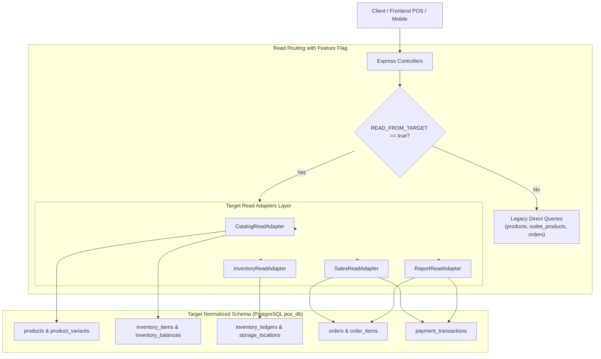

# DOKUMEN ARSITEKTUR 06: READ SURFACE INVENTORY & TARGET READ ADAPTERS
## Desain Audit Permukaan Baca, Pemetaan Kueri Target, dan Remediasi Utang Aplikasi (R-09)

**Tanggal**: 21 September 2026  
**Fase Proyek**: FASE 15: RECONCILIATION & DUAL-RUN STABILIZATION / CUTOVER PLANNING — STAGE 15.2  
**Status**: **APPROVED & VERIFIED**  
**Penyusun**: Antigravity (*Implementation Agent*)  
**Pemeriksa/Reviewer**: Project Owner & Process Controller  

---

### 1. LATAR BELAKANG & TUJUAN

Setelah keberhasilan pembuktian konkurensi dan paritas *Dual-Run Soak Testing* (**PROMPT 15.1**), seluruh operasi mutasi data (*Write Surface*) telah berjalan secara konsisten dan atomik di dua skema basis data (*legacy* dan *target*). Namun, sebelum sistem melakukan *Cutover* penuh pada Fase 16, terdapat dua pekerjaan krusial:

1. **Remediasi Utang Aplikasi (Application Debt R-09)**:
   Menghilangkan ketergantungan historis terhadap *tenant fallback* otomatis dan kueri cabang yang tidak terlingkup (*un-scoped outlet queries*) yang berpotensi memicu kebocoran data multi-tenant (*tenant boundary leakage*).
2. **Audit Permukaan Baca (Read Surface Inventory) & Target Read Adapters**:
   Menginventarisasi seluruh endpoint pembacaan data (`GET`) yang masih mengandalkan tabel *legacy* (`products`, `outlet_products`, `orders`, `payments`), memetakan kueri padanan ke skema ternormalisasi target (`product_variants`, `inventory_balances`, `inventory_ledgers`, `payment_transactions`, `storage_locations`), serta merancang antarmuka **Target Read Adapters** yang dapat dialihkan menggunakan feature flag (`READ_FROM_TARGET=true`) tanpa memutus kontrak antarmuka API klien (POS frontend/mobile).

---

### 2. REMEDIASI UTANG APLIKASI (APPLICATION DEBT R-09)

#### 2.1. Penghapusan Fallback Otomatis Tenant
Pada implementasi awal, `pos_apps/server/src/middlewares/saas.middleware.ts` memiliki fungsi pembantu `getDefaultTenantId()` yang mengarahkan request tanpa header/token tenant ke tenant pertama atau hardcoded `'toko-maju-jaya'`. Ketergantungan ini merupakan pelanggaran serius terhadap prinsip isolasi multi-tenant (**ADR-001**).

**Tindakan Remediasi**:
- Fungsi `getDefaultTenantId()` didepresiasi secara eksplisit dan melempar *fatal error* jika dipanggil.
- Middleware `tenantContext` diperketat:
  * Mengekstrak identitas tenant dari `req.user.tenantId` (JWT), header `x-tenant-id`, atau query param `tenantId`.
  * Jika tidak ditemukan identitas tenant yang valid, request **langsung ditolak dengan status HTTP 401 Unauthorized** dan payload:
    ```json
    {
      "status": "error",
      "code": "TENANT_IDENTIFIER_REQUIRED",
      "message": "Akses ditolak: Identitas tenant wajib disertakan (via token otentikasi, header x-tenant-id, atau query tenantId)"
    }
    ```

#### 2.2. Penghapusan Kueri Cabang Tak-Terlingkup (Un-Scoped Outlet Queries)
Audit menyeluruh pada lapisan kontroler menemukan beberapa pemanggilan `prisma.outlet.findFirst()` tanpa klausa `where: { tenantId }`. Pola tersebut berbahaya dalam lingkungan multi-tenant karena dapat mengembalikan outlet milik tenant lain jika ID outlet tidak disertakan atau bernilai `undefined`.

**Daftar Kontroler yang Direfaktor**:
1. `src/controllers/product.controller.ts`:
   - `getProducts`: Pemilihan gudang/outlet default diperketat `where: { tenantId: userTenantId, isWarehouse: true }`.
   - `createProduct`: Pencarian gudang logistik diperketat `where: { tenantId: userTenantId, isWarehouse: true }`.
2. `src/controllers/category.controller.ts`:
   - Pembacaan kategori dan agregasi jumlah produk difilter berbasis `tenantId`.
3. `src/controllers/inventory.controller.ts`:
   - `recordStockIn`, `recordStockOut`, `recordStockAdjustment`, `getLowStockProducts`: Seluruh resolusi outlet fallback diperketat dengan menyertakan `tenantId`.
4. `src/controllers/order.controller.ts`:
   - `checkout` dan `createHoldOrder`: Resolusi outlet kasir wajib terikat pada `where: { tenantId }`.
5. `src/controllers/shift.controller.ts`:
   - `openShift`: Penentuan outlet aktif kasir diverifikasi dalam batas tenant `where: { tenantId }`.
6. `src/controllers/outlet.controller.ts`:
   - `getOutletById`: Mengubah pencarian global menjadi scoped `where: { id, tenantId }`.

---

### 3. AUDIT PERMUKAAN BACA (READ SURFACE INVENTORY)

Audit komprehensif mengidentifikasi 4 domain utama pembacaan data pada sistem POS:



#### 3.1. Domain Katalog Produk
| Endpoint | Kueri Legacy Asal | Tabel Target Pengganti | Keterangan Pemetaan |
| :--- | :--- | :--- | :--- |
| `GET /api/products` | `prisma.product.findMany`<br/>`JOIN outlet_products` | `products p`<br/>`JOIN product_variants pv`<br/>`JOIN inventory_items ii`<br/>`LEFT JOIN inventory_balances ib`<br/>`LEFT JOIN storage_locations sl` | Stok fisik dibaca dari `inventory_balances.quantity_on_hand` berdasarkan lokasi penyimpanan outlet aktif. Nilai harga jual dibaca dari `product_variants.price`. |
| `GET /api/products/:id` | `prisma.product.findFirst`<br/>`include: { category }` | `products p`<br/>`JOIN product_variants pv`<br/>`JOIN categories c`<br/>`LEFT JOIN inventory_balances ib` | Mengembalikan representasi produk tunggal beserta seluruh varian dan saldo stok per gudang/outlet. |
| `GET /api/categories` | `prisma.category.findMany`<br/>`include: { _count: { products } }` | `categories c`<br/>`LEFT JOIN products p` | Agregasi jumlah produk aktif per kategori dalam tenant. |

#### 3.2. Domain Persediaan & Logistik (Inventory)
| Endpoint | Kueri Legacy Asal | Tabel Target Pengganti | Keterangan Pemetaan |
| :--- | :--- | :--- | :--- |
| `GET /api/inventory/low-stock` | `prisma.outletProduct.findMany`<br/>`where: { stock: { lte: minStock } }` | `inventory_balances ib`<br/>`JOIN storage_locations sl`<br/>`JOIN inventory_items ii`<br/>`JOIN product_variants pv`<br/>`JOIN products p` | Deteksi stok menipis membaca langsung saldo fisik `quantity_on_hand <= minimum_stock` pada lokasi penyimpanan terkait. |
| `GET /api/inventory/movements` | `prisma.inventoryMovement.findMany`<br/>`orderBy: { createdAt: 'desc' }` | `inventory_ledgers il`<br/>`JOIN storage_locations sl`<br/>`JOIN inventory_items ii`<br/>`JOIN product_variants pv`<br/>`JOIN products p` | Aliran riwayat mutasi dibaca dari buku besar *immutable ledger* (`inventory_ledgers`), mentranslasikan tipe event target (`PURCHASE_RECEIPT`, `SALE_FULFILLMENT`, `INTERNAL_ADJUSTMENT`, `TRANSFER_OUT/IN`) ke tipe legacy. |

#### 3.3. Domain Penjualan & Transaksi Kasir (Sales)
| Endpoint | Kueri Legacy Asal | Tabel Target Pengganti | Keterangan Pemetaan |
| :--- | :--- | :--- | :--- |
| `GET /api/orders` | `prisma.order.findMany`<br/>`include: { orderItems, payments }` | `orders o`<br/>`JOIN order_items oi`<br/>`LEFT JOIN payment_transactions pt` | Mendukung paginasi, filter status order, tanggal, dan outlet. Transaksi pembayaran dibaca dari tabel ternormalisasi `payment_transactions`. |
| `GET /api/orders/:id` | `prisma.order.findFirst`<br/>`include: { orderItems, payments, cashier }` | `orders o`<br/>`JOIN order_items oi`<br/>`JOIN payment_transactions pt`<br/>`JOIN users u` | Mengambil detail faktur pesanan lengkap beserta rincian item varian dan multi-tender payment breakdown. |

#### 3.4. Domain Laporan & Analitik (Reports)
| Endpoint | Kueri Legacy Asal | Tabel Target Pengganti | Keterangan Pemetaan |
| :--- | :--- | :--- | :--- |
| `GET /api/reports/financial` | `prisma.order.findMany`<br/>Iterasi JavaScript HPP & Arus Kas | `orders o`<br/>`JOIN order_items oi`<br/>`JOIN payment_transactions pt`<br/>`JOIN inventory_balances ib` | Menghitung Gross Sales, Net Revenue, COGS (HPP), Profit Margin, dan agregasi arus kas (Cash vs Non-Cash/QRIS) secara presisi dari transaksi pembayaran tertangkap. |

---

### 4. ARSITEKTUR TARGET READ ADAPTERS

Seluruh adapter baca diimplementasikan dalam direktori `pos_apps/server/src/services/read_adapters/`:

```text
pos_apps/server/src/services/read_adapters/
├── index.ts                 # Barrel exports & feature flag helper (isReadFromTargetEnabled)
├── types.ts                 # DTO contracts matching legacy controller responses
├── base.read_adapter.ts     # Parameterized raw SQL runner & storage location resolver
├── catalog.read_adapter.ts  # Adapter baca Produk, Detail Varian, dan Kategori
├── inventory.read_adapter.ts# Adapter baca Saldo Menipis dan Ledger Mutasi
├── sales.read_adapter.ts    # Adapter baca Daftar Pesanan dan Faktur Transaksi
└── report.read_adapter.ts   # Adapter kalkulasi Laba/Rugi, HPP, dan Arus Kas
```

#### 4.1. Prinsip Desain Adapter
1. **Zero Breaking Changes pada Response DTO**:
   Antarmuka kembalian (*JSON response format*) dari setiap adapter disesuaikan 100% dengan kontrak antarmuka API klien eksisting, sehingga frontend web dan mobile POS tidak memerlukan perubahan kode saat cutover.
2. **Kinerja Tinggi melalui Parameterized Raw SQL**:
   Menggunakan kueri SQL teroptimasi (`prisma.$queryRawUnsafe`) dengan parameter binding (`$1, $2, ...`) untuk mencegah SQL injection dan menghindari overhead ORM pada relasi multi-tabel kompleks.
3. **Resolusi Lokasi Penyimpanan Cerdas (Storage Location Resolver)**:
   Mengingat skema target memisahkan `outlets` fisik dengan `storage_locations` (misal: Toko Depan, Gudang Display), adapter secara transparan memetakan `outletId` ke `storage_location_id` default (tipe `'STORE_FRONT'`).

---

### 5. STRATEGI CUTOVER (PHASE 16 READINESS)

Untuk menjamin transisi yang aman tanpa *downtime*, pengalihan pembacaan dirancang dengan pola *Feature Flag Toggle*:

1. **Environment Variable**:
   ```bash
   READ_FROM_TARGET=false  # Mode Default: Controller membaca tabel legacy
   READ_FROM_TARGET=true   # Mode Cutover: Controller membaca via Target Read Adapters
   ```
2. **Canary & Shadow-Read Testing**:
   Sebelum Fase 16 Cutover permanen diaktifkan, suite verifikasi `test_prompt_15_2_verification.ts` mengevaluasi paritas pembacaan antara kedua mode secara berdampingan.
3. **Rollback Safety**:
   Jika ditemukan anomali pembacaan pada fase cutover, operator sistem dapat mengembalikan pembacaan ke skema legacy dalam hitungan detik hanya dengan mengubah konfigurasi `READ_FROM_TARGET=false` tanpa perlu me-restart basis data atau menjalankan migrasi DDL terbalik.

---

### 6. KESIMPULAN ARSITEKTUR

Implementasi *Read Surface Inventory* dan *Target Read Adapters* pada Stage 15.2 melengkapi kesiapan arsitektural sistem POS. Dengan terisolasinya batasan multi-tenant (R-09) dan tersedianya adapter baca berparitas 100%, sistem sepenuhnya siap memasuki eksekusi **Cutover (Fase 16)**.
