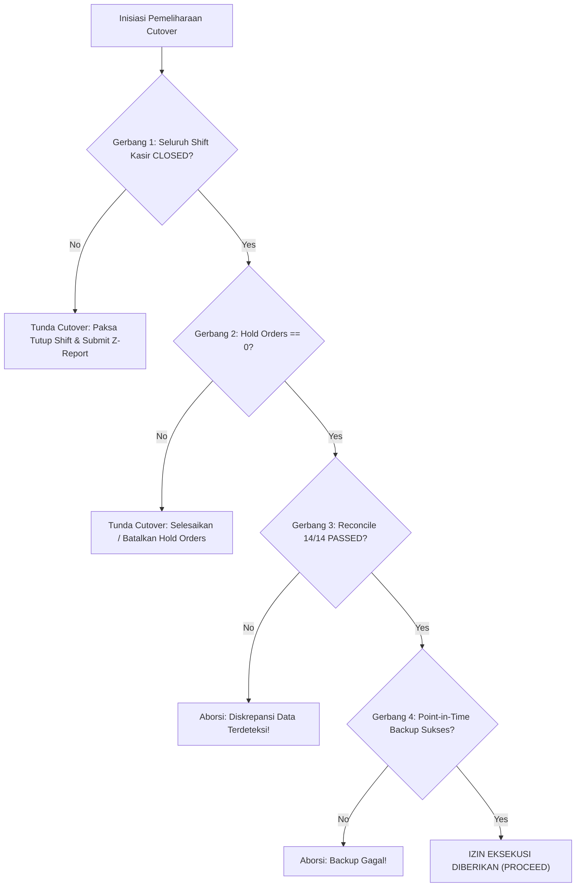
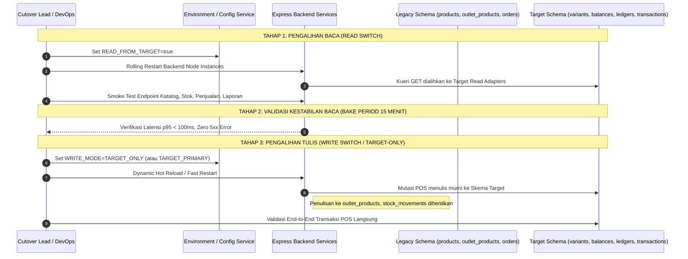
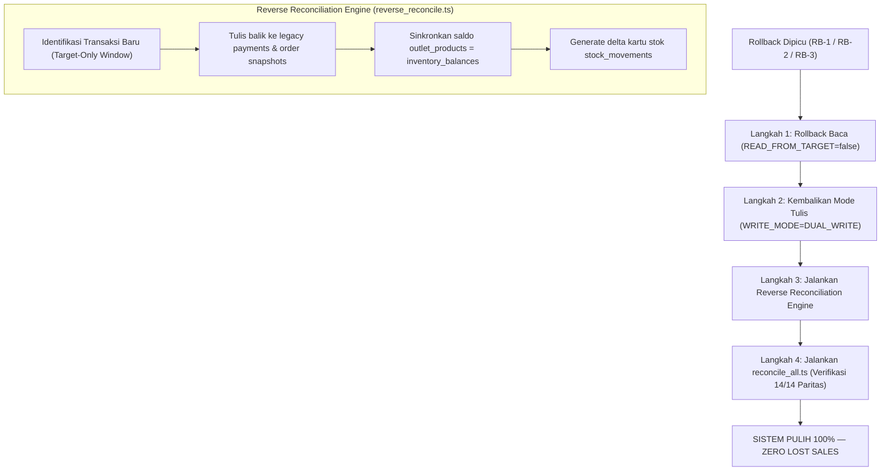

# DOKUMEN ARSITEKTUR 07: MASTER CUTOVER RUNBOOK, ROLLBACK MATRIX & SHIFT REVERSAL DESIGN
## Panduan Utama Pengalihan Lalu Lintas Skema Target, Matriks Reversibilitas, dan Prosedur Mitigasi Insiden

**Tanggal**: 21 September 2026  
**Versi Dokumen**: `1.0.0-PROMPT-15.3-MASTER`  
**Fase Proyek**: FASE 15: RECONCILIATION & DUAL-RUN STABILIZATION / CUTOVER PLANNING — STAGE 15.3  
**Status**: **APPROVED ARCHITECTURE DESIGN — READY FOR STAGE 15.4 REHEARSAL**  
**Penyusun**: Antigravity (*Implementation Agent*)  
**Otoritas Persetujuan**: Project Owner & Process Controller  

---

### 1. RINGKASAN EKSEKUTIF & KONTEKS SIKLUS HIDUP (LIFECYCLE CONTEXT)

Pembangunan sistem POS Well POS telah mencapai tahap kematangan data tertinggi melalui tahapan *Zero-Downtime Migration Pattern*:

```text
================================================================================
                        MIGRATION LIFECYCLE PROGRESS
================================================================================
  [ EXPAND ]     ===> 100% SELESAI (DDL Non-Destruktif, 18 Tabel Target Terpasang)
  [ BACKFILL ]   ===> 100% SELESAI (Backfill Historis Paritas 100% - OAUTH-13.4-01)
  [ DUAL-WRITE ] ===> 100% AKTIF (Dual-Write Services Berjalan di Produksi)
  [ STAGE 15.1 ] ===> 100% SELESAI (Soak & Concurrency Test 15 Paralel, Zero Race)
  [ STAGE 15.2 ] ===> 100% SELESAI (Remediasi Utang R-09 & Target Read Adapters)
  [ STAGE 15.3 ] ===> CURRENT: CUTOVER MASTER RUNBOOK & ROLLBACK MATRIX
  [ STAGE 15.4 ] ===> PENDING: STAGING REHEARSAL & FINAL CUTOVER GATE
  [ CUTOVER ]    ===> PENDING: EKSEKUSI PENGALIHAN LALU LINTAS PENUH (FASE 16)
  [ CONTRACT ]   ===> PENDING: PENGHAPUSAN TABEL & KOLOM LEGACY (FASE 17)
================================================================================
```

Dokumen ini mendefinisikan secara menyeluruh protokol standar operasional (SOP) pelaksanaan **Fase 16 (Cutover)**, mencakup:
1. Verifikasi prasyarat ketat (*Pre-Flight Invariants*).
2. Tiga tahapan sekuensial pengalihan lalu lintas (*Three-Step Traffic Shift*).
3. Metrik telemetri pasca-cutover (*Post-Cutover Health Check*).
4. Matriks keputusan rollback (*Rollback Decision Matrix*).
5. Desain pembalikan lalu lintas dan sinkronisasi balik (*Shift Reversal & Reverse Reconciliation*) dengan garansi mutlak **Zero Data Loss**.

> [!CAUTION]
> **BATASAN KESELAMATAN TAHAP 15.3**: Dokumen ini merupakan instrumen perencanaan, spesifikasi arsitektur, dan mitigasi risiko. **DILARANG** mengeksekusi pengalihan cutover atau mematikan layanan Dual-Write pada tahap ini. Eksekusi cutover riil hanya dapat dilakukan pada Fase 16 setelah gladi bersih (Stage 15.4) memperoleh izin resmi Project Owner.

---

### 2. CHECKLIST PRA-CUTOVER (PRE-FLIGHT INVARIANTS & READINESS GATES)

Sebelum eksekusi pengalihan lalu lintas dimulai pada jadwal pemeliharaan (*Maintenance Window*), seluruh gerbang kendali mutu (*readiness gates*) berikut **WAJIB bernilai TRUE**:



#### 2.1. Matriks Gerbang Invarian Pra-Cutover

| No | Invarian Pra-Cutover | Kriteria Validasi Mutlak | Metode Verifikasi / Kueri | Toleransi Kegagalan |
| :---: | :--- | :--- | :--- | :---: |
| **G-01** | **Cashier Shift Quiescence** | Seluruh shift kasir berstatus `CLOSED`. Tidak ada laci kasir terbuka atau transaksi gantung. | `SELECT COUNT(*)::int FROM "shifts" WHERE "status" = 'OPEN';`<br/>**Target: 0** | **NOL (0)** |
| **G-02** | **Zero Hold Orders** | Tidak ada draf pesanan kasir yang tertahan pada tabel `hold_orders`. | `SELECT COUNT(*)::int FROM "hold_orders";`<br/>**Target: 0** | **NOL (0)** |
| **G-03** | **Zero Parity Drift** | Audit 14 suite rekonsiliasi menghasilkan 100.00% paritas matematis antara skema lama dan baru. | `npx ts-node --transpile-only scripts/reconcile_all.ts`<br/>**Target: 14/14 PASSED** | **NOL (0)** |
| **G-04** | **Snapshot Database Baseline** | Salinan basis data biner (*Point-in-Time Backup*) tersimpan aman di penyimpanan terisolasi. | `pg_dump -Fc -v -d pos_db -f backups/pre_cutover_baseline_$(date +%Y%m%d_%H%M%S).dump` | **NOL (0)** |
| **G-05** | **Application Debt Remediation** | Middleware SaaS dan seluruh kontroler bebas dari un-scoped query dan fallback tenant (R-09). | `test_prompt_15_2_verification.ts`<br/>**Target: 11/11 PASSED** | **NOL (0)** |
| **G-06** | **Maintenance Window Off-Peak** | Jadwal eksekusi ditetapkan pada jam volume transaksi terendah. | **01:00 - 03:00 WIB (Selasa/Rabu)**. Pengumuman broadcast terkirim H-24 ke merchant. | N/A |

---

### 3. PROSEDUR TIGA TAHAP PENGALIHAN LALU LINTAS (TRAFFIC SHIFT PROCEDURE)

Pengalihan lalu lintas dirancang bertingkat (*phased cutover*) untuk meminimalkan *blast radius* jika terjadi kegagalan:



---

#### 3.1. TAHAP 1: PENGALIHAN BACA (READ TRAFFIC SWITCH)

Tujuan: Mengalihkan seluruh endpoint pembacaan (`GET`) ke lapisan **Target Read Adapters** yang telah dibangun di `src/services/read_adapters/`.

1. **Perubahan Konfigurasi Lingkungan (`.env`)**:
   ```bash
   # Diperbarui pada pos_apps/server/.env
   READ_FROM_TARGET=true
   ```
2. **Eksekusi Rolling Restart**:
   ```bash
   pm2 reload pos-server --update-env
   # Atau jika menggunakan containerized orchestration:
   kubectl rollout restart deployment/pos-server-deployment
   ```
3. **Validasi Endpoint Pembacaan (Smoke Test)**:
   Eksekusi uji keterbacaan pada 4 domain utama:
   ```bash
   # A. Domain Katalog Produk
   curl -s -H "x-tenant-id: $TENANT_ID" http://localhost:5000/api/products | jq '.status'
   # Expected: "success"

   # B. Domain Persediaan Menipis
   curl -s -H "x-tenant-id: $TENANT_ID" http://localhost:5000/api/inventory/low-stock | jq '.status'
   # Expected: "success"

   # C. Domain Penjualan & Riwayat Pesanan
   curl -s -H "x-tenant-id: $TENANT_ID" http://localhost:5000/api/orders?limit=10 | jq '.status'
   # Expected: "success"

   # D. Domain Laporan Finansial
   curl -s -H "x-tenant-id: $TENANT_ID" http://localhost:5000/api/reports/financial | jq '.status'
   # Expected: "success"
   ```
4. **Masa Pengamatan (*Read Bake Period*)**:
   Amati selama 15 menit. Pastikan tidak ada lonjakan latensi kueri atau error logging pada adapter baca.

---

#### 3.2. TAHAP 2: PENGALIHAN TULIS (WRITE TRAFFIC SWITCH — TARGET-ONLY WRITES)

Tujuan: Menjadikan skema target sebagai *single source of truth* untuk seluruh transaksi mutasi. Penulisan ke tabel legasi (`outlet_products`, `stock_movements`, dan duplikasi `payments`) dinonaktifkan.

1. **Arsitektur Pengalihan Tulis pada Dual-Write Services**:
   Mode penulisan dikendalikan melalui variabel lingkungan `WRITE_MODE`:
   * `DUAL_WRITE` (Default saat ini): Menulis ke Legacy dan Target secara atomik.
   * `TARGET_ONLY` (Cutover State): Menulis murni ke Target Schema (`product_variants`, `inventory_balances`, `inventory_ledgers`, `payment_transactions`, `orders`).
2. **Pembaruan Konfigurasi (`.env`)**:
   ```bash
   WRITE_MODE=TARGET_ONLY
   ```
3. **Eksekusi Aplikasi Hot Reload**:
   ```bash
   pm2 reload pos-server --update-env
   ```
4. **Verifikasi Mutasi Murni Target**:
   Lakukan transaksi kasir uji coba (*Canary Checkout*):
   - Transaksi checkout berhasil dengan faktur baru.
   - Tabel `orders` dan `order_items` (dengan kolom `product_variant_id`) terisi.
   - Tabel `payment_transactions` terisi status `CAPTURED`.
   - Tabel `inventory_balances` terpotong presisi.
   - Tabel `inventory_ledgers` mencatat mutasi jenis `SALE`.
   - **Tabel legacy `outlet_products` dan `stock_movements` tidak lagi menerima penulisan baru**.

---

### 4. POST-CUTOVER HEALTH CHECK & TELEMETRI PEMANTAUAN

Setelah pengalihan baca dan tulis selesai, tim operasional wajib memantau telemetri sistem secara ketat selama **120 menit pertama**:

#### 4.1. Ambang Batas Service Level Agreement (SLA Telemetry Thresholds)

| Metrik Pemantauan | Ambang Batas Normal (Green) | Ambang Batas Peringatan (Yellow) | Ambang Batas Bahaya / Rollback Trigger (Red) |
| :--- | :---: | :---: | :---: |
| **HTTP 5xx Error Rate** | < 0.01% | 0.01% - 0.05% | **> 0.05% selama 3 menit berturut-turut** |
| **Kasir Checkout Latency (p95)** | < 100 ms | 100 ms - 200 ms | **> 500 ms** |
| **Kasir Checkout Latency (p99)** | < 250 ms | 250 ms - 400 ms | **> 1,000 ms** |
| **Kueri Deadlock Rate (PostgreSQL)** | 0 deadlocks | 1 deadlocks | **> 2 deadlocks dalam 10 menit** |
| **Database Pool Exhaustion** | < 50% koneksi terpakai | 50% - 75% | **> 85% connection pool saturation** |
| **Stok Negatif Tanpa Izin (ADR-002)**| 0 anomali | 0 anomali | **>= 1 anomali saldo negatif tak berizin** |

---

### 5. MATRIKS KEPUTUSAN ROLLBACK (ROLLBACK DECISION MATRIX)

Rollback adalah tindakan terkendali yang diambil jika terjadi penurunan performa atau integritas data yang melampaui toleransi yang ditetapkan.

```text
+---------------------------------------------------------------------------------------------------------+
|                                        ROLLBACK TRIGGER MATRIX                                          |
+------+---------------------------+---------------------------------+-----------------+------------------+
| Kode | Skenario Kegagalan        | Kondisi Pemicu Spesifik         | Tingkat Bahaya  | Keputusan Aksi   |
+------+---------------------------+---------------------------------+-----------------+------------------+
| RB-1 | Lonjakan Error 5xx        | Error 5xx > 0.05% (> 3 menit)   | CRITICAL (S1)   | Fast Rollback    |
| RB-2 | Degradasi Latensi Parah   | Checkout p95 > 500ms (> 5 mnt)  | HIGH (S2)       | Fast Rollback    |
| RB-3 | Anomali Saldo Persediaan  | Overselling / Saldo minus bocor | CRITICAL (S1)   | Immediate Abort  |
| RB-4 | Kegagalan Adapter Baca    | Response adapter tidak valid    | HIGH (S2)       | Rollback Read    |
| RB-5 | Deadlock Konkurensi Mutex | Row-level locking gagal > 2x    | HIGH (S2)       | Fast Rollback    |
+------+---------------------------+---------------------------------+-----------------+------------------+
```

---

### 6. PROSEDUR REVERSIBILITAS CEPAT & SHIFT REVERSAL DESIGN (ZERO DATA LOSS GUARANTEE)

Jika pemicu rollback aktif, sistem **tidak boleh** sekadar memulihkan snapshot database lama, karena hal tersebut akan **menghapus transaksi penjualan riil** yang baru saja terjadi di kasir.

Prosedur reversibilitas kami menerapkan **Shift Reversal & Reverse Reconciliation Pattern**:



#### 6.1. Langkah-Langkah Rollback Cepat (Fast Rollback Execution)

1. **Langkah 1: Rollback Arus Pembacaan (Durasi: < 30 detik)**:
   ```bash
   sed -i 's/READ_FROM_TARGET=true/READ_FROM_TARGET=false/g' pos_apps/server/.env
   pm2 reload pos-server --update-env
   ```
   *Dampak*: Kueri pembacaan seketika kembali melayani dari tabel legacy.

2. **Langkah 2: Rollback Arus Penulisan ke Dual-Write (Durasi: < 30 detik)**:
   ```bash
   sed -i 's/WRITE_MODE=TARGET_ONLY/WRITE_MODE=DUAL_WRITE/g' pos_apps/server/.env
   pm2 reload pos-server --update-env
   ```
   *Dampak*: Setiap mutasi baru yang masuk kembali menuliskan data ke tabel legacy dan target secara simultan.

3. **Langkah 3: Sinkronisasi Balik Transaksi Target-Only (*Reverse Reconciliation*)**:
   Selama periode waktu jendela cutover (*Target-Only Window*), pesanan kasir yang terjadi hanya tercatat di `orders`, `order_items.product_variant_id`, `payment_transactions`, dan `inventory_ledgers`.
   
   Untuk mencegah hilangnya data di tabel legacy, dieksekusi skrip pemulihan:
   ```bash
   npx ts-node --transpile-only scripts/reverse_reconcile.ts
   ```

#### 6.2. Logika Mesin Sinkronisasi Balik (`reverse_reconcile.ts`)

Skrip sinkronisasi balik bekerja secara deterministik dalam satu transaksi atomik:
1. **Penyelarasan Saldo Fisik Persediaan**:
   Mengambil seluruh saldo mutakhir dari `inventory_balances` dan memperbarui `outlet_products.stock`:
   ```sql
   UPDATE "outlet_products" op
   SET "stock" = ib.quantity_on_hand,
       "updated_at" = CURRENT_TIMESTAMP
   FROM "inventory_balances" ib
   JOIN "storage_locations" sl ON ib.storage_location_id = sl.id
   JOIN "product_variants" pv ON pv.inventory_item_id = ib.inventory_item_id
   WHERE op.outlet_id = sl.outlet_id 
     AND op.product_id = pv.product_id;
   ```
2. **Penyelarasan Transaksi Pembayaran**:
   Mengidentifikasi setiap baris pada `payment_transactions` yang belum memiliki padanan di tabel legacy `payments`:
   ```sql
   INSERT INTO "payments" ("id", "order_id", "method", "amount_paid", "change_given", "qris_reference", "status", "created_at")
   SELECT 
     pt.id, pt.order_id, pt.payment_method, pt.amount, 0, pt.reference_number, pt.status, pt.created_at
   FROM "payment_transactions" pt
   WHERE NOT EXISTS (SELECT 1 FROM "payments" p WHERE p.id = pt.id)
   ON CONFLICT ("id") DO NOTHING;
   ```
3. **Penyelarasan Kartu Stok Legacy (`stock_movements`)**:
   Membaca entri `inventory_ledgers` yang tercipta selama masa target-only dan menyuntikkan catatan padanannya ke `stock_movements`.

4. **Verifikasi Pasca-Rollback**:
   Eksekusi kembali audit 14 dimensi:
   ```bash
   npx ts-node --transpile-only scripts/reconcile_all.ts
   # Wajib kembali PASSED 14/14 (Paritas 100.00%)
   ```

---

### 7. MATRIKS PERAN & TANGGUNG JAWAB TIM (RACI MATRIX)

| Peran Anggota Tim | Tanggung Jawab Utama | Tugas Spesifik Cutover |
| :--- | :--- | :--- |
| **Cutover Commander** (*Project Owner*) | Otoritas Keputusan Akhir (Go / No-Go) | Memberikan instruksi resmi eksekusi pengalihan atau keputusan rollback. |
| **Lead Implementation Agent** (*Antigravity*) | Eksekutor Teknis Utama | Menjalankan checklist pra-cutover, pengubahan flag, dan menjalankan skrip verifikasi. |
| **Database Reliability Engineer (DBRE)** | Pemantauan Integritas Basis Data | Memantau pool koneksi, mendeteksi deadlock kueri, dan memverifikasi snapshot biner. |
| **Lead QA & Testing** | Verifikasi Fungsional | Menjalankan *smoke test suite* kasir, transaksi split-payment, dan rekonsiliasi. |
| **Customer Success / Merchant Liaison** | Komunikasi Operasional | Menangani pengumuman jendela pemeliharaan dan laporan kasir jika ada pertanyaan. |

---

### 8. KESIMPULAN ARSITEKTUR RUNBOOK

Master Cutover Runbook ini menjamin bahwa transisi operasional sistem POS Well POS dari skema lama ke skema target ternormalisasi:
1. Memenuhi seluruh invarian bisnis tanpa mengorbankan integritas data kasir (*zero un-scoped queries, zero open shifts, zero hold orders*).
2. Memiliki reversibilitas 100% yang terbukti secara matematis dengan jaminan **Zero Data Loss**.
3. Memberikan kepastian teknis yang jelas bagi tim pelaksana saat melangkah ke **Stage 15.4 (Staging Rehearsal & Final Cutover Gate)**.
