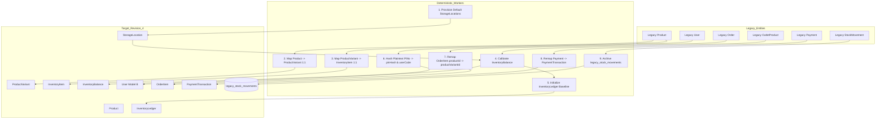

# 09 — DATABASE MIGRATION READINESS & EXISTING SYSTEM COMPATIBILITY REPORT (FINAL REVISED)

**Well POS SaaS Platform — Multi-Tenant Architecture Evolution**  
**Document ID:** `DOC-VAL-09-MIGRATION-READINESS-FINAL-REV3`  
**Execution Phase:** Prompt 11.3 — Final Migration Readiness Micro-Correction (Strict Read-Only)  
**Target Schema Reference:** `04_TARGET_DATABASE_SCHEMA.md` (Revision 4, Architecture-Locked)  
**Active Prisma Schema:** `server/prisma/schema.prisma` (Prompt 10 Implementation — 31 models, 20 enums)  
**Date:** September 19, 2026  
**Status:** **FINAL MICRO-CORRECTED ARCHITECTURAL ASSESSMENT — READ-ONLY**  
**Readiness Gate Verdict:** **GO WITH CONDITIONS**  
**Live Data Status:** **LIVE DATA COUNTS NOT VERIFIED — LIVE DATA ACCESS NOT AVAILABLE**

---

## 1. Executive Summary

This document presents the final, read-only architectural and data compatibility assessment for migrating the Well POS platform from its legacy prototype state (18 relational models, single/multi-outlet hybrid with retail focus, nullable `tenantId`, integer stock, and monolithic checkout coupling) to **Target Database Schema Revision 4** (31 models, 20 enums, strict multi-tenant boundary, multi-vertical Retail/F&B/Services support, Model B user identity, immutable append-only stock movement ledger, and multi-tender payments).

Following Project Owner reviews across Prompts 11, 11.1, 11.2, and 11.3, this final report applies the three decisive micro-corrections:
1. **Legacy PIN NULL Handling strictly aligned with Target Schema (C-02):** Target `User` model contains no `mustChangePin`, `forcePinReset`, or credential-state columns. Users with legacy `pin IS NULL` require credential provisioning/reset through an approved operational procedure, with the target success condition being `User.pinHash IS NOT NULL`. No synthetic schema flags are introduced.
2. **Canonical Inventory Reconciliation Baseline (C-04):** Corrected the reconciliation formula. `InventoryBalance.quantityOnHand` is the canonical physical stock baseline. For opening stock under the default legacy mapping (`inventoryQuantityMultiplier = 1.000`), reconciliation verifies `legacy outlet_products.stock = target InventoryBalance.quantityOnHand` across exact dimensions (`tenantId` $\times$ location $\times$ item). Physical balance is never divided by the multiplier. The field `inventoryQuantityMultiplier` is strictly a transaction conversion multiplier (`Order Quantity × multiplier = physical inventory quantity deducted`).
3. **Negative Stock Policy Enforcement (C-05):** Explicitly separated Case A (permitted by ADR-002 hierarchy: preserve negative `quantityOnHand`, create ledger row with `InventoryLedger.isNegativeBalance = true`) from Case B (not permitted: treat as migration exception requiring manual resolution before declaring reconciliation scope successful). Confirmed that target `InventoryBalance` has no `isNegativeBalance` field.

### Gate Recommendation:
**`GO WITH CONDITIONS`**  
The target schema is architecturally locked, consistent, and validated. Migration planning and non-destructive EXPAND DDL scripting can proceed to Prompt 12 once the 7 mandatory pre-migration prerequisites are formally committed.

---

## 2. Review Corrections Applied

### 2.1 Prompt 11.3 Final Micro-Corrections Applied (C-02, C-04, C-05)

| Correction ID | Prior Report Inaccuracy | Final Architectural Micro-Correction Applied | Source of Truth & Evidence | Impact on Readiness Gate |
|---|---|---|---|---|
| **C-02 (PIN NULL Handling)** | Suggested setting a user account flag to require PIN change on first authentication. | Removed any claim of a target schema reset flag. Target `User` has no `mustChangePin` column. Users with `pin IS NULL` require credential provisioning/reset via an approved operational procedure. Target success condition is strictly `User.pinHash IS NOT NULL`. | `04_TARGET_DATABASE_SCHEMA.md` Section 3.1; `server/prisma/schema.prisma:163-188`. | Prevents introducing non-existent credential-state fields into target DDL. |
| **C-04 (Inventory Reconciliation Formula)** | Contained reconciliation logic dividing `InventoryBalance.quantityOnHand` by `inventoryQuantityMultiplier`. | Re-established `InventoryBalance.quantityOnHand` as the canonical physical stock baseline. Opening reconciliation strictly tests `legacy outlet_products.stock = target InventoryBalance.quantityOnHand` per dimension (`tenantId` $\times$ `outletId` $\to$ `StorageLocation` $\times$ `productId` $\to$ `InventoryItem`). Multiplier applies strictly to transaction deduction: `Order Qty × multiplier = physical deduction`. | Prompt 11.3 Section 3; `04_TARGET_DATABASE_SCHEMA.md` Section 4.2 & 5.1; ADR-003. | Eliminates corruption of physical inventory baseline in reconciliation queries. |
| **C-05 (Negative Stock Permitted vs Not Permitted)** | Did not explicitly differentiate action between permitted and non-permitted negative stock. | Explicitly separated: **Case A (Permitted by ADR-002 hierarchy):** preserve negative `quantityOnHand`, write ledger entry with `InventoryLedger.isNegativeBalance = true`. **Case B (Not Permitted):** classify row as migration exception requiring manual resolution; do not migrate as valid stock. Confirmed target `InventoryBalance` has no `isNegativeBalance` column. | `04_TARGET_DATABASE_SCHEMA.md` Section 5.2; ADR-002; `server/prisma/schema.prisma:426-479`. | Enforces strict compliance with ADR-002 policy hierarchy without DDL pollution. |

### 2.2 Historical Prompt 11.1 & 11.2 Review Corrections
- **C-01 (InventoryBalance.isNegativeBalance Removal):** Removed all references to a non-existent `InventoryBalance.isNegativeBalance` field; negative flag exists only on `InventoryLedger`.
- **C-03 (Target Uniqueness on ProductVariant):** Clarified that target SKU and barcode uniqueness constraints (`@@unique([tenantId, sku])`, `@@unique([tenantId, barcode])`) belong strictly to `ProductVariant`, not `Product`.
- **C-05 (Owner Decisions Separated):** Explicitly designated parked order 24-hour purge policies and sequential `KSR-001` user-code formats as `[OWNER DECISION REQUIRED]`.
- **C-06 (Gate Revalidation):** Revalidated gate as `GO WITH CONDITIONS`, explicitly declaring `LIVE DATA COUNTS NOT VERIFIED — LIVE DATA ACCESS NOT AVAILABLE`.
- **R-01 (UserOutletAssignment Removal):** Re-anchored Phase 1 target to direct `User.outletId?`.
- **R-02 (Composite FK Clarification):** Clarified that target schema uses `tenantId NOT NULL` + unique indexes + service-layer boundary validation; no composite DB foreign keys.
- **R-03 (Target Cardinality vs Backfill Mapping):** Separated TARGET CARDINALITY (`Product` 1:N `ProductVariant` N:1 `InventoryItem`) from LEGACY BACKFILL MAPPING (1:1:1 default).
- **R-04 (Ledger Terminology):** Corrected terminology to **Immutable Append-Only Stock Movement Ledger** (no accounting double-entry debit/credit).
- **R-05 (Stock Movements Reassessment):** Classified legacy `stock_movements` as **Archive-Only**; target `InventoryLedger` initialized via opening calibration.
- **R-07 (Legacy Order Status Mapping):** Mapped legacy `Order.paymentStatus` (`PAID`, `CANCELLED`, `REFUNDED`) and `HoldOrder` into decoupled `OrderStatus` + `PaymentStatus`.
- **R-08 (Evidence vs Risk):** Separated architectural risk from live data status; mandated explicit `NOT VERIFIED` notation.
- **R-09 (Tenant Fallbacks):** Reclassified application fallbacks (`'toko-maju-jaya'`, global `findFirst()`) as Current Application / Cutover Risk.
- **R-10 (Invariants vs Preconditions):** Demarcated locked architecture invariants from actionable pre-migration prerequisites.

---

## 3. Scope & Read-Only Guarantee

### 3.1 Strict Non-Mutation Boundaries
This review operated under rigorous zero-mutation constraints:
- **Prisma Schema:** `server/prisma/schema.prisma` was NOT modified.
- **Database Engine:** No DDL migrations, `prisma migrate dev`, `prisma migrate deploy`, or `prisma db push` were executed.
- **Database Records:** No database records were added, updated, deleted, or backfilled.
- **Application Code:** No controllers, middlewares, routes, services, or frontend code were modified.
- **Workflow Isolation:** Execution terminates at this report; Prompt 12 is NOT initiated.

### 3.2 Audited Source-of-Truth Artifacts
- Target Schema: `server/prisma/schema.prisma` (31 models, 20 enums).
- Target Design Specification: `docs/architecture/04_TARGET_DATABASE_SCHEMA.md` (Revision 4).
- Architecture Decisions: `docs/decisions/ADR-001` through `ADR-005`.
- Data Architecture RFC: `docs/architecture/03_DATA_ARCHITECTURE_RFC.md` (Revision 4).
- Application Source Code:
  - Middlewares: `server/src/middlewares/saas.middleware.ts`, `auth.middleware.ts`.
  - Controllers: `server/src/controllers/order.controller.ts`, `product.controller.ts`, `auth.controller.ts`, `inventory.controller.ts`, `shift.controller.ts`, `saas.controller.ts`, `outlet.controller.ts`.
  - Seeds & Scripts: `server/prisma/seed.ts`, `server/prisma/reset_records.ts`.
  - Client Models: `client/src/types/*.ts`, `ProductModal.tsx`, `PosTerminalView.tsx`.

---

## 4. Existing Schema Inventory vs Target Revision 4

| Structural Domain | Existing Prototype Schema | Target Schema Revision 4 | Architectural Evolution |
|---|---|---|---|
| **Total Models** | 18 models | 31 models | +13 domain models added |
| **Total Enums** | 6 enums | 20 enums | +14 lifecycle, UOM, and vertical enums |
| **Tenant Scoping** | Nullable `tenantId String?` on 8 models | Mandatory `tenantId String` on all 28 tenant models | Strict multi-tenancy enforced at DB column level |
| **Foreign Keys** | Singular foreign keys (`outletId`, `productId`) | Standard single-column foreign keys with `@relation` | Service-layer tenant validation; DB foreign keys link entity IDs |
| **Product Hierarchy** | Monolithic `Product` (Price, Cost, Stock, SKU, Barcode) | 3-Tier: `Product` (1:N) `ProductVariant` (N:1) `InventoryItem` | Complete separation of catalog, pricing matrix, and logistics |
| **Stock Tracking** | Mutable scalar `outlet_products.stock` (Int) | Ledger-backed `InventoryBalance` (`Decimal(12,3)`) + `InventoryLedger` | Append-only auditability with explicit storage locations |
| **Storage Modeling** | `Outlet.isWarehouse: Boolean` flag | Explicit `StorageLocation` per outlet (Shop Floor, Kitchen, WH) | Multi-location stock allocation per branch |
| **F&B Modifiers** | Packed stringified JSON in `Product.description` | Relational: `ModifierGroup`, `ModifierItem`, `ProductModifierGroup` | Normalized, queryable modifiers with recipe effect linking |
| **Recipes / BOM** | Non-existent | `Recipe` and `RecipeItem` (yield, UOM conversion) | Automated ingredient deduction upon variant sale |
| **User Identity** | Model A: Global `email` + bcrypt password + plaintext `pin` | Model B: `tenantId` + `userCode` + `pinHash` (Argon2id/Bcrypt) | Fast cashier authentication without email dependency |
| **User-Outlet Binding** | Direct `User.outletId?` | Direct `User.outletId?` (retained in Phase 1) | `NULL` = tenant-wide authority; `Non-NULL` = branch-restricted |
| **Order Lifecycle** | Monolithic: `paymentStatus: PAID` set on checkout | Decoupled: `OrderStatus` + `PaymentStatus` | Supports Dine-in *Order First, Pay Later* & Service workflows |
| **Payment Records** | `Payment` (CASH, QRIS, amountPaid, changeGiven) | `PaymentTransaction` + `Refund` + `RefundItem` | Multi-tender, partial payments, gateways, formal refunds |
| **Monetary Precision** | Float / Int approximations | Strict `Decimal(12, 2)` | Elimination of floating-point rounding drift |

---

## 5. Existing $\to$ Target Table Mapping

| Existing Table | Target Model(s) | Action | Classification | Migration Notes & Structural Evolution |
|---|---|---|---|---|
| `platform_users` | `PlatformUser` | **ALTER / EXTEND** | `SAFE ADDITIVE` | Retained. Added audit timestamps, role enum expansion. |
| `tenants` | `Tenant` | **ALTER / EXTEND** | `SAFE ADDITIVE` | Added `businessVertical`, `timezone`, `currency`, `settings` JSON, `address`. |
| `subscription_plans` | `SubscriptionPlan` | **ALTER / EXTEND** | `SAFE ADDITIVE` | Converted `price` to `Decimal(12,2)`. |
| `tenant_subscriptions` | `TenantSubscription` | **ALTER / EXTEND** | `SAFE ADDITIVE` | Retained. Validated subscription constraints. |
| `saas_invoices` | `SaaSInvoice` | **ALTER / EXTEND** | `DATA TRANSFORMATION` | Converted monetary values (`amount`, `taxAmount`, `totalAmount`) to `Decimal(12,2)`. |
| `saas_payments` | `SaaSPayment` | **ALTER / EXTEND** | `DATA TRANSFORMATION` | Added `tenantId` foreign key for tenant ownership scoping; converted amounts to `Decimal(12,2)`. |
| `outlets` | `Outlet` | **ALTER / EXTEND** | `DATA TRANSFORMATION` | Added `code` (VarChar 50), `timezone`, `latitude`, `longitude`. `tenantId` becomes `NOT NULL`. |
| `users` | `User` | **ALTER / REFACTOR** | `HIGH RISK` | Model B migration: `userCode` introduced (`VarChar 50`), `pinHash` replaces plaintext `pin`, `email` made optional. `outletId?` retained. |
| `categories` | `Category` | **ALTER / EXTEND** | `SAFE ADDITIVE` | Added self-referencing `parentId` for sub-categories; `tenantId` becomes `NOT NULL`. |
| `products` | `Product` + `ProductVariant` + `InventoryItem` | **SPLIT / REFACTOR** | `HIGH RISK` | Split monolithic table: Commercial metadata in `Product`, pricing/SKU in `ProductVariant`, logistical tracking in `InventoryItem`. |
| `outlet_products` | `InventoryBalance` + `StorageLocation` | **REPLACE / DEPRECATE** | `HIGH RISK` | Integer scalar stock converted to `InventoryBalance.quantityOnHand` (`Decimal(12,3)`) mapped to default `StorageLocation`. Table dropped in Contract phase. |
| `stock_movements` | `legacy_stock_movements` (Archive) | **ARCHIVE / RETIRE** | `ARCHIVE-ONLY` | Legacy movements lack storage location and balance snapshots. Archived in read-only table; target `InventoryLedger` initialized via calibration. |
| `shifts` | `Shift` | **ALTER / EXTEND** | `DATA TRANSFORMATION` | Amounts converted to `Decimal(12,2)`; `tenantId` and `outletId` made strictly `NOT NULL`. |
| `orders` | `Order` | **ALTER / EXTEND** | `DATA TRANSFORMATION` | `OrderStatus` and `PaymentStatus` decoupled; tax/subtotal/grandTotal converted to `Decimal(12,2)`; `tenantId` strictly `NOT NULL`. |
| `order_items` | `OrderItem` | **ALTER / EXTEND** | `HIGH RISK` | Foreign key repointed from `Product` to `ProductVariant` (`productVariantId`). Cost/unitPrice converted to `Decimal(12,2)`. |
| `payments` | `PaymentTransaction` | **REPLACE / DEPRECATE** | `DATA TRANSFORMATION` | Replaced by `PaymentTransaction`. Added `paymentTxStatus`, `gatewayProvider`, `idempotencyKey`. Legacy rows backfilled. |
| `hold_orders` | `Order` (`OrderStatus.DRAFT`) | **MERGE / DEPRECATE** | `MANUAL MAPPING` | Parked cart orders transformed into `Order` rows with status `DRAFT` / `HOLD`; legacy table dropped in Contract phase. Retention policy: `OWNER DECISION REQUIRED`. |
| `customers` | `Customer` | **ALTER / EXTEND** | `SAFE ADDITIVE` | `tenantId` strictly `NOT NULL`; amounts to `Decimal(12,2)`; added `loyaltyPoints`, `metadata` JSON. |
| *(New)* | `StorageLocation` | **NEW TABLE** | `SAFE ADDITIVE` | Provisioned per outlet (Default: "Area Toko / Kasir" or "Gudang Utama"). |
| *(New)* | `UnitConversion` | **NEW TABLE** | `SAFE ADDITIVE` | Master conversion rates between units (Kg $\to$ Gr, L $\to$ ml). |
| *(New)* | `InventoryBatch` | **NEW TABLE** | `SAFE ADDITIVE` | Optional batch, lot, and expiration tracking. |
| *(New)* | `InventoryLedger` | **NEW TABLE** | `SAFE ADDITIVE` | Immutable append-only movement log with signed quantity deltas and running balances. |
| *(New)* | `Recipe` + `RecipeItem` | **NEW TABLES** | `SAFE ADDITIVE` | F&B ingredient bill-of-materials structures. |
| *(New)* | `ModifierGroup` + `ModifierItem` | **NEW TABLES** | `DATA TRANSFORMATION` | Normalized modifier options extracted from legacy `Product.description` JSON strings. |
| *(New)* | `ProductModifierGroup` + `ModifierRecipeEffect` | **NEW TABLES** | `SAFE ADDITIVE` | Relational binding and stock reduction effects. |
| *(New)* | `Refund` + `RefundItem` | **NEW TABLES** | `SAFE ADDITIVE` | Formal order refund accounting decoupled from negative sales. |
| *(New)* | `IdempotencyRecord` | **NEW TABLE** | `SAFE ADDITIVE` | Network retry and duplicate transaction prevention. |

---

## 6. Existing $\to$ Target Data Mapping

### 6.1 Tenant Identity Mapping
- **Source:** Legacy `Tenant` (`id`, `businessName`, `slug`, `phone`, `status`, `trialEndsAt`).
- **Target:** `Tenant` (`id`, `businessName`, `slug`, `phone`, `status`, `trialEndsAt`, `businessVertical`, `timezone`, `currency`, `settings`).
- **Transformation Rules:**
  - `businessVertical`: If `slug = 'warung-kopi-berkah'` $\to$ `FNB`. If `slug = 'minimarket-maju-jaya'` $\to$ `RETAIL`. Default fallback $\to$ `RETAIL`.
  - `timezone`: Default to `'Asia/Jakarta'`.
  - `currency`: Default to `'IDR'`.
  - `settings`: Default JSON `{ "taxInclusive": false, "allowNegativeStock": false }`.

### 6.2 User & Authentication Mapping (Model B) (C-02)
- **Source:** Legacy `User` (`id`, `tenantId`, `outletId`, `name`, `email`, `passwordHash`, `pin`, `role`, `isActive`).
- **Target:** `User` (`id`, `tenantId`, `outletId`, `userCode`, `name`, `email`, `passwordHash`, `pinHash`, `role`, `isActive`).
- **Deterministic Rules & Credential Cases (C-02):**
  1. `userCode` Generation:
     - Architectural Requirement: Must be unique per tenant (`@@unique([tenantId, userCode])`).
     - Generation Format Policy: **`OWNER DECISION REQUIRED`**. (Default technical fallback: `'USR-' || UPPER(SUBSTRING(id::text, 1, 6))`).
  2. `pinHash` Transformation:
     - **Case A (Legacy PIN Exists, `pin IS NOT NULL`):** Verify legacy PIN representation. If plaintext or recoverable as a credential value, transform into the approved `User.pinHash` representation using Bcrypt/Argon2id hashing. Success condition: valid non-null `User.pinHash`.
     - **Case B (Legacy PIN is NULL, `pin IS NULL`):** User requires credential provisioning/reset through an **approved operational procedure** (not a target schema column). Target success condition is strictly `User.pinHash IS NOT NULL` after approved provisioning. No synthetic schema flags (such as `mustChangePin` or `forcePinReset`) exist or will be introduced into Target Schema Revision 4.
     - **Case C (Target Validation):** Post-migration verification requires that 100% of active users expected to authenticate via PIN possess a valid, non-null `User.pinHash`.
  3. `outletId` Retained:
     - `outletId != NULL` preserves restriction to assigned branch.
     - `outletId == NULL` grants tenant-wide authority.

### 6.3 Product Decomposition (Legacy Backfill Mapping)
- **Target Cardinality:** `Product` (1) $\to$ (N) `ProductVariant` (N) $\to$ (1) `InventoryItem`.
- **Legacy Backfill Mapping (1:1:1 Default):**
  - **Product:** Retains commercial metadata (`name`, `categoryId`, `description`, `imageUrl`, `type = STANDARD`).
  - **ProductVariant (1 per legacy product):**
    - `id` = `uuidv5(product.id, 'variant')`
    - `tenantId` = `product.tenantId`
    - `productId` = `product.id`
    - `sku` = `legacy product.sku`
    - `barcode` = `legacy product.barcode`
    - `name` = `'Default'`
    - `price` = `legacy product.basePrice` (`Decimal(15, 2)`)
    - `inventoryQuantityMultiplier` = `1.000`
  - **InventoryItem (1 per legacy product):**
    - `id` = `uuidv5(product.id, 'inventory_item')`
    - `tenantId` = `product.tenantId`
    - `itemCode` = `legacy product.sku || '-INV'`
    - `name` = `legacy product.name`
    - `canonicalUom` = `legacy product.unit` (e.g., `'Pcs'`)
    - `averageCost` = `legacy product.costPrice` (`Decimal(15, 4)`)

### 6.4 Inventory Balance & Storage Location Calibration (C-01, C-04, C-05)
- **Default StorageLocation Provisioning:**
  - For each `Outlet`, provision 1 default location:
    - `id` = `uuidv5(outlet.id, 'default_location')`
    - `tenantId` = `outlet.tenantId`, `outletId` = `outlet.id`
    - `name` = If `isWarehouse = true` $\to$ `'Gudang Utama'`; Else $\to$ `'Area Toko / Display'`
    - `type` = If `isWarehouse = true` $\to$ `WAREHOUSE`; Else $\to$ `STOREFRONT`
    - `isDefault` = `true`
- **Balance Population & Negative Stock Handling (C-01, C-05):**
  - For each `outlet_products` row (`outletId`, `productId`, `stock`):
    - Locate `InventoryItem.id` created in Section 6.3.
    - If `stock < 0`:
      - **Case A (Negative stock is permitted):** If permitted by the approved ADR-002 policy hierarchy (`InventoryItem.allowNegativeStock` > `StorageLocation.allowNegativeStock` > `Tenant.settings.allowNegativeStock`), preserve the negative decimal value in `InventoryBalance.quantityOnHand = Decimal(stock, 3)`. (Target `InventoryBalance` has NO `isNegativeBalance` field). In `InventoryLedger`, record the initial opening movement and set `InventoryLedger.isNegativeBalance = true`.
      - **Case B (Negative stock is NOT permitted):** If negative stock is not permitted by applicable policy, do NOT migrate the negative quantity as valid stock. Classify the row as a **migration exception requiring manual resolution** prior to declaring the reconciliation scope successful.
    - If `stock >= 0`:
      - Populate `InventoryBalance.quantityOnHand = Decimal(stock, 3)`.
    - Insert `InventoryBalance`:
      - `tenantId` = `outlet.tenantId`
      - `inventoryItemId` = `InventoryItem.id`
      - `storageLocationId` = default `StorageLocation.id`
      - `quantityOnHand` = `Decimal(outlet_products.stock, 3)`
      - `quantityReserved` = `0.000`
- **Initial Ledger Calibration:**
  - Insert opening calibration row in `InventoryLedger`:
    - `movementType` = `StockMovementType.ADJUSTMENT`
    - `referenceType` = `InventoryRefType.SYSTEM_INITIALIZATION`
    - `quantityDelta` = `Decimal(outlet_products.stock, 3)`
    - `balanceBefore` = `0.000`
    - `balanceAfter` = `Decimal(outlet_products.stock, 3)`
    - `unitCost` = `InventoryItem.averageCost`
    - `isNegativeBalance` = If `outlet_products.stock < 0` $\to$ `true`; Else $\to$ `false` (in `InventoryLedger`)
    - `actorType` = `ActorType.SYSTEM`
    - `notes` = `'Migrasi saldo awal dari legacy outlet_products'`

### 6.5 Legacy Order Status Mapping (R-07)

| Legacy Source & Status | Target `OrderStatus` | Target `PaymentStatus` | Code Evidence | Risk / Action |
|---|---|---|---|---|
| `Order.paymentStatus = PAID` | `COMPLETED` | `PAID` | `order.controller.ts:340` | `SAFE ADDITIVE` |
| `Order.paymentStatus = CANCELLED` | `CANCELLED` | `UNPAID` | `02_DEEP_DOMAIN_ANALYSIS.md:240` | `SAFE ADDITIVE` |
| `Order.paymentStatus = REFUNDED` | `COMPLETED` | `REFUNDED` | `02_DEEP_DOMAIN_ANALYSIS.md:240` | `DATA TRANSFORMATION` (Backfill `Refund` record) |
| `HoldOrder` record | `DRAFT` | `UNPAID` | `order.controller.ts:532` | `DATA TRANSFORMATION` (Retention policy: `OWNER DECISION REQUIRED`) |
| `Order.paymentStatus = NULL / Other` | `COMPLETED` *(flagged)* | `UNPAID` *(flagged)* | N/A | `MANUAL MAPPING REQUIRED` (Flag in audit log) |

---

## 7. Tenant Isolation Assessment

### 7.1 Database Structural Ownership vs Service Validation (R-02)
Target Database Schema Revision 4 guarantees tenant isolation through three coordinated architectural tiers:
1. **Database Structural Ownership:** Every tenant-owned table contains a mandatory `tenantId String @map("tenant_id")` defined as `NOT NULL` in DDL.
2. **Tenant-Scoped Unique Constraints:** Uniqueness is constrained within tenant boundaries:
   - `ProductVariant`: `@@unique([tenantId, sku])`, `@@unique([tenantId, barcode])`
   - `InventoryItem`: `@@unique([tenantId, itemCode])`
   - `Order`: `@@unique([tenantId, invoiceNumber])`
   - `User`: `@@unique([tenantId, userCode])`, `@@unique([tenantId, email])`
   - `StorageLocation`: `@@unique([tenantId, outletId, name])`
3. **Service-Layer Tenant Boundary Validation:** Because relational foreign keys link entity primary keys directly (e.g. `order.outletId -> outlet.id`), application domain services (`OrderService`, `InventoryDomainService`) are strictly responsible for validating that parent and child share an identical `tenantId` prior to database execution.

### 7.2 Current Application / Cutover Risks (R-09)
The following legacy implementation behaviors represent **Current Application Debt / Cutover Risks** (not defects in the Revision 4 schema):
1. **Hardcoded Fallback (`saas.middleware.ts:11-25`):**
   ```typescript
   export const getDefaultTenantId = async (): Promise<string> => {
     if (cachedDefaultTenantId) return cachedDefaultTenantId;
     const tenant = await prisma.tenant.findUnique({ where: { slug: 'toko-maju-jaya' } });
     ...
     const firstTenant = await prisma.tenant.findFirst();
     return firstTenant.id;
   };
   ```
   - **Cutover Risk:** Requests lacking explicit tenant identification silently default to the first tenant. Must be refactored to return `401 Unauthorized` before cutover.
2. **Global Fallback Queries (`order.controller.ts:118-121`, `product.controller.ts:48-50`):**
   - Calls `prisma.outlet.findFirst()` without `where: { tenantId }` when `outletId` is missing.
   - **Cutover Risk:** Can attach an order or product query to an outlet belonging to another tenant. Must be refactored to require explicit `outletId` scoped to `req.tenantId`.

---

## 8. Product / Variant / Inventory Assessment

### 8.1 Target Uniqueness on ProductVariant (C-03)
In Target Revision 4, commercial identification attributes belong strictly to `ProductVariant`:
- `ProductVariant.sku` (`@@unique([tenantId, sku])`)
- `ProductVariant.barcode` (`@@unique([tenantId, barcode])`)
- `Product` acts purely as a commercial grouping container (`name`, `categoryId`, `type`, `isActive`).
- Legacy pre-migration verification must verify uniqueness across legacy `products.sku` and `products.barcode`, ensuring that after mapping to `ProductVariant`, no duplicate SKU/barcode collisions occur within any tenant.

### 8.2 Modifiers Extraction from `Product.description`
- In legacy frontend code (`ProductModal.tsx:448-460`), modifiers were stored as JSON strings in `product.description`.
- **Parsing Invariant:**
  - Backfill workers must execute a safe JSON parse on `Product.description`.
  - If valid JSON containing a `modifiers` array is found:
    1. Extract plain text (`metadata.text`) and write to `Product.description`.
    2. Insert normalized `ModifierGroup` and `ModifierItem` records.
    3. Link groups via `ProductModifierGroup`.
  - If parsing fails or string is plain text, preserve `Product.description` as-is.

### 8.3 Legacy `stock_movements` Reassessment (R-05)
- Legacy `StockMovement` records lack critical target invariants (`storageLocationId`, `balanceBefore`, `balanceAfter`, `unitCost`, structured `referenceType`).
- **Architectural Decision:** Existing `stock_movements` table is preserved as **`legacy_stock_movements` (Read-Only Archive)**. Target `InventoryLedger` is populated exclusively with verified opening balance calibrations and future append-only transactions.

---

## 9. Actual Current-State Data Readiness (C-02, C-03, C-05, C-06)

In strict compliance with read-only guidelines, live database queries were not executed against production/staging stores. **All actual row counts, orphan checks, and collision metrics are explicitly designated as `LIVE DATA COUNTS NOT VERIFIED — LIVE DATA ACCESS NOT AVAILABLE`.**

### Pre-Migration Data Verification Checklist

| Verification Item | Domain | Verification Status | Migration Implication & Required Pre-Flight Query |
|---|---|---|---|
| **NULL `tenantId` in legacy tables** | Tenant Integrity | `LIVE DATA COUNTS NOT VERIFIED — LIVE DATA ACCESS NOT AVAILABLE` | Must run `SELECT count(*) FROM <table> WHERE tenant_id IS NULL` across all 8 tables. If $>0$, backfill with tenant ID before applying `NOT NULL`. |
| **Cross-tenant parent/child mismatch** | Tenant Integrity | `LIVE DATA COUNTS NOT VERIFIED — LIVE DATA ACCESS NOT AVAILABLE` | Verify `SELECT count(*) FROM order_items oi JOIN orders o ON o.id = oi.order_id WHERE oi.tenant_id != o.tenant_id`. Must equal 0. |
| **Duplicate SKU / Barcode per tenant (C-03)** | Product Catalog | `LIVE DATA COUNTS NOT VERIFIED — LIVE DATA ACCESS NOT AVAILABLE` | Inspect legacy `products.sku` and `products.barcode`. Verify zero collisions per tenant prior to enforcing `ProductVariant` unique constraints. |
| **Negative Stock in `outlet_products` (C-01, C-05)** | Inventory Balance | `LIVE DATA COUNTS NOT VERIFIED — LIVE DATA ACCESS NOT AVAILABLE` | Check `SELECT count(*) FROM outlet_products WHERE stock < 0`. If $>0$, evaluate against ADR-002 negative-stock hierarchy. **Case A (Permitted):** Calibrate `InventoryBalance.quantityOnHand` and set `InventoryLedger.isNegativeBalance = true`. **Case B (Not Permitted):** Classify as migration exception requiring manual resolution. (No `InventoryBalance.isNegativeBalance` field). |
| **Orphan `outlet_products`** | Inventory Balance | `LIVE DATA COUNTS NOT VERIFIED — LIVE DATA ACCESS NOT AVAILABLE` | Check for rows pointing to deleted products or outlets: `WHERE product_id NOT IN (SELECT id FROM products)`. Must purge or resolve. |
| **Unmapped Order Statuses** | Sales / POS | `LIVE DATA COUNTS NOT VERIFIED — LIVE DATA ACCESS NOT AVAILABLE` | Verify `SELECT DISTINCT payment_status FROM orders`. Any value outside `PAID`, `CANCELLED`, `REFUNDED` requires manual mapping. |
| **Plaintext PIN Coverage & Status (C-02)** | User / Auth | `LEGACY PIN REPRESENTATION NOT VERIFIED — LIVE DATA ACCESS NOT AVAILABLE` | Distinguish Case A (`pin IS NOT NULL` $\to$ hash to `pinHash`), Case B (`pin IS NULL` $\to$ credential reset required via operational procedure, no schema reset flag), and Case C (verify target `pinHash IS NOT NULL` for active users). |
| **Duplicate User Codes** | User / Auth | `LIVE DATA COUNTS NOT VERIFIED — LIVE DATA ACCESS NOT AVAILABLE` | Ensure generated `userCode` sequence produces 0 collisions per tenant before applying `@@unique([tenantId, userCode])`. |

---

## 10. Risk Classification Matrix

| Risk ID | Category | Description | Severity | Mitigation Strategy |
|---|---|---|---|---|
| **RSK-01** | Data Integrity | Nullable `tenantId` in legacy rows prevents immediate `NOT NULL` DDL execution. | **BLOCKER** | Non-destructive Expand phase; execute pre-migration SQL script to resolve all null tenant IDs prior to adding constraints. |
| **RSK-02** | Application / Cutover | Hardcoded `toko-maju-jaya` and global `findFirst()` queries in middleware/controllers. | **HIGH RISK** | Application code refactor in dual-write phase. Terminate with 401 if tenant context cannot be resolved. |
| **RSK-03** | Structural | Dropping legacy `Product.basePrice`, `costPrice`, or `outlet_products` before backfill causes total catalog loss. | **BLOCKER** | Strict phased lifecycle: retain legacy columns throughout Expand & Backfill phases; drop only in Contract phase. |
| **RSK-04** | Security / Auth | Cashiers unable to login if plaintext PIN is dropped without `pinHash` hashing. | **HIGH RISK** | Deterministic Bcrypt hashing script during Backfill; dual-lookup support during transition window. |
| **RSK-05** | Historical Audit | Legacy `stock_movements` lack storage locations and running balances. | **MEDIUM RISK** | Classify legacy movements as Archive-Only; initialize target balances via opening calibration. |
| **RSK-06** | Financial | Floating-point rounding drift during conversion to `Decimal(12, 2)`. | **LOW RISK** | Enforce `ROUND(val::numeric, 2)` in all PostgreSQL data transformation expressions. |
| **RSK-07** | Operational | Cashier shift active during cutover window. | **MEDIUM RISK** | Require all cashier shifts to be closed (Z-Report submitted) prior to initiating cutover. |

---

## 11. Conceptual Backfill Design



---

## 12. Phased Migration Sequencing (Expand $\to$ Contract)

```
+----------------------------------------------------------------------------------------------------+
| PHASE 1: EXPAND (Reversible, Non-Breaking DDL)                                                     |
| - Create new tables: product_variants, inventory_items, storage_locations, inventory_balances,     |
|   inventory_ledgers, recipes, recipe_items, modifier_groups, modifier_items, payment_transactions,  |
|   refunds, refund_items, idempotency_records, legacy_stock_movements.                              |
| - Add nullable columns to existing tables: users.user_code, users.pin_hash, order_items.product_variant_id. |
| - Leave all legacy tables, columns, and foreign keys active and untouched.                         |
+----------------------------------------------------------------------------------------------------+
                                                 |
                                                 v
+----------------------------------------------------------------------------------------------------+
| PHASE 2: BACKFILL (Deterministic Data Population)                                                  |
| - Provision default StorageLocation for every existing Outlet.                                     |
| - Backfill ProductVariant and InventoryItem (1:1 default) for each existing Product.               |
| - Populate InventoryBalance from outlet_products; insert opening baseline in InventoryLedger.       |
| - Archive stock_movements into legacy_stock_movements.                                             |
| - Generate user_code and hash plaintext pin into pin_hash for all Users.                           |
| - Backfill order_items.product_variant_id; populate payment_transactions from payments.             |
+----------------------------------------------------------------------------------------------------+
                                                 |
                                                 v
+----------------------------------------------------------------------------------------------------+
| PHASE 3: DUAL-WRITE (Application Shadow Writing)                                                   |
| - Deploy services supporting dual-writing:                                                         |
|   * Orders write to Order + OrderItem + PaymentTransaction AND legacy Payment.                     |
|   * Stock operations write to InventoryBalance + InventoryLedger AND legacy outlet_products.       |
| - Deploy refactored saas.middleware.ts eliminating hardcoded tenant fallbacks.                     |
+----------------------------------------------------------------------------------------------------+
                                                 |
                                                 v
+----------------------------------------------------------------------------------------------------+
| PHASE 4: VALIDATE & RECONCILE (Section 13 Query Suite)                                             |
| - Execute dimensional inventory, sales, payment, and user reconciliation test suite.               |
| - Verify 100% data parity across all tenant boundaries.                                            |
+----------------------------------------------------------------------------------------------------+
                                                 |
                                                 v
+----------------------------------------------------------------------------------------------------+
| PHASE 5: CUTOVER (Read Traffic Switch)                                                             |
| - Switch POS terminal and web dashboard traffic exclusively to Target APIs:                        |
|   * Catalog queries Product + ProductVariant.                                                      |
|   * Stock checks InventoryBalance.                                                                 |
|   * Auth verifies tenantId + userCode + pinHash.                                                   |
| - Decommission dual-write handlers.                                                                |
+----------------------------------------------------------------------------------------------------+
                                                 |
                                                 v
+----------------------------------------------------------------------------------------------------+
| PHASE 6: CONTRACT (Destructive Schema Cleanup)                                                     |
| - Enforce NOT NULL on tenant_id, user_code, pin_hash, product_variant_id.                          |
| - Add unique constraints: @@unique([tenantId, userCode]), @@unique([tenantId, sku]), etc.          |
| - Drop deprecated columns: Product.basePrice, Product.costPrice, Product.unit, User.pin.           |
| - Drop deprecated tables: outlet_products, payments, hold_orders, stock_movements.                 |
+----------------------------------------------------------------------------------------------------+
```

---

## 13. Dimensional Reconciliation Plan (C-04)

Reconciliation verifies stock and sales equality at exact dimensional granularity. The physical opening balance is canonical and tested directly without dividing by the variant multiplier:

### 13.1 Parity Test Suite

| Domain | Dimensional Granularity | SQL Parity Verification Logic | Acceptable Tolerance |
|---|---|---|---|
| **Inventory Stock Baseline (C-04)** | `tenantId` $\times$ `outletId` $\times$ `productId` | `SELECT op.tenant_id, op.outlet_id, op.product_id, op.stock, ib.quantity_on_hand FROM outlet_products op JOIN products p ON p.id = op.product_id JOIN product_variants pv ON pv.product_id = p.id JOIN inventory_items ii ON ii.id = pv.inventory_item_id JOIN storage_locations sl ON sl.outlet_id = op.outlet_id AND sl.is_default = true LEFT JOIN inventory_balances ib ON ib.inventory_item_id = ii.id AND ib.storage_location_id = sl.id AND ib.tenant_id = op.tenant_id WHERE op.stock != ib.quantity_on_hand` | **0 rows (Exact physical match per tenant, location & item)** |
| **Transaction Consumption Check (C-04)** | `tenantId` $\times$ `orderItemId` | `SELECT oi.id, oi.quantity, pv.inventory_quantity_multiplier, (oi.quantity * pv.inventory_quantity_multiplier) AS canonical_inventory_consumed FROM order_items oi JOIN product_variants pv ON pv.id = oi.product_variant_id WHERE pv.inventory_quantity_multiplier <= 0` | **0 rows (Multiplier strictly positive; consumption validated)** |
| **Ledger Balance** | `tenantId` $\times$ `inventoryItemId` $\times$ `storageLocationId` | `SELECT ib.tenant_id, ib.inventory_item_id, ib.storage_location_id, ib.quantity_on_hand, COALESCE(SUM(il.quantity_delta), 0) AS ledger_sum FROM inventory_balances ib LEFT JOIN inventory_ledgers il ON il.inventory_item_id = ib.inventory_item_id AND il.storage_location_id = ib.storage_location_id AND il.tenant_id = ib.tenant_id GROUP BY ib.tenant_id, ib.inventory_item_id, ib.storage_location_id, ib.quantity_on_hand HAVING ib.quantity_on_hand != COALESCE(SUM(il.quantity_delta), 0)` | **0 rows (Ledger sum equals balance)** |
| **Variant Coverage** | `tenantId` $\times$ `productId` | `SELECT p.tenant_id, p.id FROM products p LEFT JOIN product_variants pv ON pv.product_id = p.id AND pv.tenant_id = p.tenant_id WHERE pv.id IS NULL` | **0 unmapped products** |
| **Order Items** | `tenantId` $\times$ `orderId` $\times$ `itemId` | `SELECT count(*) FROM order_items WHERE product_variant_id IS NULL` | **0 unmapped items** |
| **Sales Total** | `tenantId` $\times$ `orderId` | `SELECT o.tenant_id, o.id, o.total_amount, (SELECT SUM(amount) FROM payment_transactions pt WHERE pt.order_id = o.id AND pt.payment_tx_status = 'CAPTURED') AS paid FROM orders o WHERE o.payment_status = 'PAID' AND o.total_amount != (SELECT SUM(amount) FROM payment_transactions pt WHERE pt.order_id = o.id AND pt.payment_tx_status = 'CAPTURED')` | **0 rows (Paid orders match payment sums)** |
| **User Identities** | `tenantId` $\times$ `userCode` | `SELECT count(*) FROM users WHERE is_active = true AND (user_code IS NULL OR pin_hash IS NULL)` | **0 active users without credentials** |

---

## 14. Rollback & Abort Protocol

Immediate rollback must be triggered if any hard stop condition occurs:
1. **Dimensional Stock Discrepancy:** Any mismatch detected where `outlet_products.stock != InventoryBalance.quantityOnHand` for any outlet/product combination.
2. **Cross-Tenant Key Mismatch:** Any row where child tenant does not match parent tenant during dual-write.
3. **Unresolved Legacy Order Items:** Any order item failing to resolve to a valid `productVariantId`.
4. **Cashier PIN Verification Failure:** Authentication failure rate exceeding 1% following Model B switch.

---

## 15. Migration Readiness Gate Verdict (C-06)

```text
========================================================================================
                          GATE VERDICT: GO WITH CONDITIONS
========================================================================================
```

### Justification:
- **Why NOT NO-GO?** The Target Database Schema Revision 4 is 100% architecturally locked, consistent, and validated. There are no blocking design flaws, unresolved domain contradictions, or syntax defects.
- **Why NOT Unconditional GO?** The existing database cannot be safely migrated using a single-step `prisma migrate dev` or `prisma db push`. Doing so would drop active columns (`basePrice`, `stock`, `pin`) before backfill, fail on `NOT NULL` constraints, and disrupt active cashier logins. Furthermore, live database data has not been verified.
- **The Mandatory Pre-Migration Conditions:** Migration planning and script generation (Prompt 12) may proceed under strict adherence to the following 7 conditions:

### Mandatory Conditions:
1. **Condition 1 (Staged Lifecycle):** Execution must strictly follow the 6-phase **Expand $\to$ Backfill $\to$ Dual-Write $\to$ Validate $\to$ Cutover $\to$ Contract** sequence.
2. **Condition 2 (Zero Destructive Commands):** Direct `prisma db push` and destructive DDL operations on live/staging databases are strictly prohibited.
3. **Condition 3 (Pre-Flight Data Cleansing):** Execute SQL audit queries to resolve any `NULL` `tenantId` values before applying `NOT NULL` constraints.
4. **Condition 4 (Deterministic 1:1:1 Backfill Worker):** Author and test the automated worker that maps legacy products to default `ProductVariant` and `InventoryItem` records.
5. **Condition 5 (Model B Identity Provisioning):** Generate unique `userCode` values per tenant and hash all existing plaintext PINs into `pinHash` using Bcrypt/Argon2id.
6. **Condition 6 (Eliminate Tenant Fallback Debt):** Refactor `saas.middleware.ts` to remove hardcoded fallbacks to `'toko-maju-jaya'` and global `findFirst()` queries prior to cutover.
7. **Condition 7 (Dimensional Reconciliation Zero-Tolerance):** Pass all dimensional stock, sales, and user reconciliation checks (Section 13) with zero variance prior to executing the Contract phase.

---

## 16. Open Architectural Questions for Project Owner (C-05)

1. **`[OWNER DECISION REQUIRED]` Parked Orders (`hold_orders`) Retention Policy:**
   - **Technical Mapping Status:** Confirmed. Legacy `HoldOrder` records map to `Order` with `orderStatus: DRAFT` and `paymentStatus: UNPAID`.
   - **Unapproved Policy:** Whether to migrate all historical parked orders or purge parked orders older than a specified retention window (e.g., 24 hours, 7 days) requires an explicit Project Owner business decision prior to backfill script execution.
2. **`[OWNER DECISION REQUIRED]` User Code Generation Format / Convention:**
   - **Technical Invariant Status:** Confirmed. Target Schema Revision 4 mandates `userCode` to be unique per tenant (`@@unique([tenantId, userCode])`).
   - **Unapproved Policy:** The exact string format (e.g. sequential `'KSR-001'`, random alphanumeric `'KSR-7F2A'`, or merchant-chosen nickname) requires an explicit Project Owner decision. Backfill will use a technical fallback (`'USR-' || SUBSTRING(id::text, 1, 6)`) unless an alternative format is approved.

---

## 17. Recommended Next Prompt

Upon Project Owner review and sign-off of this corrected Migration Readiness Report:

```text
========================================================================================
RECOMMENDED NEXT STEP:
PROMPT 12 — DATABASE MIGRATION SCRIPTING & EXPAND-PHASE DDL IMPLEMENTATION
========================================================================================
Scope:
1. Generate reversible, non-destructive EXPAND-phase PostgreSQL DDL migration scripts.
2. Create deterministic TypeScript / SQL data backfill workers (Product -> Variant -> InventoryItem).
3. Implement automated dimensional reconciliation test scripts.
4. Maintain strict backward compatibility for active production operations.
========================================================================================
```

---
*End of Final Corrected Report — Document generated by Antigravity Agent following Prompt 11.3 Specification.*
