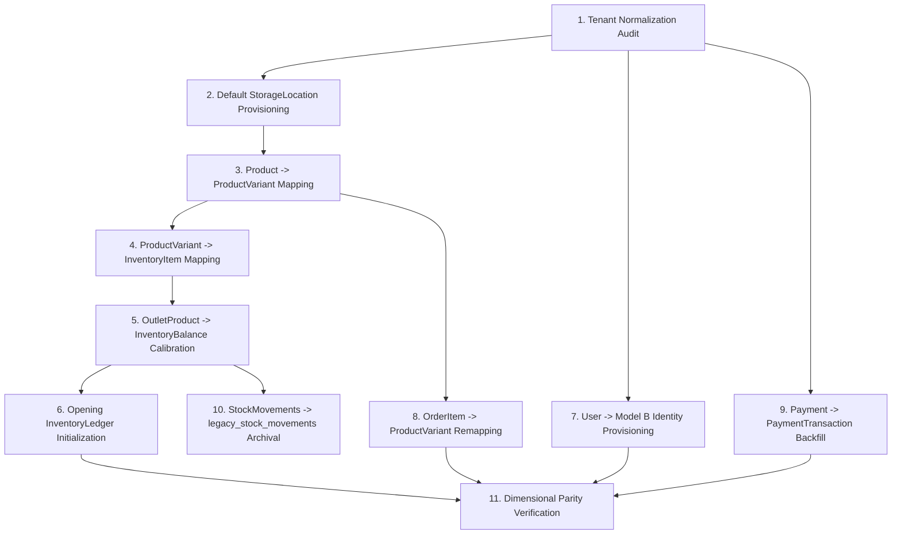

# 10 — PROMPT 12 BACKFILL IMPLEMENTATION DESIGN & SPECIFICATION

**Project:** Well POS Multi-Tenant SaaS Platform  
**Document ID:** `DOC-VAL-10-PROMPT-12-BACKFILL-DESIGN`  
**Execution Stage:** Prompt 12 — Database Migration Scripting & Expand-Phase DDL Implementation  
**Preceding Gate:** Prompt 11.3 = `GO WITH CONDITIONS` (Project Owner Approved)  
**Date:** September 19, 2026  
**Status:** **AUTHORITATIVE BACKFILL DESIGN SPECIFICATION — SCAFFOLDING & ALGORITHMS ONLY**  
**Live Data Status:** `LIVE DATA COUNTS NOT VERIFIED — LIVE DATA ACCESS NOT AVAILABLE`

---

## 1. Backfill Principles & Safety Architecture

The Backfill Phase is the deterministic data population engine that bridges the legacy prototype structures with Target Database Schema Revision 4. It executes strictly **after** the Expand DDL is applied and **before** any application cutover occurs.

### Core Architectural Principles:
1. **Tenant-Scoped Batching:** Backfill workers process data tenant-by-tenant (`WHERE tenant_id = :tenantId`), preventing memory bloat and isolating failures.
2. **Deterministic UUID Generation (UUIDv5):** All mapped entity IDs use RFC 4122 UUIDv5 hashing derived from the legacy primary key and a constant namespace string. Rerunning a worker reproduces identical IDs without duplicate record generation.
3. **Transaction-Safe & Idempotent:** Each tenant batch runs within an ACID transaction (`BEGIN ... COMMIT`). If an error occurs, the tenant batch rolls back cleanly. Upsert/existence checks ensure full re-runnability.
4. **Dry-Run Capability:** Every backfill worker supports a `--dry-run` flag that performs all calculations, audits, and validations without committing changes to the database.
5. **Preservation of Legacy Data:** Source tables (`products`, `outlet_products`, `users`, `orders`, `payments`, `stock_movements`, `hold_orders`) are treated as **Read-Only Sources**. No legacy data is modified or deleted during backfill.

---

## 2. Deterministic Identifier (UUIDv5) Standard

To guarantee repeatability and traceability across staging runs and disaster recovery, entity IDs are computed using UUIDv5 with a fixed DNS namespace:

```typescript
const WELL_POS_NAMESPACE = '6ba7b810-9dad-11d1-80b4-00c04fd430c8';

// Deterministic ID Mappings:
uuidv5(`${legacyProduct.id}:variant`, WELL_POS_NAMESPACE);        // -> ProductVariant.id
uuidv5(`${legacyProduct.id}:inventory_item`, WELL_POS_NAMESPACE); // -> InventoryItem.id
uuidv5(`${legacyOutlet.id}:default_location`, WELL_POS_NAMESPACE); // -> StorageLocation.id (Default)
```

---

## 3. Backfill Worker Pipeline & Dependency Graph



---

## 4. Granular Worker Specifications

### 4.1 Worker 01: Tenant Normalization Audit
- **Objective:** Detect and resolve any `NULL` `tenant_id` on existing tables (`outlets`, `users`, `categories`, `products`, `orders`, `shifts`, `customers`, `hold_orders`).
- **Algorithm:**
  1. Scan each legacy table for `tenant_id IS NULL`.
  2. If found, attempt resolution via relational hierarchy (e.g. `order.outletId -> outlet.tenantId`).
  3. If unresolvable, assign to verified primary tenant (or flag as migration exception requiring owner intervention).
  4. Emit report of audited records.

### 4.2 Worker 02: Default StorageLocation Provisioning
- **Objective:** Ensure every active `Outlet` possesses exactly one default `StorageLocation`.
- **Target Invariant:** Single default location per outlet (`isDefault = true`) matching the partial unique index.
- **Algorithm:**
  - For each `Outlet` where `id = outletId`:
    - `id` = `uuidv5(`${outlet.id}:default_location`)`
    - `tenantId` = `outlet.tenantId`
    - `outletId` = `outlet.id`
    - `name` = If `outlet.isWarehouse = true` $\to$ `'Gudang Utama'`; Else $\to$ `'Area Toko / Kasir'`
    - `type` = If `outlet.isWarehouse = true` $\to$ `StorageLocationType.WAREHOUSE`; Else $\to$ `StorageLocationType.STOREFRONT`
    - `isDefault` = `true`
    - `allowNegativeStock` = `null` (B-05, H-05: Preserves nullable override semantics; NULL inherits Tenant policy)
    - `isActive` = `true`

### 4.3 Worker 03 & 04: Product $\to$ ProductVariant $\to$ InventoryItem
- **Target Cardinality:** `Product 1:N ProductVariant N:1 InventoryItem`.
- **Default Legacy Backfill Mapping (1:1:1):**
  - **Product:** Retains commercial grouping metadata (`name`, `categoryId`, `description`, `imageUrl`, `type = STANDARD`).
  - **ProductVariant (1 per legacy product):**
    - `id` = `uuidv5(`${product.id}:variant`)`
    - `tenantId` = `product.tenantId`
    - `productId` = `product.id`
    - `sku` = `product.sku`
    - `barcode` = `product.barcode`
    - `name` = `'Default'`
    - `price` = `Decimal(product.basePrice, 2)`
    - `inventoryQuantityMultiplier` = `Decimal('1.000', 3)`
    - `isActive` = `product.isActive`
  - **InventoryItem (1 per legacy product):**
    - `id` = `uuidv5(`${product.id}:inventory_item`)`
    - `tenantId` = `product.tenantId`
    - `itemCode` = Deterministic collision-safe code per tenant: sanitized `sku`, fallback to `product.id`, deduped with index suffixes (H-04).
    - `name` = `product.name`
    - `canonicalUom` = `product.unit` (e.g. `'PCS'`)
    - `purchaseUom` = `product.unit`
    - `reorderPoint` = `Decimal('0.000', 3)`
    - `targetLevel` = `Decimal('0.000', 3)`
    - `averageCost` = `Decimal(product.costPrice, 4)`
    - `allowNegativeStock` = `null` (B-04, H-05: Nullable override)
    - `isBatched` = `false`
    - `isActive` = `product.isActive`
  - Link `product_variants.inventory_item_id = inventory_items.id` (B-02: Nullable FK in schema, populated for standard retail).

### 4.4 Worker 05 & 06: InventoryBalance & InventoryLedger Calibration
- **Canonical Stock Baseline:** `legacy outlet_products.stock = InventoryBalance.quantityOnHand`.
- **Negative Stock Handling (ADR-002 Hierarchy):**
  - Evaluate `allowNegativeStock` policy: `InventoryItem` $\to$ `StorageLocation` $\to$ `Tenant.allowNegativeStock`. (H-05)
  - **Case A (Permitted):** If `stock < 0` and permitted:
    - Set `InventoryBalance.quantityOnHand = Decimal(stock, 3)`, `inventoryBatchId = null`. (Target `InventoryBalance` has NO `isNegativeBalance` column).
    - Insert opening `InventoryLedger` entry with `quantityDelta = Decimal(stock, 3)`, `balanceAfter = Decimal(stock, 3)`, and `InventoryLedger.isNegativeBalance = true`.
  - **Case B (Not Permitted):** If `stock < 0` and not permitted:
    - Treat as a **migration exception requiring manual resolution**. Do NOT migrate as valid stock without manual clearance.
- **Normal Stock (`stock >= 0`):**
  - Set `InventoryBalance.quantityOnHand = Decimal(stock, 3)`, `quantityReserved = Decimal('0.000', 3)`, `inventoryBatchId = null` (B-01).
  - Insert initial `InventoryLedger` calibration record (B-07, B-09, H-03):
    - `movementType` = `StockMovementType.OPNAME_ADJUSTMENT` (Locked Revision 4 enum)
    - `referenceType` = `InventoryRefType.STOCK_OPNAME` (Locked Revision 4 enum)
    - `referenceId` = `'BASELINE_OPENING_BALANCE'`
    - `quantityDelta` = `Decimal(stock, 3)`
    - `balanceBefore` = `Decimal('0.000', 3)`
    - `balanceAfter` = `Decimal(stock, 3)`
    - `unitCost` = `InventoryItem.averageCost`
    - `isNegativeBalance` = `false`
    - `actorType` = `ActorType.SYSTEM`
    - `actorUserId` = `null`
    - `inventoryBatchId` = `null`
    - `notes` = `'Migrasi saldo awal dari legacy outlet_products'`

### 4.5 Worker 07: User Credential Backfill (Model B)
- **Target Invariant:** `userCode` unique per tenant (`@@unique([tenantId, userCode])`), `pinHash` (Bcrypt/Argon2id).
- **Format Policy:** `[OWNER DECISION REQUIRED]`. Technical default fallback: `'USR-' || UPPER(SUBSTRING(user.id, 1, 6))`.
- **PIN Credential Handling (C-02):**
  - **Case A (`pin IS NOT NULL`):** Hash plaintext `pin` using `bcrypt.hash(user.pin, 10)` and save into `users.pin_hash`.
  - **Case B (`pin IS NULL`):** Flag user as requiring credential provisioning via approved operational procedure. Target success condition is strictly `users.pin_hash IS NOT NULL`. No synthetic schema flags (`mustChangePin`, `forcePinReset`) are added.
  - **Security Rule:** Never log or output plaintext PINs in terminal or log artifacts.

### 4.6 Worker 08: OrderItem $\to$ ProductVariant
- **Objective:** Repoint legacy `order_items.product_id` to `order_items.product_variant_id`.
- **Algorithm:**
  - For each `order_items` row:
    - Resolve target variant: `productVariantId = uuidv5(`${orderItem.productId}:variant`)`.
    - Populate historical snapshot columns:
      - `product_name` = `legacy product.name`
      - `variant_name` = `'Default'`
      - `sku` = `legacy product.sku`
      - `cost_price` = `Decimal(legacy product.costPrice, 4)`
      - `product_variant_id` = `productVariantId`

### 4.7 Worker 08b: Legacy Order Status & Payment Status Decoupling Backfill Mapping
- **Objective:** Map legacy unified payment-status semantics into decoupled `OrderStatus` and `PaymentStatus` per Revision 4.
- **Target Schema Invariant:** 
  - `orders.order_status` has DDL default `'CONFIRMED'` (Revision 4 line 707).
  - Target `OrderStatus` enum: `DRAFT`, `CONFIRMED`, `PROCESSING`, `COMPLETED`, `CANCELLED`.
  - Target `PaymentStatus` enum: `UNPAID`, `PARTIALLY_PAID`, `PAID`, `REFUNDED`.
- **Deterministic Historical Backfill Mapping:**
  | Legacy Source & Value | Target `OrderStatus` | Target `PaymentStatus` | Operational Rationale |
  | :--- | :--- | :--- | :--- |
  | `orders.payment_status = 'PAID'` | `COMPLETED` | `PAID` | Historical completed sales transactions fulfilled at POS. |
  | `orders.payment_status = 'CANCELLED'` | `CANCELLED` | `UNPAID` | Order was voided/aborted; inventory returned, no retained payment. |
  | `orders.payment_status = 'REFUNDED'` | `COMPLETED` | `REFUNDED` | Historical order fulfillment occurred; payment was subsequently reversed. |
  | `hold_orders` records | `DRAFT` | `UNPAID` | Saved cart / suspended order awaiting completion at cashier. |
  | *New / Active Orders (DDL Default)* | `CONFIRMED` | `UNPAID` | Authoritative Revision 4 default for newly placed orders before cashier checkout. |

### 4.8 Worker 09: Payment $\to$ PaymentTransaction
- **Objective:** Transform legacy monolithic `payments` into target `payment_transactions`.
- **Algorithm:**
  - For each legacy `payment` row:
    - `id` = `uuidv5(`${payment.id}:tx`)`
    - `tenantId` = `order.tenantId`
    - `orderId` = `payment.orderId`
    - `paymentMethod` = `payment.paymentMethod`
    - `amount` = `Decimal(payment.amountPaid - payment.changeGiven, 2)`
    - `status` = `PaymentTxStatus.CAPTURED`
    - `paidAt` = `payment.createdAt`

### 4.8 Worker 10: Stock Movement Archival
- **Objective:** Safely preserve historical `stock_movements` without polluting the clean `inventory_ledgers` event stream.
- **Algorithm:**
  - Bulk copy rows from `stock_movements` into `legacy_stock_movements`.
  - Verify total row count match between source and archive.

---

## 5. Idempotency & Failure Recovery

- All workers query existing target records before inserting (`findUnique` or `ON CONFLICT DO NOTHING`).
- If interrupted mid-execution, re-running a worker will safely skip already-migrated records without error or duplication.
- Unresolved records are written to a structured audit report (`docs/validation/10_BACKFILL_EXCEPTIONS.log`).

---
*End of Prompt 12 Backfill Design Specification.*
