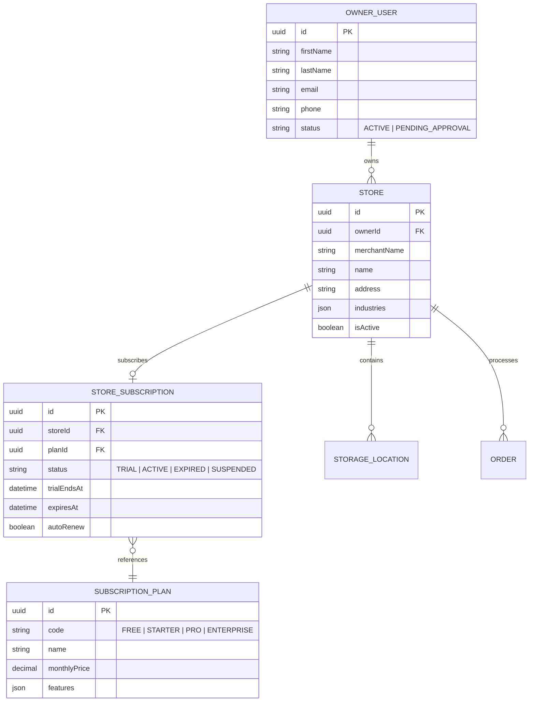

# EPIC-17: MULTI-STORE HIERARCHY & PER-STORE SAAS SUBSCRIPTIONS
## Pohon Hirarki 1-Owner-ke-N-Toko & Tata Kelola Paket Langganan SaaS Granular Per Toko di SuperAdmin

**Epic ID**: `EPIC-17`  
**Status**: **COMPLETED ✅**  
**Prioritas**: **P1 — COMMERCIAL SAAS GOVERNANCE & BUSINESS SCALING**  
**Target Komponen**: `pos_apps/server`, `pos_apps/client/src/pages/SuperadminDashboardPage.tsx`, billing engine  
**Dokumen Induk**: [`docs/epics/00_EPIC_REGISTRY_AND_PROJECT_MEMORY.md`](./00_EPIC_REGISTRY_AND_PROJECT_MEMORY.md)  
**Dokumen Arsitektur Rujukan**: `docs/00_PROJECT_CONTEXT.md`  

---

### 1. DESKRIPSI & LATAR BELAKANG ARSITEKTUR
Dalam model SaaS lama, satu Tenant dianggap memiliki satu paket langganan global terpusat. Namun, kebutuhan bisnis ritel dan F&B nyata menuntut fleksibilitas komersial yang lebih tinggi:
1. **Pola Multi-Toko / Multi-Brand**: Seorang pengusaha (Owner A) dapat memiliki beberapa toko dengan model bisnis berbeda (misal: *Kedai Kopi Senja*, *Minimarket Senja*, dan *Laundry Express Senja*).
2. **Paket SaaS Per Toko**: Toko rintisan baru mungkin masih menggunakan paket *Free Trial*, sementara toko cabang utama yang ramai membutuhkan paket *Pro Business* atau *Enterprise*.
3. **Pemberdayaan SuperAdmin Control Tower**: SuperAdmin platform harus dapat melihat struktur pohon kepemilikan toko per akun Owner dan mengelola paket langganan secara mandiri untuk masing-masing toko tersebut.

---

### 2. ARSITEKTUR MODEL DATA MULTI-TOKO & LANGGANAN PER-TOKO

---

### 3. FITUR KONTROL TOWER SUPERADMIN SAAS
1. **Tampilan Hirarki Owner & Toko (Hierarchical Tree View)**:
   - Superadmin dapat menelusuri:
     * **Owner A (Budi Santoso - budi@kopisenja.id)**
       - 🏪 *Kopi Senja Senopati* ➔ Paket: **PRO Business** (Berlaku s.d 31 Des 2026)
       - 🏪 *Kopi Senja BSD* ➔ Paket: **Free Trial** (Berlaku s.d 5 Okt 2026)
       - 🏪 *Senja Mart Kelontong* ➔ Paket: **Starter Retail** (Aktif)
2. **Manajemen Paket SaaS Granular Per Toko**:
   - Superadmin dapat mengubah paket toko tertentu tanpa mempengaruhi toko lainnya milik Owner yang sama.
   - Tindakan per toko:
     - Ganti Paket: Free / Starter / Pro / Enterprise.
     - Perpanjang Masa Aktif / Trial (*Extend Days*).
     - Suspend Toko Tertentu (misal toko cabang yang menunggak sewa/iuran).
     - Audit Penggunaan Fitur (apakah toko tersebut memakai modul Resep BOM, Multi-Gudang, dll).

---

### 4. BREAKDOWN SPRINT TASK (SPRINT WORK PLAN)

- [x] **Sprint 17.1: Prisma Schema Refactoring for Store-Level Subscriptions**
  - Pemindahan relasi langganan dari tingkat global tenant ke tingkat toko individual (`StoreSubscription` terhubung ke `Outlet/Store`).
  - Skrip migrasi data aman memastikan toko yang sudah ada tetap memiliki referensi paket valid.

- [x] **Sprint 17.2: Backend API Multi-Store Ownership & Subscription Management**
  - Endpoint Owner: `GET /api/outlets` (Daftar seluruh toko milik owner yang sedang login).
  - Endpoint SuperAdmin: `GET /api/platform/tenants` dan `GET /api/platform/tenants/:id` (Daftar seluruh owner berserta toko-toko yang dimilikinya).
  - Endpoint SuperAdmin: `PUT /api/platform/stores/:storeId/subscription` (Update paket, status, dan masa aktif toko).

- [x] **Sprint 17.3: Superadmin Dashboard Tree View UI (`SuperadminDashboardPage.tsx`)**
  - Pembaruan antarmuka tabel tenant menjadi tampilan hierarki yang dapat di-expand (*Inline Expandable Accordion Sub-Baris*).
  - Modal pengelolaan paket per toko (*Manage Store Subscription Single Modal*).
  - Indikator badge paket warna-warni di setiap baris toko.

- [x] **Sprint 17.4: Client-Side Multi-Store Switcher Integration**
  - Header switcher toko di dashboard owner (EPIC-16) terhubung langsung ke `GET /api/outlets`.
  - Kemampuan Owner untuk menambah toko baru kapan saja melalui tombol *"Tambah Toko Baru +"* yang memicu Store Creator Wizard (EPIC-15).

---

### 5. KRITERIA PENERIMAAN (ACCEPTANCE CRITERIA)
1. Satu akun Owner dapat memiliki lebih dari satu toko dan berpindah antar toko dengan mulus di Backoffice. (Lulus ✅)
2. Superadmin dapat melihat daftar toko apa saja yang dimiliki oleh setiap Owner. (Lulus ✅)
3. Superadmin dapat menetapkan dan mengubah paket SaaS secara mandiri per unit toko. (Lulus ✅)
4. Fitur pada backoffice toko mematuhi batasan paket langganan toko yang bersangkutan secara akurat. (Lulus ✅)
5. Terverifikasi 100% via test suite `pos_apps/server/src/scripts/verify_onboarding_e2e.ts`. (Lulus ✅)
