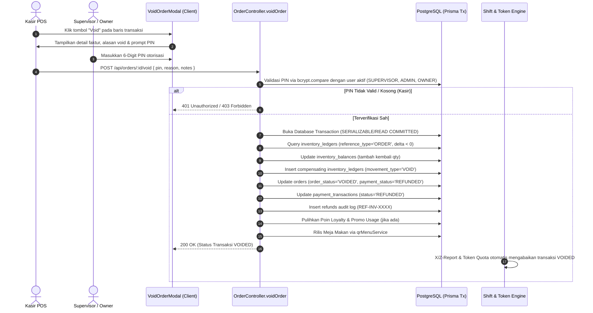

# EPIC-24: TRANSACTION VOID & SUPERVISOR/OWNER PIN APPROVAL ENGINE

## 1. Executive Summary & Objective
Modul ini mengimplementasikan alur pembatalan transaksi (*Transaction Void*) resmi untuk pesanan kasir yang telah dibuat/dibayar, dengan pengamanan otorisasi bertingkat berbasis 6-digit PIN persetujuan dari Supervisor atau Owner toko. Fitur ini dirancang untuk mencegah kecurangan kasir (*internal fraud/theft*), memulihkan stok inventaris secara akurat tanpa *rework*, membersihkan omzet dari laporan shift (*X/Z-Report*), dan mengembalikan kuota transaksi token SaaS ke merchant.

---

## 2. Business Flow & Authorization Matrix



### Matriks Otorisasi Pengguna

| Peran Pengguna Aktif (*Logged-in User*) | Input PIN Supervisor Diperlukan? | Keterangan & Batasan |
| :--- | :--- | :--- |
| **CASHIER** | **Wajib (Mandatory)** | Kasir dilarang membatalkan transaksi tanpa kehadiran Supervisor/Owner yang memasukkan PIN valid. |
| **SUPERVISOR** | **Opsional** | Dapat membatalkan langsung dengan identitasnya, atau memasukkan PIN supervisor rekan kerja untuk audit silang. |
| **ADMIN / OWNER** | **Opsional** | Memiliki wewenang langsung untuk membatalkan pesanan di outlet manapun di bawah tenant-nya. |

---

## 3. Atomic Reversal Engine (Database Transaction)

Seluruh proses pembatalan dieksekusi dalam satu transaksi atomik `prisma.$transaction`:

1. **Pemulihan Stok Bahan & Produk Retail**:
   - Sistem membaca seluruh riwayat potongan stok dari tabel `inventory_ledgers` yang memiliki `reference_type = 'ORDER'` dan `quantity_delta < 0`.
   - Menambahkan kuantitas kembali ke saldo aktif `inventory_balances.quantity_on_hand`.
   - Mencatat ledger pembalik resmi dengan `movement_type = 'VOID'` dan catatan audit nomor faktur.
2. **Status Transaksi & Pembayaran**:
   - `orders.order_status` diubah menjadi `'VOIDED'::"OrderStatus"`.
   - `orders.payment_status` diubah menjadi `'REFUNDED'::"PaymentStatus"`.
   - `payment_transactions.status` diubah menjadi `'REFUNDED'::"PaymentTxStatus"`.
   - Catatan faktur (`orders.notes`) ditambahkan tag permanen: `[VOID: <alasan> | Disetujui: <Nama> (<Role>)]`.
3. **Pencatatan Audit Retur / Refund**:
   - Membuat baris di tabel `refunds` dengan kode referensi `REF-[invoiceNumber]-[random]`.
   - Menyimpan seluruh item yang diretur ke tabel `refund_items` dengan flag `restock_item = true`.
4. **Poin Loyalitas & Promo**:
   - Jika pelanggan menukarkan poin diskon pada pesanan ini, saldo poin dikembalikan ke akun pelanggan (`PointTxType.MANUAL_ADJUSTMENT`).
   - Jika pelanggan mendapatkan poin belanja dari pesanan ini, poin tersebut ditarik kembali (`PointTxType.REFUND_DEDUCT`).
   - Jika menggunakan kupon promo, `promotions.usageCount` didekremen dan `promotion_usages` dihapus.
5. **Rilis Meja (F&B Dine-In)**:
   - Meja dilepaskan secara otomatis melalui `qrMenuService.releaseTableIfNoActiveOrders` agar siap digunakan tamu berikutnya.

---

## 4. Perlindungan Omzet Shift & Kuota Token SaaS

Untuk mencegah transaksi yang dibatalkan mengotori kas fisik kasir dan menguras kuota merchant:

1. **Shift Sales Summary & Kas Penutupan (`shift.controller.ts`)**:
   - Seluruh kueri agregasi penjualan aktif (`getActiveShift`, `getShiftSalesSummary`, dan `closeShift`) difilter ketat dengan klausul:
     ```sql
     AND o.order_status NOT IN ('CANCELLED', 'VOIDED')
     ```
   - Uang tunai yang di-void tidak dihitung dalam kas akhir yang diharapkan (*expected cash*), sehingga kasir tidak mengalami selisih minus (*cash shortage*).
2. **Kuota Token SaaS Pay-As-You-Go (`saas.controller.ts`)**:
   - Perhitungan penggunaan transaksi bulanan aktif merchant difilter dengan:
     ```ts
     orderStatus: { notIn: [OrderStatus.CANCELLED, OrderStatus.VOIDED] }
     ```
   - Transaksi yang dibatalkan otomatis mengembalikan kuota transaksi token merchant.

---

## 5. Antarmuka Pengguna (UI/UX)

1. **`<VoidOrderModal />` (`pos_apps/client/src/components/VoidOrderModal.tsx`)**:
   - Desain Vanilla CSS clean dengan visual warning rose/amber.
   - Pilihan alasan cepat (*Chips*): *"Salah Input Item"*, *"Pelanggan Batal Beli"*, *"Salah Pilih Metode Bayar"*, *"Input Transaksi Ganda (Duplikat)"*, *"Komplain Kualitas / Barang Rusak"*, serta opsi kustom alasan.
   - Kolom PIN numerik 6 digit dengan masking keamanan tinggi.
2. **`<OrdersView />` (`pos_apps/client/src/pages/OrdersView.tsx`)**:
   - Tombol aksi *"Void"* dengan ikon `Ban` pada setiap baris pesanan aktif.
   - Badge penanda status `VOID` berwarna rose-100 dan coret teks (*line-through*) pada nomor faktur serta nominal total bayar.
   - Auto-reload tabel dan notifikasi toast hijau saat pembatalan berhasil.
3. **Item-Level Partial Void (`POST /api/orders/:id/void-item`) & `<VoidOrderItemModal />`**:
   - Memungkinkan pembatalan sebagian item tanpa harus membatalkan keseluruhan transaksi.
   - Stok bahan/barang dikembalikan secara proporsional sesuai kuantitas yang dibatalkan.
   - Grand total dan subtotal dihitung ulang secara otomatis.
   - Jika seluruh item pada faktur habis dibatalkan, sistem secara otomatis mengeskalasi faktur menjadi Full `VOIDED` dan merilis meja.
4. **Slip Cetak Fisik Bukti Void Termal 58mm/80mm (`receiptPdf.ts`)**:
   - Struk untuk transaksi yang telah dibatalkan memiliki watermark/banner tegas:  
     `*** VOID / DIBATALKAN ***`  
   - Dilengkapi signature block fisik (Kasir Bertugas & Supervisor/Owner) untuk diarsipkan di laci kasir (*cash drawer*) sebagai bukti fisik pemotongan kas saat audit shift (*X/Z-Report*).

---

## 6. Verifikasi & Pengujian
- Unit & E2E Controller Test: `pos_apps/server/src/scripts/test_void_controller.ts` (100% Passed).
  - Kasir tanpa PIN: Ditolak dengan HTTP 403 Forbidden.
  - Kasir dengan PIN Salah: Ditolak dengan HTTP 401 Unauthorized.
  - Kasir dengan PIN Benar: Berhasil dibatalkan (HTTP 200).
  - Percobaan re-void transaksi yang sudah void: Ditolak dengan HTTP 400 Bad Request.
  - Void Parsial Item: Berhasil mengurangi subtotal, mengembalikan stok proporsional, dan mencatat audit refund (HTTP 200).
- Server Build: `tsc` Exit code 0.
- Client Build: `tsc -b && vite build` Exit code 0.
- **Status Akhir: 100% COMPLETED (GAP: 0%)**

